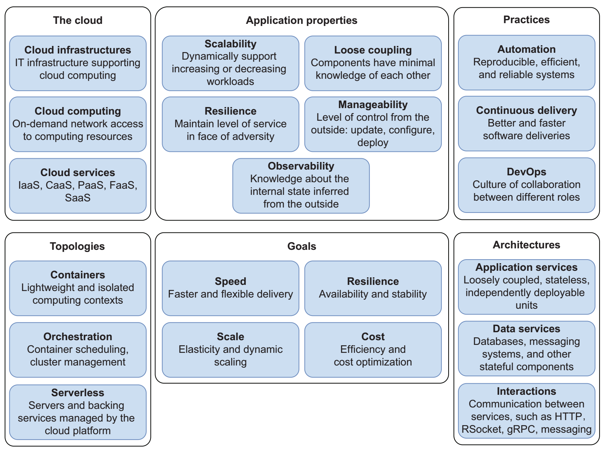
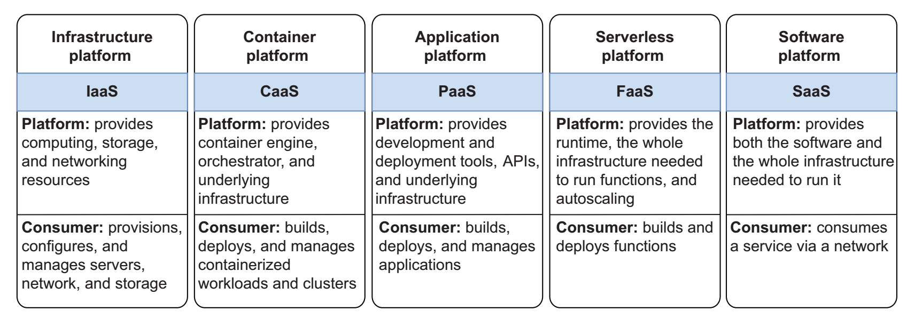
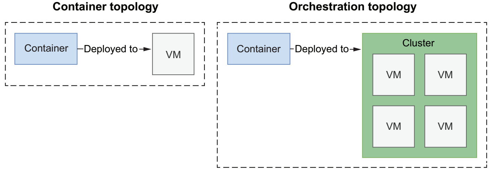
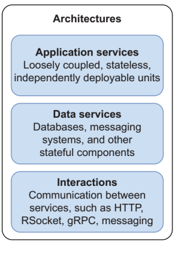
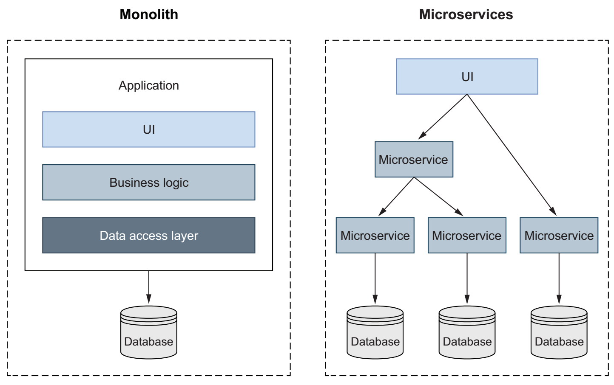

# Cloud Native 
Cloud native applications are highly distributed systems that live in the cloud and
are resilient to change. Systems are made up of several services that communicate
through a network and are deployed in a dynamic environment where everything keeps changing.

*Cloud native is an approach to application development aiming at leveraging cloud technologies.*

The key concept is that cloud native applications should be specifically designed for the cloud and have properties that take advantage of the cloud environment and the cloud computing model. 

The Cloud Native Computing Foundation (CNCF) defines cloud native definition as:

*Cloud native technologies empower organizations to build and run scalable applications in modern, dynamic environments such as public, private, and hybrid clouds. Containers, service meshes, microservices, immutable infrastructure, and declarative APIs exemplify this approach.*

*These techniques enable loosely coupled systems that are resilient, manageable, and observable. Combined with robust automation, they allow engineers to make high-impact changes frequently and predictably with minimal toil.*

The Three Ps of Cloud Native:
1. **Platforms**—Cloud native applications run on platforms based on dynamic, distributed environments: the clouds (public, private, or hybrid).
1. **Properties**—Cloud native applications are designed to be scalable, loosely coupled, resilient, manageable, and observable.
2. **Practices**—Practices around cloud native applications—automation, continuous
delivery, and DevOps—include robust automation combined with frequent and
predictable changes.

Cloud native applications are highly distributed systems that are specifically
designed for and live in the cloud.

Modern businesses go cloud native to produce software that can be delivered
quickly, can be scaled dynamically depending on demand, and is always avail-
able and resilient to failures while optimizing costs.

The cloud is an IT infrastructure provided as a commodity in terms of comput-
ing, storage, and networking resources.

In the cloud, users pay only for the actual resources they use.
Cloud platforms deliver their services at different levels of abstraction: infra-
structure (IaaS), container (CaaS), platform (PaaS), functions (FaaS), or soft-
ware (SaaS).

Cloud native applications are horizontally scalable, loosely coupled, highly cohe-
sive, resilient to faults, manageable, and observable.

Cloud native development is supported by automation, continuous delivery,
and DevOps.

## Cloud
The cloud is an IT infrastructure that supports the delivery of computing resources toconsumers according to the cloud computing model. The National Institute of Standards and Technology (NIST) defines cloud computing as follows:

*Cloud computing is a model for enabling ubiquitous, convenient, on-demand network
access to a shared pool of configurable computing resources (e.g., networks, servers,storage, applications, and services) that can be rapidly provisioned and released with minimal management effort or service provider interaction.*

Just like you get electricity from a provider rather than generating it on your own, with the cloud you can get computing resources (such as servers, storage, and networks) as a commodity.

The cloud provider manages the underlying cloud infrastructure, so the consumer
doesn’t need to worry about physical resources like machines or networks. Companies
moving to the cloud can get all the computing resources they need via a network (usually the internet) through a set of APIs that allows them to provision and scale resources as they need on an on-demand, self-service basis.

With the cloud computing model, the usage of computing resources is monitored, and consumers only pay for what they actually use(Elasticity).

There is no strict requirement about where the cloud infrastructure should be or
who should manage it. There are several deployment models for delivering cloud services. The main ones are private cloud, public cloud, and hybrid cloud.

* **Private cloud**—Cloud infrastructure provisioned to be used by a single organization. It can be managed by the organization itself or by a third party, and it can be hosted on premises or externally. A private cloud is usually the preferred option for organizations dealing with sensitive data or highly critical systems. It is also a common choice for having complete control over the infrastructure’s compliance with specific laws and requirements like the General Data Protection Regulation (GDPR) or the California Consumer Privacy Act (CCPA). For example, banks and healthcare providers are likely to set up their own cloud
infrastructure.

* **Public cloud**—Cloud infrastructure provisioned for public use. It is usually owned and managed by an organization, the cloud provider, and is hosted on the provider’s premises. Examples of public cloud service providers are Amazon Web Services (AWS), Microsoft Azure, Google Cloud, Alibaba Cloud, and DigitalOcean.

* **Hybrid cloud**—Composition of two or more distinct cloud infrastructures belonging to any of the previous types, bound together and offering services as if they were one single environment.

### Cloud computing service models
The cloud computing service models differ by the level of abstraction they provide and who is responsible for managing which levels (the platform or the consumer)

* **Infrastructure as a Service (IaaS)**
   In the Infrastructure as a Service (IaaS) model, consumers can directly control and provision resources like servers, storage, and networks. For example, they can provision virtual machines and install software like operating systems and libraries. Even though this model has been used for a while, it was in 2006 that Amazon made it popular and widely accessible with Amazon Web Services (AWS). Examples of IaaS offerings are AWS Elastic Compute Cloud (EC2), Azure Virtual Machines, Google Compute Engine, Alibaba Virtual Machines, and DigitalOcean Droplets. 

* **Container as a Service (CaaS)**
   Using the Container as a Service (CaaS) model, consumers cannot control primitive virtualization resources. Instead, they provision and manage containers. The cloud provider takes care of provisioning the underlying resources that fulfill the needs of those containers, such as by starting new virtual machines and configuring networks to make them accessible through the internet. Docker Swarm, Apache Mesos, and Kubernetes are examples of tools used to build container platforms. All major cloud providers offer a managed Kubernetes service, which has become the de facto technology for CaaS offerings: Amazon Elastic Kubernetes Service (EKS), Azure Kubernetes Service (AKS), Google Kubernetes Engine (GKE), Alibaba Container Service for Kubernetes (ACK), and DigitalOcean Kubernetes. 

* **Platform as a Service (PaaS)**
   In the Platform as a Service (PaaS) model, the platform provides infrastructure, tools, and APIs that developers can use to build and deploy applications. For example, as a developer, you can build a Java application, package it as a Java Archive (JAR) file, and then deploy it to a platform working according to the PaaS model. The platform provides the Java runtime and other required middleware, and it can also offer extra services like databases or messaging systems. Examples of PaaS offerings are Cloud Foundry, Heroku, AWS Elastic Beanstalk, Azure App Service, Google App Engine, Alibaba Web App Service, and DigitalOcean App Platform. In the past few years, vendors have been converging on Kubernetes for building a new PaaS experience for developers and operators. Examples of this new generation of services are VMware Tanzu Application Platform and RedHat OpenShift. 

* **Function as a Service (FaaS)**
   The Function as a Service (FaaS) model relies on serverless computing to let consumers focus on implementing the business logic of their applications (often in the form of functions), whereas the platform takes care of providing servers and the rest of the infrastructure. Serverless applications are triggered by events, such as HTTP requests or messages. For example, you might code a function that analyzes a data set whenever available from a message queue and computes results according to some algorithms. Examples of commercial FaaS offerings are Amazon AWS Lambda, Microsoft Azure Functions, Google Cloud Functions, and Alibaba Functions Compute. Examples of open source FaaS offerings are Knative and Apache OpenWhisk. 

* **Software as a Service (SaaS)**
   The service with the highest abstraction is Software as a Service (SaaS). In this model, consumers access applications as users, while the cloud provider manages the whole stack of software and infrastructure. Many companies build their applications, use a CaaS or PaaS model to run them, and then sell their usage to the end customers as SaaS. The consumers of SaaS applications typically use thin clients like web browsers or mobile devices to access them. Examples of applications available as SaaS are Proton Mail, GitHub, Plausible Analytics, and Microsoft Office 365.

## Properties of cloud native applications
The CNCF identifies five main properties that cloud native applications should
have: scalability, loose coupling, resilience, observability, and manageability. Cloud native is a methodology for building and running applications that exhibit those properties. Cornelia Davis sums it up by stating that “cloud-native software is defined y how you compute, not about where you compute. In other words, the cloud is about where, and cloud native is about how.

* **Scalability**
    
    Elasticity is about being able to scale your software depending on the load. You can
    scale an elastic system to ensure an adequate service level for all your customers.
   
   Cloud native applications can support increasing workloads if provided with additional resources. Depending on the nature of thoseextra resources, we can distinguish between vertical scalability and horizontal scalability:
   * Vertical scalability—Scaling vertically, or scaling up or down, means adding hard ware resources to or removing them from the computing node, such as CPU ormemory. This approach is limited, since it’s not possible to keep adding hard ware resources. On the other hand, applications don’t need to be explicitlydesigned to be scaled up or down.
   * Horizontal scalability—Scaling horizontally, or scaling out or in, means addingmore computing nodes or containers to, or removing them from, the system.This approach doesn’t have the same limits as vertical scalability, but it requiresapplications to be scalable.

   

   In the cloud, where everything is dynamic and in constant change, horizontal scalability is preferred. Thanks to the abstraction levels offered by the cloud computingmodels, it’s straightforward to spin up new instances of your application rather thanincreasing the computational power of the machines already running. Since the cloudis elastic, we can scale application instances in and out quickly and dynamically.

* **Loose coupling**
  
  It’s a good design practice to decompose a system into modules (modularization), each of which has minimal dependencies on the other parts(loose coupling) and to encapsulate code that changes together (high cohesion).Depending on the architectural style, a module can model a monolithic componentor a standalone service (for example, a microservice). Either way, we should aim atachieving proper modularization with loose coupling and high cohesion.

* **Resilience**
  
    A system is resilient if it provides its services even in the presence of faults or environ mental changes. 
    Resilience is “the capability of a hardware-software network to provide and maintain an acceptable level of service in the face of faults and challenges to normal operation.
    we should design applications to be fault tolerant. An essential part of resilience is ensuring that a failure will not cascade to other components of the system but stay isolated while it gets fixed. We also want the system to be self-repairing or self-healing,
    some techniques for tolerating faults and preventing their effects from propagating to other parts of the system and spreading the failure are circuit breakers, retries, timeouts, and ratelimiters. 

* **Observability** 
  
    Observability is about inferring the internal state of an application from its external outputs. Manageability is about changing the internal state and outputs via external inputs. In both cases, the application artifact is never changed. It’s immutable. 
    * Monitoring—Monitoring is about measuring specific aspects of an application to get information on its overall health and identify failures.  

        *System/Libraries:  Spring Boot Actuator ,Prometheus*
    * Alerting/visualization—Collecting data about the state of a system is useful only if it’s used to take some action. When a failure is identified while monitoring anapplication, an alert should be triggered, and some action should be taken tohandle it. Specific dashboards are used to visualize the data collected and plotthem in relevant graphs to provide a good picture of the system’s behavior. 

        *System/Libraries: Grafana*
    * Distributed systems tracing infrastructure— to trace the data flowing through the different subsystems.

        *System/Libraries: Spring with OpenTelemetry ,Grafana Tempo* 
    * Log aggregation/analytics— logs should be aggregated and collected to provide a better picture of the system’s behavior and ensure the possibility of running analytics to mine information from that data.
    
        *System/Libraries: Fluent Bit, Loki, and Grafana*

* **Manageability** 

    Manageability is the ability to modify an application’s behavior without
    needing to change its code

    One aspect of manageability is deploying and updating applications while keeping
    the overall system up and running. Another element is configuration, we want to make cloud native applications configurable so we can modify their behavior without changing their code and building a new release. 

    *System/Libraries: Spring Cloud Config Server, Kubernetes ConfigMaps and Secrets, Kustomize*

## Culture and practices supporting cloud native
Cloud native allow engineers to make high-impact changes frequently and predictably with minimal toil

* **Automation** 
    
    Automate repetitive manual tasks to accelerate the delivery and deployment of cloud native applications. 
    The most important advantage of automation is that it makes processes and tasks repeatable and overall systems more stable and reliable. Manually executing a task is error-prone and costs money. By automating it, we can get a result that is both more reliable and more efficient.

    In cloud, computing resources are provisioned in an automated, self-service model, and they can be increased or decreased elastically. Two significant categories of automation for the cloud are: 
    * infrastructure provisioning(infrastructure as code): infrastructure as code is defining computing and network infrastructure through source code that can then be treated just like any software system.i.e creating and provisioning servers, networks, and storage

        *System/Libraries: Terraform*
    * configuration management(configuration as code):configuration as code is defining the configuration of computing resources through source code,
    which can be treated just like any software system.

        *System/Libraries: Ansible*

    Automation helps avoid snowflakes in favor of phoenix servers: all tasks acting on those servers are automated, every change can be tracked in source control, reducing risks, and each setup is reproducible.

    After their initial provisioning and configuration, immutable servers are not changed: they are immutable. If any change is necessary, it’s defined as code and delivered. A new server is then provisioned and configured from the new code while the previous server is destroyed.
* **Continuous delivery** 
    
    Continuous delivery is a "software development discipline where you build software in such a way that the software can be released to production at any time".

    Continuous delivery is a holistic engineering practice for delivering high-quality software quickly, reliably, and safely.

    With continuous delivery, teams implement features in short cycles, ensuring that the software can be released at any time reliably. Such a discipline is key to “make high-impact changes frequently and predictably with minimal toil,” as per the cloud native definition from the CNCF.

    Continuous integration (CI) is a foundational practice in continuous delivery. Developers commit their changes to the mainline (the main branch) continuously (at least once a day). At each commit, the software is automatically compiled, tested, and packaged as executable artifacts (such as JAR files or container images). The idea is to get fast feedback about the software’s status after each new change. If an error is detected,
    it should be immediately fixed to ensure the mainline keeps being a stable foundation for further development.

    Continuous delivery encourages the automation of the whole process via a deployment pipeline (also called a continuous delivery pipeline)
* **DevOps** 
    
    DevOps is A culture where people, regardless of title or background, work together to imagine,develop, deploy, and operate a system.

    DevOps is a culture enabling collaboration among different roles to deliver business value together.
## Goals
## Cloud Native Topologies
* **Containers**
    
    OS container is a lightweight executable package that
    includes everything needed to run the application. Containers share the same kernel
    as the host: there’s no need to bootstrap full operating systems to add new isolated
    contexts.
    Virtualization and container technologies differ in what is shared across 
    isolated contexts. Virtual machines share the hardware only. Containers share the 
    operating system kernel as well. Containers are more lightweight and portable.
    
    containers enable agility, portability across different environments, and
    deployment repeatability. Being lightweight and less resource-demanding, they are
    perfect for running in the cloud, where applications are disposable and scaled dynamically and quickly. In comparison, building and destroying virtual machines is
    much more expensive and time-consuming.
* **Orchestration**
    
    *The deployment target of containers is a machine, whereas for orchestrators, it’s 
    a cluster*

    Container orchestration helps you automate many different tasks:
    * Managing clusters, bringing up and down machines when necessary
    * Scheduling and deploying containers within a cluster to a machine that meets
    the container requirements for CPU and memory
    * Dynamically scaling containers for high availability and resilience, leveraging
    health monitoring
    * Setting up networks for containers to communicate with each other, defining
    routing, service discovery, and load balancing
    * Exposing services to the internet, establishing ports and networks
    * Allocating resources to containers according to specific criteria
    * Configuring the applications running within the containers
    * Ensuring security and enforcing access control policies

     *System/Libraries: Kubernetes (a CNCF project), Docker Swarm, and Apache Mesos*

* **Serverless**

    The serverless computing model enables developers to focus on implementing the business logic for their applications.

    Serverless computing is a model where the platform (such as Knative) manages
    servers and the underlying infrastructure, and the developer only focuses on
    the business logic. The backend functionality is enabled on a pay-per-use basis
    for cost optimization.
    
    With serverless you do not need to manage servers or orchestrate the application’s deployment on it. That’s a platform responsibility now.a serverless platform takes care of setting up the underlying
    infrastructure needed by the applications, including virtual machines, containers, and dynamic scaling.

    Serverless architectures comprise two main models:
    * Backend as a Service (BaaS)—In this model, applications rely heavily on third-
    party services offered by cloud providers, such as databases, authentication services, and message queues. 
    The focus is on reducing development and operational costs related to backend services. Developers can implement frontend
    applications (such as single-page applications or mobile applications) while off-
    loading most or all of the backend functionality to BaaS vendors. For example,
    they could use Okta to authenticate users, Google Firebase for persisting data,
    and Amazon API Gateway to publish and manage REST APIs.
    * Function as a Service (FaaS)—In this model, applications are stateless, triggered
    by events, and fully managed by the platform. The focus is on reducing deployment and operations costs related to orchestrating and scaling applications.
    Developers can implement the business logic for their applications, and the
    platform takes care of the rest. Serverless applications don’t have to be imple-
    mented with functions to be categorized as such. There are two main FaaS
    offerings. 
      * One option is to go with vendor-specific FaaS platforms, such as AWS
      Lambda, Azure Functions, or Google Cloud Functions. 
      * Another option is to  serverless platform based on open source projects, which can run
      either in a public cloud or on premises, addressing concerns like vendor lock-in
      and lack of control. Examples of such projects are Knative and Apache OpenWhisk. 
      Knative provides a serverless runtime environment on top of Kubernetes. It’s used as the foundation for enterprise serverless
      platforms like VMware Tanzu Application Platform, RedHat OpenShift Serverless, and Google Cloud Run.

    Serverless applications are typically event-driven and run only when there is an event
    to handle, such as an HTTP request or a message. The event can be external or be
    produced by another function. For example, a function might be triggered whenever
    a message is added to a queue, process it, and then exit the execution.
    When there is nothing to process, the serverless platform shuts down all the
    resources involved with the function, so you can really pay for the actual usage. 

## Architectures for cloud native applications
{: .float-right}

monolithic applications were deployed on huge mainframes as single components. 

A multi-tiered architecture, relying on client/server paradigm, was  used for desktop and web applica-
tions, decomposing the code into presentation, business, and data layers.

A microservice-based application, is associated with many components, each implementing only
one piece of functionality. Many patterns have been proposed to decompose a monolith into microservices and to handle the complexity created by having many compo-
nents instead of one.
