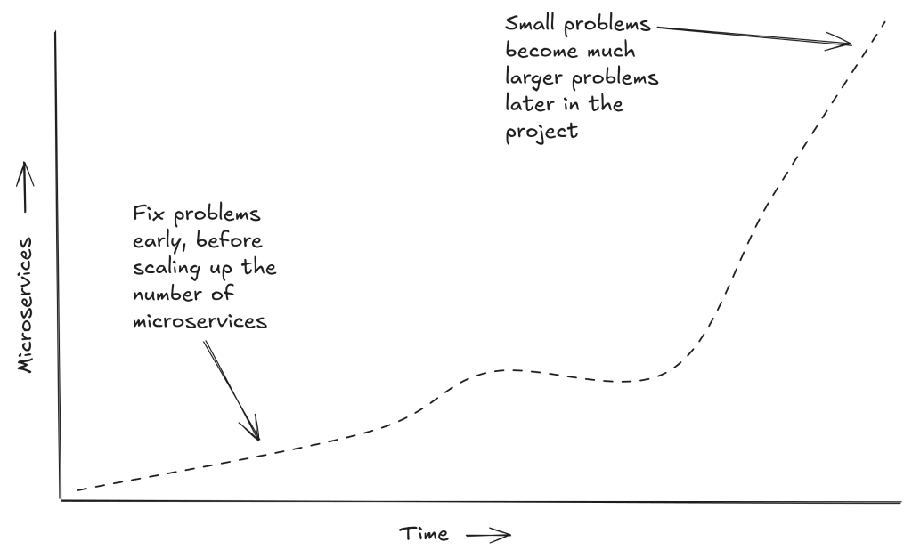
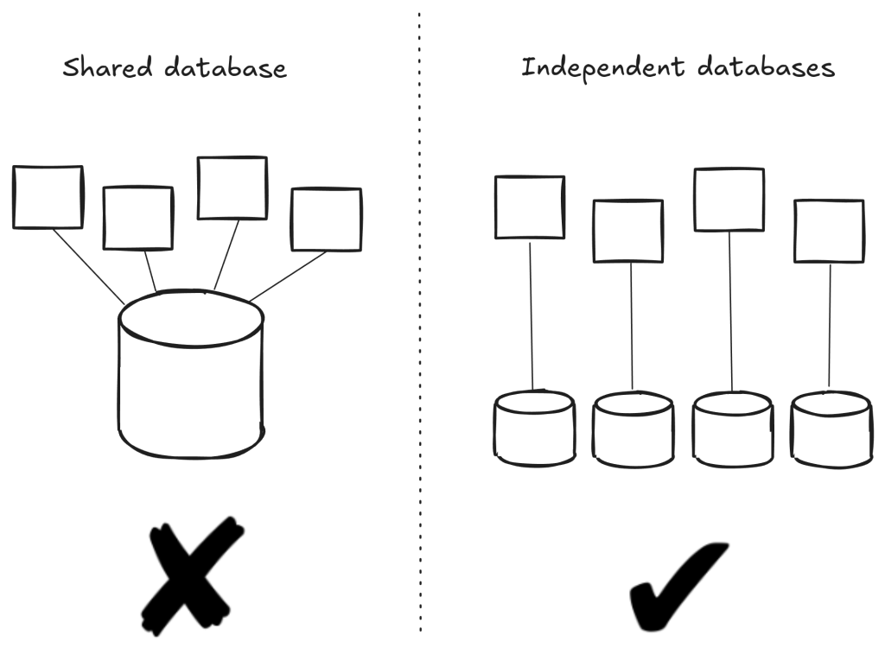
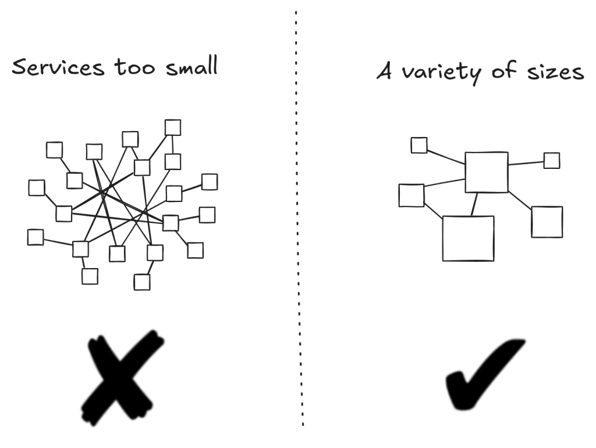
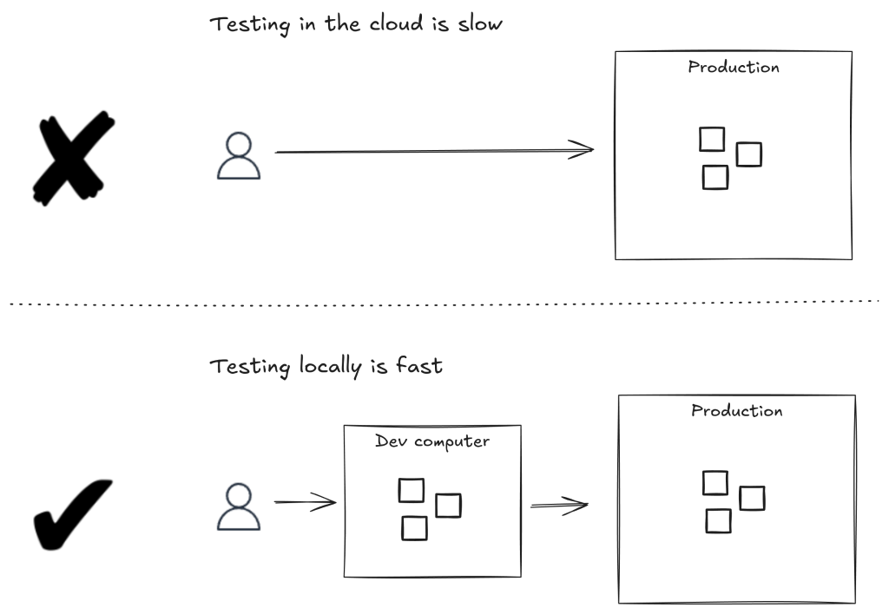
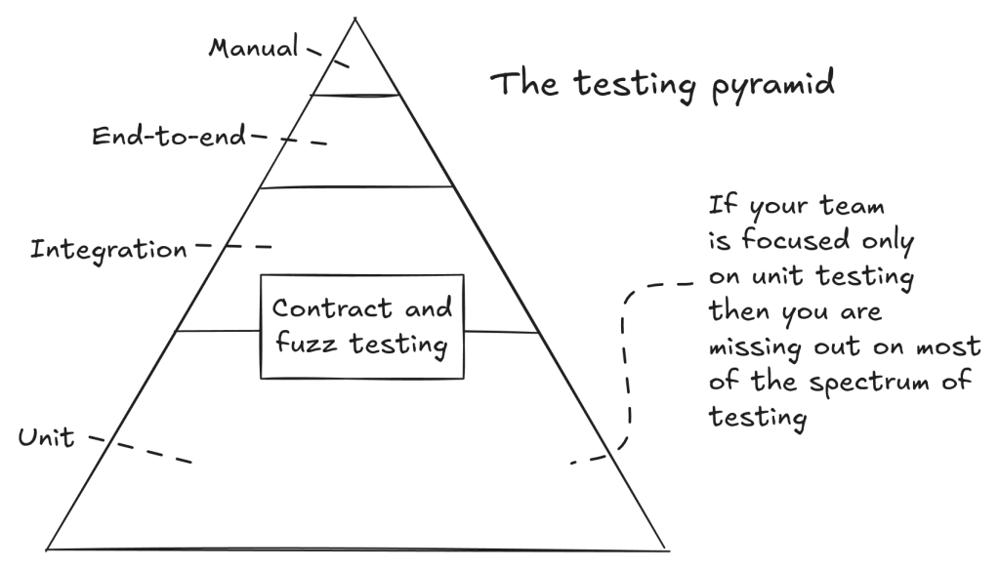

How To Fail at Microservices
============================
*Source: https://thenewstack.io/how-to-fail-at-microservices/*

Don’t hold off fixing problems until they become too big and difficult to manage.

Nov 1st, 2024 3:00am by [Ashley Davis](https://thenewstack.io/author/ashley-davis1/ "Posts by Ashley Davis")

Photo by [David Pupăză](https://unsplash.com/@davfts?utm_content=creditCopyText&utm_medium=referral&utm_source=unsplash) on [Unsplash](https://unsplash.com/photos/text-heNwUmEtZzo?utm_content=creditCopyText&utm_medium=referral&utm_source=unsplash).

No one wants to fail at microservices. No one sets out to do that. But it’s easy to do given the difficulty of microservices and the surprising number of ways we can fail.

I’m usually an advocate for microservices, at least where they are warranted and when implemented well. Usually, I teach cheaper, more straightforward, and more effective ways to use microservices, but in this article, I want to take a different tack. I will describe the many ways we can fail at microservices. Towards the end, we’ll look at what we can do to escape the hell we created (or maybe that we inherited).

The Myriad of Ways To Fail at Microservices
-------------------------------------------

There are many ways to fail at development. The following list is compiled from experience in the field. These are all real examples from real production applications.

I’m going to relate all of these problems to microservices. But I’ll concede that many are just ordinary development problems that have been turned up to 11 by microservices. Let’s get into it.

### Hold Off Fixing Problems

During development, especially when trying to move quickly, you may be tempted to put off fixing non-essential problems until later.

The longer you wait to solve problems with infrastructure, automated deployments, automated testing, code reuse, etc., the more entrenched these problems become and the harder they will be to fix. As you scale up the number of microservices, any problems you have will also scale up.

Mounting problems can eventually outpace your team’s capacity to fix them. At this point, you might complain about having an under-resourced team. If only you had addressed the most crucial problems before they spiraled out of control.

### Use a Shared Database

If there is only one fixed rule of working with microservices, it should be this: avoid using a shared database.

But maybe you missed the memo, and now all your microservices use the same database.

Now, you have no data encapsulation, high coupling between services, a single point of failure, and a scalability bottleneck.

Congratulations, you have circumvented many of the advantages of microservices.

### Make Your Microservices as Small as Possible.

It’s microservices, so we are supposed to make them as small as possible, right?

You might like to model your services on technical concerns (as opposed to business concerns). For example, you could create a microservice for each database query (I have actually seen it!).

You might have thought that a microservice-per-database query was a good way to separate your _data concerns_, but then you remember that it’s impossible because all your services share a single database.

Basing microservices on technical concerns results in unnecessarily small services with a growing cost to maintain them. With more smaller services, you’ll need more of them to make it work — making the overall application more complex than it needs to be because your services are more minor than they need to be. An increasing number of services creates an exponential increase in communication pathways and a much larger cost for network operations.

Microservices should be modeled on business needs and not on technical concerns. Each service should be the size the business needs, not smaller. Yes, this will mean you will have a range of sizes for your services, but so what — no one cares how big or small your services are.

### Use manual deployments

When someone new starts working​​ on your established microservices application and you find yourself explaining to them the instructions for manually deploying _each_ microservice, you should definitely know that things are not going well.

But maybe you don’t realize the negative impact of error-prone manual deployments on the development process. Your developers will be burning [time on avoidable](https://thenewstack.io/how-to-avoid-time-drifts-on-your-linux-servers-with-chrony/) problems.

Automated deployments are one of those things we have to get right early when there are only a handful of microservices. Waiting until you have hundreds of microservices makes it more difficult.

### Deploy All Microservices in Lockstep

Do you need absolute control over the deployment of your microservices application? Would you prefer that deployment work like it did when it was a monolith? Create a deployment pipeline (a manual one if possible) that deploys all microservices in lockstep simultaneously in bulk.

Great work. Now, you have a distributed monolith. It’s kind of like the worst of both worlds, and it destroys one of the most important benefits of microservices. When microservices can be deployed independently, as opposed to all at once, it decouples developers and teams, allowing them to release updates at their own pace without being deployed by the deployment process or other teams.

Independent microservice deployments are fast and can also be rolled back quickly. Lockstep deployments, on the other hand, are slow. Each one takes longer to test and deploy, and it’s more difficult to roll back when things go wrong.

The time it takes to organize, test, and deploy in lockstep decreases your ability to perform _continuous deployment_. Still, I’m guessing that the ability to respond quickly to customer demands isn’t a priority for you. I hope you have a great QA department. (But no one seems to have a QA department anymore).

### Make It Difficult To Test

Make it difficult for your development team to test their changes to really stunt their effectiveness. Of course, this is an easy trap to fall into when working in a [complex cloud environment](https://thenewstack.io/terraform-beta-supports-multicloud-complex-environments/), especially when there’s pressure to skimp on testing to get things done.

Reproducing complex configurations locally can be very difficult, so it’s easy to lose the ability to test locally and fall into the bad habit of having to deploy first before being able to test code changes.

Testing code changes locally is required for a fast development pace. When your developers are forced to test their code by deploying it (manually!) to dev, QA, test, or staging environments, they will move at a very slow pace.

With local testing, developers can make code changes and see results immediately, resulting in fast feedback and allowing for rapid experimentation to test new ideas and find fixes for problems quickly. Developers [testing their code in a cloud environment](https://thenewstack.io/how-to-choose-a-cloud-development-environment/) must go through the whole deployment process, even for minor experimental code changes. In the cloud (when running on someone else’s computer rather than their local development computer), it will also be significantly more challenging to debug any problems in the code, not to mention problems caused by your manual deployment process.

Local testing is essential for a fast development pace, but it’s not enough. Developers also need access to a realistic production-like testing environment. Ideally, they should be able to reproduce problems from customer bug reports in the same environment as the customer. Suppose that’s not possible for security or privacy reasons. In that case, they need systems and infrastructure to reproduce the production environment as closely as possible (minus any private or personal customer information) and as quickly as possible.

If your developers can’t easily reproduce customer problems, there will be a massive disconnect between the problems hurting customers and the problems the developers are chasing. If developers can’t precisely and reliably see the actual problems customers are having, they will spend time hunting the wrong problems.

### Focus Only on Unit Testing

Some teams seem to know only about unit testing, which is weird. Don’t they know there’s a whole spectrum of testing techniques?

If a hammer is your only tool, then every problem looks like a nail. If all you know is unit testing, you will debug many issues that would have been prevented if only you used a selection of testing techniques across the testing spectrum, from unit testing up to end-to-end and manual testing.

Also, although quick to run, unit tests are the most time-consuming tests to write and maintain. I believe that unit tests should be reserved for business logic. But that implies extracting your business logic from all the technical and presentation concerns — something you probably aren’t doing. If you want to unit-test anything, you are probably trying to unit-test _everything_, even the code that doesn’t deserve unit testing.

When you force your developers to spend all their time on unit tests, they simply won’t have the time to explore more time-efficient forms of testing. Good use of integration tests, end-to-end tests, contract tests, and snapshot/output testing gives a lot of coverage for much less effort.

Manual testing also still has an important place, and I would say you should not attempt to use automated testing when you don’t have a manual test plan for your product. It’s so cheap and easy to invest in a manual test plan that everyone can use; it’s much cheaper than automated testing. Personally, I still believe it’s necessary even after you are successful across the spectrum of automated testing.

### Have inadequate tooling

Any microservice application needs a lot of tooling. We need tooling for builds, deployments, managing services, infrastructure, testing, debugging, and observability. Suppose you lack sufficient tooling in these areas. In that case, it will cause a massive but difficult-to-see drain on your development team, who will be stumbling about in the dark just trying to understand what is happening, let alone how to fix problems.

Sometimes, we also need to build tooling when it doesn’t exist. Fortunately, big companies have mostly already done this for us, and plenty of good tooling is out there (Postman and Backstage come to mind). But when big companies haven’t provided for us, or if we are a big company, or if we are just trying to do something different or unique where some custom tooling would help… we need the skills and the motivation to build that tooling ourselves (and if we are friendly, release it as [open source for others to benefit](https://thenewstack.io/5-ways-that-open-source-benefits-api-management/)).

### Have Inadequate Skills

In addition to adequate tooling, we also need sufficient skills in using our tools, practicing development, and designing distributed applications.

Success with microservices requires a culture that strives for technical excellence and practices continuous improvement. If you don’t have that, you might struggle to get developers to the level of proficiency demanded by distributed applications.

### Make Everything as Complex as Possible

When you make everything as complex as possible (the architecture, the code, the development process), you impose a cognitive tax on your developers, causing them to burn unnecessary time on chores and busy work.

Have as many small services as you can so that any given coding task must be spread out over several services. Ensure the code in each service is spread out so that even making the slightest change requires following a web of interactions across files. Use broken and leaky abstractions so that any advantages from those abstractions are overwhelmed by the complexity they add.

When your process is unnecessarily complex, your development team will engage in a kind of _process theater_, where successfully navigating the complicated rules of the process trumps delivering value for the customer and the business. If your developers are constantly busy but producing little in the way of real value, maybe it’s time to reevaluate how your process is actually working.

Hopefully, I’d prefer things to be simple. Any modern application will tend towards complexity, but that doesn’t mean we can’t strive towards simplicity where possible. We should actively manage complexity, dividing it up into simpler parts and using good abstractions when that makes things simpler.

Believe it or not, microservices are intended to manage complexity. Used well, microservices don’t cause extra complexity; they help deal with the complexity that was going to be there anyway. But use microservices badly, and your problems will be compounded.

### Don’t Write Anything Down

According to [The Agile Manifesto](https://agilemanifesto.org/), working code is generally preferred over documentation. Isn’t this just a great excuse not to write documentation?

When an application gets complex, when no single person knows how it all works, when it’s difficult to understand how to test it, or when you want new starters to have a good time, documentation can be precious. But only if it’s consistent.

Without documentation, developers new to an application or a particular microservice (or haven’t been in those parts for a few months) must reverse engineer the code to understand how to update and test it. It’s not effective to have your developers do this time after time. Any developer who routinely creates or updates documentation helps future developers (and their future selves) get up and running more quickly each time they return to a subsystem or service.

You won’t be successful with documentation until it becomes an essential and valued part of your culture.

### Don’t Have a Plan for the Future

Ultimately, the best way to ensure that your application devolves into a distributed ball of mud is to have no viable plan for the future.

Don’t have a strategy for development. Don’t have a vision for the architecture. Don’t have a plan for managing technical debt. Indeed, don’t communicate the plan to the team. Don’t take feedback from the team on what’s wrong with the architecture, the code, and the development process.

Of course, the extreme opposite of not having a plan can be just as bad. A micromanaging control freak of an architect can be disastrous in other ways.

What’s needed is something between a solid architectural vision that is constantly adapted to reality and takes new input from the world and one that gives the developers the scope they need to make decisions and solve day-to-day problems while making consistent progress.

Do We Need Microservices?
-------------------------

Have I convinced you not to use microservices? Looking at the list of ways to fail at microservices (a reminder: I have seen all these failures in the wild recently), you might wonder why anyone would even consider using microservices at all.

This is a valid point. Microservices are going to cost a lot. Before adopting them, we must be able to articulate a good justification for them. If we can’t show how the benefits outweigh the costs, then we have no business using microservices. We also need a team with the skills, tooling, and architectural knowledge that microservices demand.

That said, microservices offer many benefits and valid use cases. Companies are already using microservices and failing in big ways. Using a monolith might not be appropriate, and converting from microservices back to moonlight might be infeasible. What else can we do?

Escaping Microservices Hell
---------------------------

There is hope if we are suffering from any or all of the above failures. There are concrete ways we can address these problems.

The first thing to understand is that it’s not all or nothing. [It’s not just a case of microservices vs. monoliths.](https://www.infoq.com/articles/monolith-versus-microservices/) There’s a spectrum of choice between these extremes, and positioning ourselves somewhere in the middle can give us the best of both microservices and monoliths.

The second thing to note is that nothing will change unless it is supported from an appropriate level in the organization. Sometimes, that means you [need to convince your fellow developers of the need for change, but more likely, you need to convince the architects and the managers](https://thenewstack.io/why-kubernetes-cluster-management-needs-to-be-easier-for-developers/) that there is a problem (or many problems, as the case may be). If the higher-ups don’t recognize the issues the team is facing or don’t understand the need for change, your drive for change will likely get you into trouble rather than helping the team.

That said, here are the ways to tackle the failures mentioned above:

*   Actively work on improving the developer experience for the team. Streamline and automate the development process where possible. Give your developers as much autonomy as possible. Listen to their feedback and permit them to fix the problems that are in their power to fix. Happy, efficient, effective, and _invested_ developers are the key to many improvements we need to make.
*   Fix problems early if you can. Don’t wait until you have already built 100s of microservices. But if not, you have to reserve time every day to make progress in improving the following areas: deployability, testability, debuggability, and observability.
*   Model your software based on business needs and customer problems; don’t model it based on technical concerns. Whatever state it’s in now… model any changes or additions in the right way before you make the change.
*   Don’t make your services too small. Use modeling to figure out an appropriate size rather than trying to make them as small as possible. Consider merging related services that feel too small or don’t pull enough weight alone.
*   Automated deployment must be fully automatic and extremely reliable. If not, this is the first thing you should fix so that the team does not spin its wheels on avoidable deployment issues.
*   Automated testing is very important for scaling the development of many services, and I’m not just talking about unit testing. Learn every testing technique you can and make sure the team is using the most effective suite of testing. Build your own testing tools for unique use cases, but only when the value delivered outweighs the cost of building them.
*   Rebuild your capability for local testing. You are in serious trouble if your developers can only reproduce the [software in the cloud for testing](https://thenewstack.io/top-5-trends-in-cloud-native-software-testing-in-2023/). Invest whatever time is necessary for your developers to reliably test their code changes and additions on their local computers before they _commit_ the code. If the system itself is too big to reproduce for local testing, you must find ways to produce parts of the system while mocking or simulating the rest.
*   Whether or not you are good at testing, debugging problems and figuring out how to fix them will consume considerable developer time. If you aren’t actively improving your application’s debugability and observability, it will probably be heading in the wrong direction. Buy or build the tools you need. Give your developers access to production or production-like environments. Find ways to make it easy for your developers to reproduce customer problems to give the developers the best chance to hunt the correct issues.
*   Don’t be afraid of documentation. Review and reward documentation with the same level of attention and appreciation as you do for code. Foster a culture of sharing knowledge. Realize that documentation isn’t just writing things down in a wiki; it can come in a variety of formats:
    *   There are good descriptions and readmes for each repo.
    *   Readable code and code samples.
    *   Test cases and test plans.
    *   Architecture decision records.
    *   Detailed annotated diagrams.
    *   Internal blog posts.
    *   Recording videos for the team to watch later.
*   Work towards a culture of technical excellence and continuous improvement. Being successful with microservices requires the use of many (wonderful) tools, and we need a team with high skill levels in all facets of distributed application development.
*   Actively simplify your application by striving to remove complexity that doesn’t pay for itself. Work constantly to reduce or remove unnecessarily complex code, architecture, or processes. This reduces the cognitive tax on the developers in their day-to-day work: you want them to solve customer problems, not problems from unnecessary complexity. Refactoring (supported by solid testing) should be a daily ritual for each developer. If they aren’t doing this, you aren’t heading towards a more straightforward, manageable system. Instead, you are heading to an ever more complex and unmanageable system.

Ultimately, we must ask ourselves: _Do microservices make it easier for our developers to safely and reliably get helpful and valuable features and fixes into production?_ 

The purpose of a microservices architecture is to reduce deployment risk. It works by dividing up our deployments into small parcels. Because each parcel is small, it is easier to understand, easier to test, and easier to deploy independently. It’s also easier to roll back when things go wrong.

If, instead, microservices make deployment more difficult for you, it means you are probably using them the wrong way, and maybe you are making some or all of the mistakes I have outlined. If you are unwilling to invest the time and energy required to get microservices right, maybe using a monolith is the right choice for you. If that’s not feasible, consider using a hybrid model with various service sizes, from monolith to microservices, depending on your needs.

The Most Important Way to Ensure Success
----------------------------------------

If you don’t have a strong vision or plan for your application, it could mean you are heading in the wrong direction. Or worse, each developer has a separate direction.

Any plan you have must be updated continuously to adapt to the unfolding reality. Involve the team in creating and updating the plan; that’s the best way for everyone to become invested in it. Communicate the plan to stakeholders and ensure management understands why it is essential.

Everyone has to be on board. Someone has to champion the vision for the architecture and bring everyone into agreement on it. It’s not enough just to document the existing architecture; there needs to be a plan for the future, and it needs to be spearheaded by someone who isn’t afraid to get into the nuts and bolts of the system and understand the details of how it works. Bigger-picture knowledge is built from lower-level knowledge.