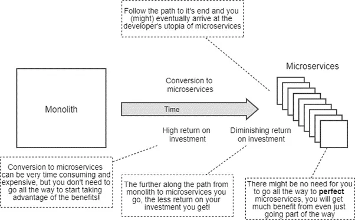
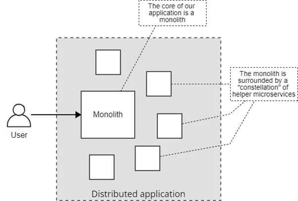

The False Dichotomy of Monolith vs. Microservices
=================================================
*Source: https://www.infoq.com/articles/monolith-versus-microservices/*

Nov 02, 2023 14 min read

by [Ashley Davis](/profile/Ashley-Davis/)

reviewed by [Thomas Betts](/profile/Thomas-Betts/)

### Key Takeaways

*   Microservices are the cure to, rather than the cause of, complexity. All applications will become complex; beyond a certain point, microservices will help us manage that complexity.
*   Microservices come with costs and benefits. If the benefits don’t outweigh the costs, you won’t have a good time with microservices.
*   There is no such thing as monolith vs. microservices. There is actually a spectrum of possibilities between them. If you have pegged yourself at either extreme of the spectrum, you are missing out on the wide variety of architectures in the middle.
*   We can stop our journey to microservices somewhere in the middle of the spectrum, what I like to call the hybrid model. At this point, we might have some big services mixed up with some smaller services. We can have the best of both worlds: the simplicity and convenience of the monolith combined with the flexibility and scalability of microservices.
*   We should stop talking about monolith vs. microservice and instead have a more nuanced debate about right-sized services.

The ongoing war: monolith vs. microservices
-------------------------------------------

> "In many ways, microservices is a zombie architecture. Another strain of an intellectual contagion that just refuses to die. It’s been eating brains since the dark days of J2EE (remote server beans, anyone??) through the WS-Deathstar nonsense, and now in the form of microservices and serverless."  
> \-- David Heinemeier Hansson ([source](https://world.hey.com/dhh/even-amazon-can-t-make-sense-of-serverless-or-microservices-59625580))

With the [recent blog post from AWS](https://www.primevideotech.com/video-streaming/scaling-up-the-prime-video-audio-video-monitoring-service-and-reducing-costs-by-90) saying they have ditched microservices and returned to the monolith, the old war of monolith vs. microservices has reignited.

What’s your position on this? Are you team microservices or team monolith? What if I told you the distinction was something of a fantasy and that people are fighting over a fiction: _microservices vs. monolith_ is just one part of the bigger story.

The article from AWS has been taken as evidence that the company (as a longtime proponent of microservices) has backflipped on microservices and gone back to the monolith.

Despite the title of their blog post being calculated to get attention, the article seems to be about their conversion from _functions as a service_ to what is now arguably a microservices architecture, if not a distributed application with services that are larger than _micro_ (however you define micro).

But the point I’d like to make is that it doesn’t really matter. This is just one team at AWS acknowledging that their first attempt at an architecture didn’t work out (over time), so they tried a different architecture, and it worked better. But so what? From what I have seen in my career, this is just the normal way that good software development should work.

We all want to focus on what’s most important; doing the right thing for our customers. Taking sides in the debate of microservices v. monolith gets in the way of that. Sometimes, we need microservices. Sometimes, we need a monolith. (I’m not yet convinced I’ll ever need FaaS -- but I’m keeping an open mind). Most of the time we are better off somewhere between these extremes.

Why do we fear microservices?
-----------------------------

Sure, microservices are more difficult to work with than a monolith -- I’ll give you that. But that argument doesn’t pan out once you’ve seen a microservices architecture with good automation. Some of the most seamless and easy-to-work-with systems I have ever used were microservices with good automation. On the other hand, one of the most difficult projects I have worked on was a large old monolith with little to no automation. We can’t assume we will have a good time just because we choose monolith over microservices.

Is the fear of microservices a backlash to the hype? Yes, microservices have been overhyped. No, microservices are not a silver bullet. Like all potential solutions, they can’t be applied to every situation. When you apply any architecture to the wrong problem (or worse, were forced to apply the wrong architecture by management), then I can understand why you might passionately hate that architecture.

Is some of the fear from earlier days when microservices were genuinely much more difficult? Ten years ago, microservices did make development significantly more difficult. But the tools and platforms have come a long way since then. It’s easier than ever before to create good automation that makes working with microservices a much more seamless and enjoyable experience.

Maybe some of the fear comes from the perceived complexity. I do think this is a big part of it. People naturally fear (or at least avoid) complexity. I say _perceived complexity_ because it’s not just microservices that get complex. Every monolith will become complex as well -- you just have to give it some time. Whereas with microservices, the complexity is just out there for all to see, and we have to deal with it early. In my book, Bootstrapping Microservices, I call this _bringing the pain forward_ in the development process so that it’s easier and cheaper to deal with.

Unfortunately, it’s not possible to hide from complexity in modern software development. Our applications are growing larger and more complex -- even the humble monolith is destined to become more complex than any single person can handle.

We can’t avoid complexity in large-scale modern development. We need tools to help us manage the complexity so that it doesn’t slow our development process or overwhelm us.

Why do microservices seem so difficult?
---------------------------------------

> "You must be this tall to use microservices."  
> \-- Martin Fowler ([source](https://martinfowler.com/bliki/MicroservicePrerequisites.html))

Building distributed applications, not just microservices, requires higher technical proficiency. Managing a fleet of many services instead of just one means we must have tools to automate system management. There’s also a lot to keep track of, just trying to understand what our services are doing. The communication between services becomes exponentially more difficult to understand the more of them we have.

Suppose you are a small team or small project. In that case, if you are applying microservices to a situation where they aren’t warranted, or if you aren’t willing to pay down the investment in skills and technology required to build and run the distributed system, you can’t expect to have a good experience with it.

Another possible pain point is not aligning your services appropriately with the domain. I have seen microservices applications aligned with technological rather than business needs -- leading to too many services and an avoidably overwhelming system to manage. There is such a thing as making your services too small, unnecessarily increasing the complexity and difficulty of managing the system.

If you can’t align your architecture correctly with your domain, you will have massive problems irrespective of whether you are using a monolith or microservices -- but those problems will be massively amplified the more services you have. Microservices aren’t just good for scaling performance; they will also scale up whatever problems you already have.

Is it just a scaling problem?
-----------------------------

> "If you can’t build a monolith, what makes you think microservices are the answer?"  
> \-- Simon Brown ([source](https://plainoldobjects.com/2016/03/01/thoughts-on-if-you-cant-build-a-well-structured-monolith-what-makes-you-think-microservices-is-the-answer/))

Is the real problem with microservices just that they scale up our existing problems?

A bad microservices implementation will be at least X times worse than a bad monolith, where X is the number of services in your distributed application. It’s even worse than that, given the exponentially increasing communication pathways in a distributed application.

If you don’t have the tools, techniques, automation, process, and organization that work for your monolith, what makes you think you can scale up to microservices? You need to get your house in order before you can scale up.

**Microservices don’t just scale for performance and the dev team; they also scale in difficulty. If you struggle to build and maintain a monolith, scaling to microservices isn’t going to help you.**

A microservices application is just a monolith, but with the number of services dialed up and the sizes of the services dialed down. If you are struggling with a monolith and think microservices are the answer, please think again.

I think that microservices are not just scalable for performance and development; they are also scalable in difficulty. Microservices come with benefits, but they aren’t without their costs.

The cost of microservices
-------------------------

> "Microservices are not a free lunch."  
> \-- Sam Newman (from Building Microservices)

What are microservices really about? Why would we divide our application into separate services?

There are a bunch of well-known benefits:

*   Scalability
    *   Performance
    *   Dev team
*   Fault tolerance
*   Independent (and less risky) deployment for rapid development cycles
*   Developer empowerment
*   Designing for disposability
*   Managing complexity

But the benefits aren’t the whole story. There are also costs that must be paid:

*   A higher level of technical skill
*   Better automation, management, and observability systems
*   Dealing with the scaleable difficulty

For any tool, technology, architecture, or whatever we want to use, we must ask ourselves the question: _Do the benefits outweigh the costs?_ When the benefits outweigh the costs, you will have a good experience using that technology. When they don’t, you will have a bad time.

Managing complexity
-------------------

> "Microservices enable the continuous deployment of large, complex applications."  
> \-- Chris Richardson ([source](https://microservices.io/post/microservices/general/2019/02/16/whats-a-service-part-1.html))

Microservices have a ton of benefits, but the real reason we should use them is because they can help us manage the growing complexity of our application.

That’s right, you heard it here: microservices are not the cause of, but the cure to, complexity.

All applications will become complex; we can’t avoid that even if we are building a monolith. But microservices give us the tools to break up that complexity into smaller, simpler, and more manageable chunks.

**Microservices help us manage complexity by breaking it into simple yet isolated pieces. Yes, we can do this with the monolith, but you need a disciplined and proactive team to keep the design intact and not degenerate into a big ball of mud.**

We can use microservices to create abstractions and componentize our software. Of course, we can do this kind of thing with a monolith. Still, microservices also give us hard and difficult-to-breach boundaries between components, not to mention other important benefits like independent deployments and fault isolation.

The spectrum of possibilities
-----------------------------

> "There is not one architectural pattern to rule them all."  
> \-- Dr. Werner Vogels ([source](https://www.allthingsdistributed.com/2023/05/monoliths-are-not-dinosaurs.html))

I asked you a question at the start of this article. Are you team microservices or team monolith?

Returning to this article's title, it’s not a one-or-the-other choice. There’s a sliding scale from one big service (the monolith) to many tiny services (microservices) with many other viable choices in between.

**It’s not just monolith vs. microservices; there’s a whole spectrum of different possibilities. If you fix yourself to either team monolith or team microservices, you are missing out on the rich variety of architectures in between.**

You don’t have to artificially align yourself at either end of this spectrum. You don’t even have to peg yourself to any particular position within it. **Despite** what some people want you to think, there is no right position. The location you choose must be appropriate for your team, business, project, or customers. Only you can decide where you should be on the spectrum of possible architectures.

A diminishing return on investment
----------------------------------

The benefits from microservices will come as you move to the right on the spectrum of possibilities. But moving to the right also has costs and difficulties. We need to be sure that the cost of moving toward microservices is one that we are willing to pay.

If you aren’t trying to manage complexity, don’t need the other benefits of microservices, or are struggling to manage the automation and technology for a single service, you should be sticking as close as possible to the monolith on the left side of the spectrum. To the extent that you need microservices, you should be moving closer to microservices on the right side of the spectrum.

**It might not be worth pushing all the way to the developer’s utopia of microservices due to a diminishing return on investment, but going part of the way there can yield a high return on investment.**

It’s important to realize at this point that we don’t need to reach (what I like to call) _the developer’s utopia of microservices_ to start getting the benefits of them. Any amount of movement we make toward the right-hand side of the spectrum will bring tangible benefits even if we don’t reach all the way to the other side!

There are good reasons why we don’t want to push all the way to _perfect_ microservices. (For a start, who gets to decide what _perfect_ means?) As we start pushing toward the right, we’ll start to see big payoffs. But as we continue to push further, there will be a _diminishing return on investment_. The more we push toward smaller services, the more the cost will outweigh the benefits. In the real world (it’s messy and complicated out there), it’s difficult, not to mention unnecessary, to achieve anyone’s notion of perfect microservices. But that doesn’t mean moving in that general direction doesn’t help.

The hybrid model
----------------

If we don’t need to push all the way to microservices, then where do we stop? The answer is _somewhere in the middle_ where there is a set of trade-offs that improve our development speed and capability, and where the cost of development does not exceed the benefits.

I like to think of _somewhere in the middle_ as _the best of both worlds_. Yes, we can have a monolith (or multiple monoliths) surrounded by a constellation of microservices. Am I some kind of heathen that I take this pragmatic position? The practical benefit is that I can mix and match the monolith’s benefits with the microservices’ benefits. The convenience and simplicity of the monolith for much of the codebase, and the flexibility, scalability, and other benefits of microservices that I can leverage when I need them make for an ideal environment. I can also incrementally excavate individual microservices from the monolith whenever it becomes apparent that certain features or tasks can benefit from doing so.

The hybrid model isn’t a new idea. It is what the real world often looks like (_somewhere in the middle_), despite the arguments that continue to rage online.

David Heinemeier Hansson (very much in team monolith) even [seems to like the idea](https://blog.appsignal.com/2020/04/08/the-citadel-architecture-at-appsignal.html), which he calls _The Citadel Architecture_.

Does size really matter?
------------------------

> "Perhaps ‘micro’ is a misleading prefix here. These are not necessarily ‘small’ as in ‘little.’ Size doesn’t actually matter."  
> \-- Ben Morris ([source](https://www.ben-morris.com/how-big-is-a-microservice/))

The smaller our services, the more _micro_ they are, the less useful they will be, and the more of them we’ll need. The level of difficulty goes up as we reduce the size of our services and increase the number of them.

Maybe we should stop focusing on the "micro" part of microservices. I think it’s causing people to make their services way too small -- and that’s a guarantee to have a bad time with microservices.

I’m not sure how we even got so fixated on making them as small as possible. The intention is to be able to split up our software into pieces, separating the responsibilities, where each of the parts is simpler than the whole, thus making it easier to manage the overall complexity of the system. But when we make our services too small, we risk being swamped by the complexity instead of managing it.

Even though everyone seems to have their own idea of how big or small a microservice should be, the reality is that there is _no fixed size_ that a microservice should be. The "microservice police" aren’t out patrolling for offenders.

So let’s stop arguing about the size of our services and instead start talking about "right-sized" services, that is to say, whatever the right size is for our situation -- monolith-sized or somewhere over on the smaller end of the spectrum. Our services, no matter how big or small, should be organized around our business and appropriate to our domain. The size is almost an afterthought; it’s the overall organization that is important.

It’s not about making our services as small as they can be. Beyond a certain point, making your services smaller is counterproductive. The smaller they are, the more they must communicate with the rest of the system to get work done. The more they communicate, the more we’ll pay the _network transfer_ cost. Not to mention that it becomes much more difficult to understand who is talking to whom. We need a good balance between service size and how _chatty_ our services are (thanks to Damian Maclennan for bringing me the term _chatty_).

Choose a size for your services that’s meaningful to you. It doesn’t matter if some services are bigger than others. Please don’t let your OCD decide on service size–that can get in the way of what could have been great architecture. There’s nothing inherently right or wrong about making them bigger or smaller, so long as you find something that works for you.

Don’t be afraid to change your mind
-----------------------------------

> "Just to be honest -- and I’ve done this before, gone from microservices to monoliths and back again. Both directions."  
> \-- Kelsey Hightower

Sometimes, we have to try new things to understand whether they are a good fit for our project. So don’t be afraid to try new technologies. Don’t be scared to try microservices or the hybrid model to see if it works.

But later, don’t be afraid to change your mind and roll back whatever previous decisions you have made. It’s not bad to admit that something hasn’t worked out. That’s exactly what we need to do to find success. Try different things, do various experiments, and move on from the ones that didn’t work out. Because microservices didn’t work out for you on a particular project doesn’t mean they are a bad choice for other teams or projects.

Or better yet, just keep an open mind. That’s the best way to not shut yourself off from new ideas and new thinking that could be what you need to truly shine in your next project.
