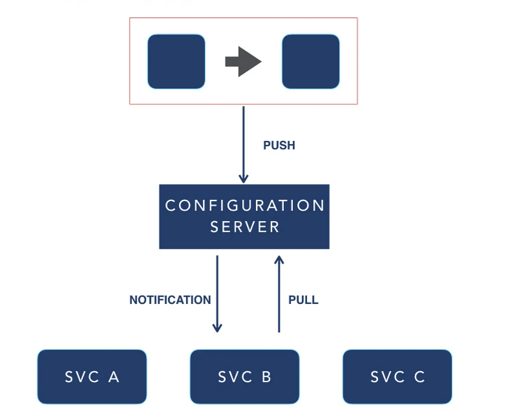

Centralized Configuration
======================================================
Source: https://simonatta.medium.com/centralized-configuration-d8150a20774d

[Simon Ghobreil](/@berrayana?source=post_page-----eb295f076939--------------------------------)

Nov 14, 2021

Why do we need such a centralized configuration management ?

In the microservices world, basically, each bounded context is implemented as separate microservices and scaled independently one from others.

Briefly, that means numerous services each having its own configuration. And as you guess, management of these configurations manually and independently is a cumbersome work.

For example, if a timeout value is to be increased then you must change the relevant property in all configurations of the deployed service; and worse, if the property is to be applied to several services that change may need to be applied to hundreds of configurations. That’s really quite awesome. You can think of this scenario using the following simple microservice arcitecture diagram.

So the config server solution comes to play to resolve this problem by the way of keeping all the configuration in one place and serving them to all services on demand.

That means centralizing all the application configuration in one place and that again means changing a configuration property would be applied once in the data store of the config server regardless of the count of services deployed; saves your time and so the money.

Another benefit gained from the config server solution is that you can easily refresh a property by changing it in one place and apply it to the application on runtime without need a restart of all the instances of the services. Yes, that’s exactly perfect.

Looking for a solution
It would be possible to leverage the standard DevOps tools like Puppet, Chef or Ansible to manage the configuration files on each of the deployed nodes. For bare metal deployments or when deploying on virtual machines in the cloud, these tools could do a decent job. For updating a handful of configuration files inside of a Docker container, Puppet, Chef or Ansible just seem too heavy. Needless to say that these tools would not be usable when considering serverless architecture.

When searching for a solution, we came across the confd, consul-template ,vault and spring cloud config server projects. All tools are based on the same principle. First, the values of the configuration options are persisted in a backend store. While consul-template can store values in Consul only, confd supports a host of different backends like Consul, etcd, Redis or DynamoDB. Second, a set of templates on the filesystem is populated with the values from the backend store and hence forming valid configuration files. These configuration files are then consumed by the application. We drew a great deal of inspiration from this approach.

Microservices
{: .label }

Centralized Configuration
{: .label }

Architecture
{: .label }