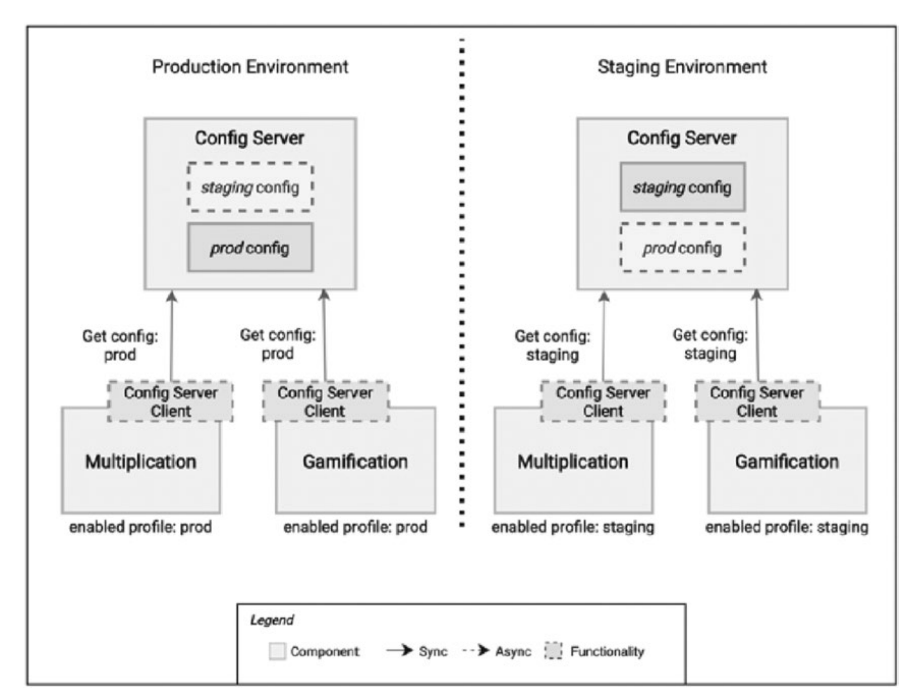

# Configuration
Unlike a monolithic app in which everything runs within a single instance, a cloud-native application consists of independent services distributed across virtual machines, containers, and geographic regions. Managing configuration settings for dozens of interdependent services can be challenging. Duplicate copies of configuration settings across different locations are error prone and difficult to manage. Centralized configuration is a critical requirement for distributed cloud-native applications.

the Twelve-Factor App recommendations require strict separation between code and configuration. Configuration must be stored externally from the application and read-in as needed. Storing configuration values as constants or literal values in code is a violation. The same configuration values are often be used by many services in the same application. Additionally, we must support the same values across multiple environments, such as dev, testing, and production. The best practice is store them in a centralized configuration store.

all your microservices could have a lot of common configuration values per environment.A better approach is to put this configuration in a common place in your system and 
make the applications sync its contents before they start. Then, you keep a centralized 
configuration per environment, so you need to adjust the values only once. this is a well-known pattern, known as externalized
(or centralized) configuration, so there are out-of-the-box solutions to build a centralized 
configuration server.

## Samples
* [Multiplication Microservices Example](https://github.com/books-java/Learn-Microservices-with-Spring-Boot-3)