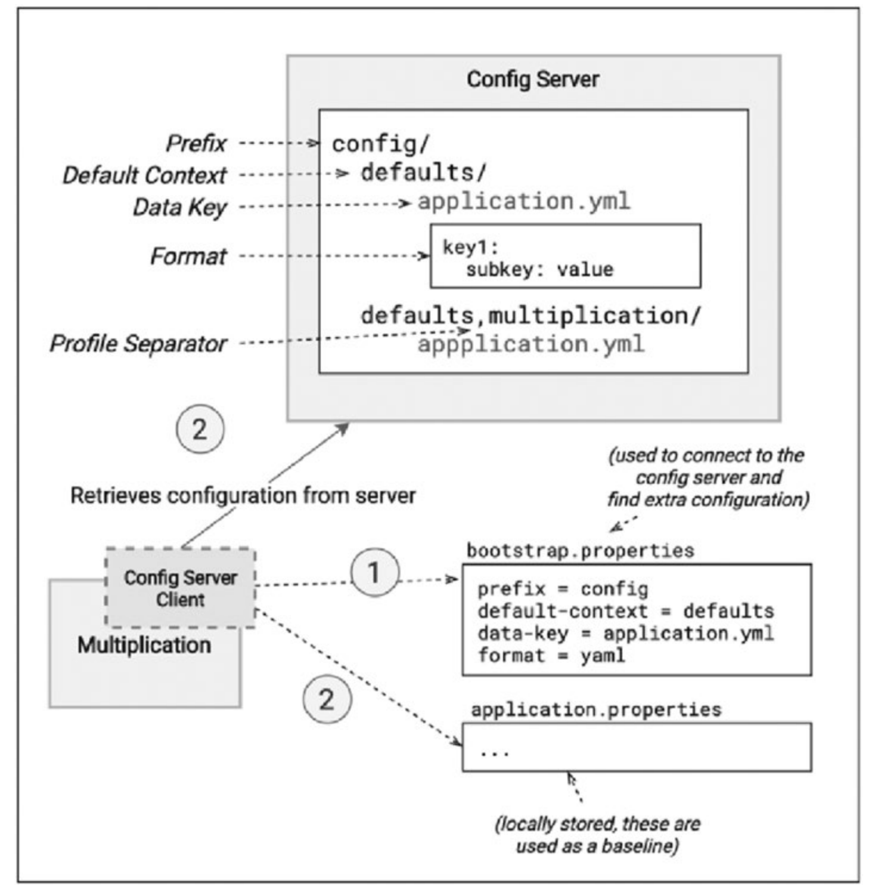
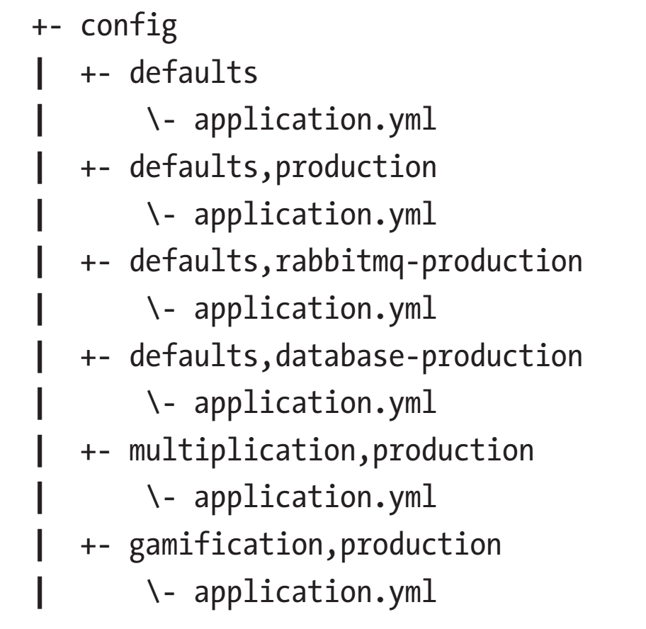
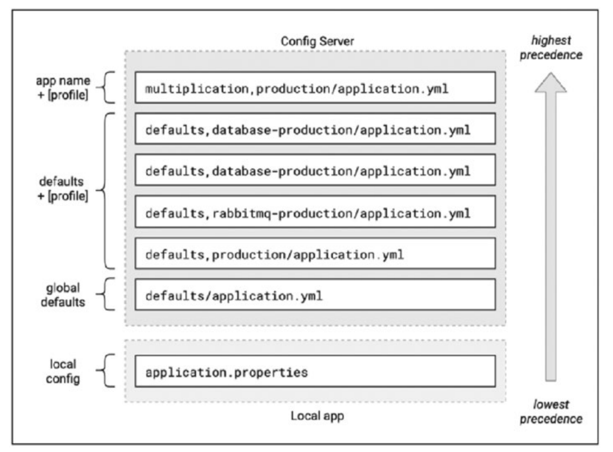

# Consul KV
Consul KV, a feature included in the default Consul package. Consul KV is a simple, distributed key-value store that can 
store configuration data, metadata, and other small pieces of information to be shared across a cluster. 

When you set up Consul as a cluster, this feature also benefits from replication, so 
there is less risk of data loss or downtime due to services being unable to get their configuration.

## Integration with Spring Cloud
Spring Cloud also has an integration with this tool to implement a centralized configuration server. You use this approach to reuse components and keep 
your system as simple as possible, with Consul combining service discovery, health checks, and centralized configuration

The Spring Cloud project that implements centralized configuration with Consul KV is 
Spring Cloud Consul Configuration. To use this module, you need to add a new Spring 
Cloud dependency to your projects: spring-cloud-starter-consul-config.
```xml
    <dependency>
        <groupId>org.springframework.cloud</groupId>
        <artifactId>spring-cloud-starter-consul-config</artifactId>
    </dependency>
```
This artifact includes autoconfiguration classes that will try to find the Consul agent and 
read the corresponding KV values at an early stage while booting up your application, 
the special “bootstrap” phase. It uses this phase because you want Spring Boot to apply 
the centralized configuration values for the rest of its initialization (e.g., to connect to RabbitMQ).

Spring Cloud Consul Config expects each profile to map to a given key in the KV
store. Its value should be a set of Spring Boot configuration values, in either YAML or plain format (.properties).
You can configure a few settings that help your application find the corresponding 
keys in the server. These are the most relevant ones:
* Prefix: This is the root folder in Consul KV where all profiles are stored. The default value is config.
* Format: This specifies if the value (the Spring Boot configuration) is in YAML or properties syntax.
* Default context: This is the name of the folder used by all applications as common properties.
* Profile separator: Keys may combine multiple profiles. In that case, 
you can specify the character you want to use as a separator (e.g., with a comma prod,extra-logging).
* Data key: This is the name of the key that holds the properties or 
YAML content.


```
spring.config.import=consul:
spring.cloud.consul.config.enabled=true
spring.cloud.consul.config.prefixes=config
spring.cloud.consul.config.format=yaml
spring.cloud.consul.config.default-context=defaults
spring.cloud.consul.config.data-key=application.yml
```
you’ll have a defaults folder, which may contain a key named application.yml with the configuration that applies to all your microservices. 
You can have extra folders per application, or per combination of application and profiles that you want to use, and each of them may contain the application.yml key with the properties that should be added or overridden

as an example configuration structure in the configuration server consider

Then, if you run the Multiplication application with a list of active profiles equal to 
production,rabbitmq-production,database-production, the processing order would 
be the following (from lower to higher precedence):
1. The baseline values are included in the local 
application.properties of the project that is accessing the 
configuration server, in this example Multiplication.
Then, Spring Boot merges and overrides the remote values 
included in the application.yml key inside the defaults folder, 
because it applies to all the services.
3. The next step is to merge the default values for all active profiles. 
That means all files that match the defaults,{profile} pattern: 
defaults,production, defaults,rabbitmq-production, 
defaults,database-production. Note that, if there are multiple 
profiles specified, the last one’s values win.
4. After that, it tries to find more specific settings for the 
corresponding application name and active profiles, following 
the pattern {application},{profile}. In this example, the 
key multiplication,production matches the pattern, so its 
configuration values will be merged. The precedence order is the 
same as before: the last profile in the enumeration wins.

a visual representation that will help you understand how all the 
configuration files are applied.



A practical approach to structure configuration values could be as follows:
* Use defaults when you want to add global configuration to all the 
applications for all the environments such as when customizing 
JSON serialization.
* Use defaults,{profile} with a profile name representing a {tool}-
{environment} pair to set up common values for a given tool per 
environment. For example, in this case, RabbitMQ connection values 
could be included to rabbitmq-production.
* Use {application},{profile} with a profile name equal to 
{environment} to set up specific settings for an application in a 
given environment. For example, you could reduce logging of the 
Multiplication microservice on production using properties inside mu
ltiplication,production.

Spring Cloud Consul counts with a retry mechanism by default,so your applications will keep retrying the connection to Consul when it’s not available. 
This dependency is only at starting time; if Consul goes down while your applications are running, they keep working with the configuration loaded initially.

**Consul Configuration and Tests**

By default, the integration tests in your 
projects will use the same application configuration. That means your controller 
tests and the default @SpringBootTest created by the Initializr will fail if 
Consul is not running because they keep waiting for the configuration server to 
be available. You can disable Consul Config for tests easily;
```yml
# Disable Consul Config for tests. Search for the `TestPropertySource`
# annotation to find out which tests require this.
spring.cloud.consul.config.enabled=false
```

## Examples

## Samples
* [Multiplication Microservices Example](https://github.com/books-java/Learn-Microservices-with-Spring-Boot-3)