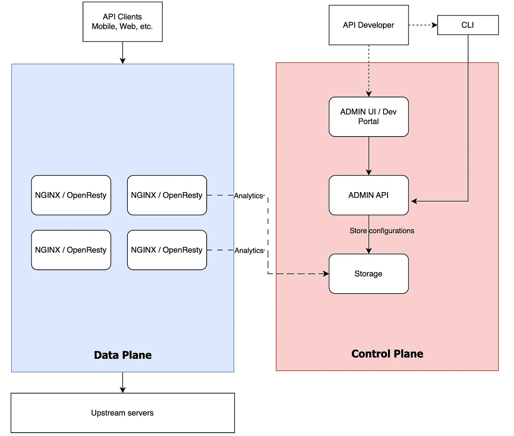
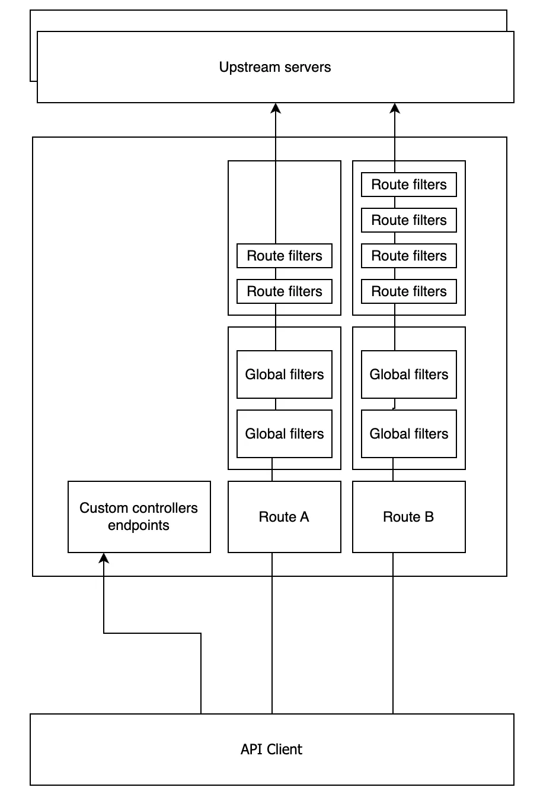
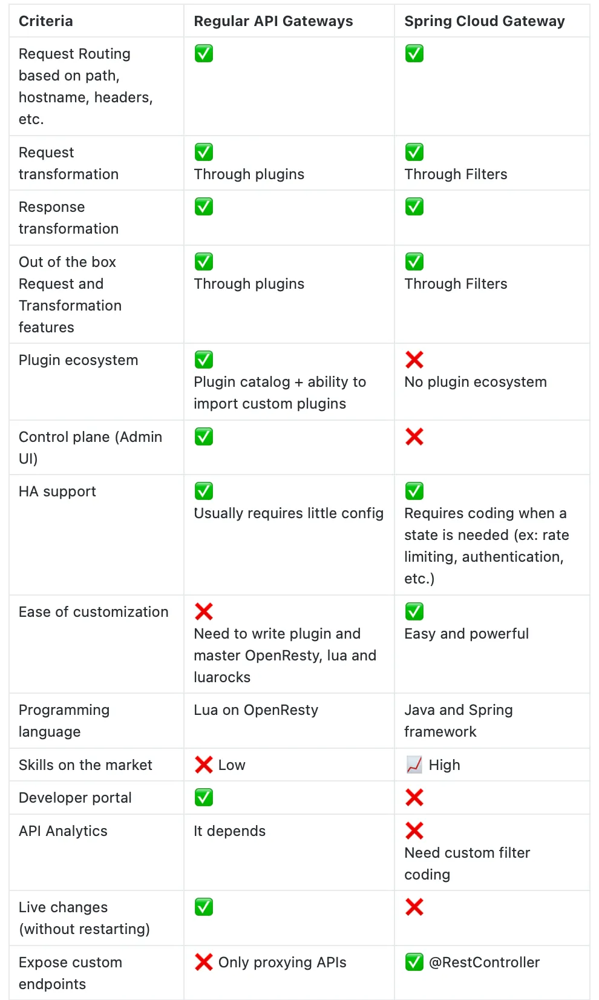

Selecting the right open-source API Gateway technology
======================================================
Source: https://medium.com/@berrayana/selecting-the-right-open-source-api-gateway-technology-eb295f076939

[Houcem Berrayana](/@berrayana?source=post_page-----eb295f076939--------------------------------)

Oct 26, 2023

I was tasked with setting up an API gateway to protect the APIs of a backend server. The requirements were divided into two types: standard requirements and custom requirements. While any API Gateway should address the standard requirements using various plugins, meeting the custom requirements might involve additional engineering and analysis. This article aims to assist in choosing the appropriate API Gateway technology for securing your backend workloads.

The requirements
================

The Backend server acts as an OAuth2/OIDC resource server and in the front end we had an SPA application based on React JS.

Our expectation from the API Gateway was:

1.  OIDC/OAuth2 client: The API Gateway must act as an OAuth2 confidential client. It should manage the authentication flow and maintain the Access, ID, and Refresh tokens
2.  Session management: Tokens acquired as part of the OIDC login flow should be maintained in a web session.
3.  Token relay: Whenever a new request comes from the front-end applications, the access token should be extracted, and then added to the request sent to the backend server.
4.  Token refreshing: expiring access tokens must be refreshed using the cache refresh token automatically by the API Gateway.

In a few words, we expect the Gateway to behave like any traditional OAuth2 client.

The above requirements are pretty standard because they are around OIDC client implementation. To make things more complicated, here are extra requirements that require specific customizations:

1.  User Agent parsing and Mobile vs Web channel detection. This logic happens based on different attributes including HTTP requests.
2.  Handle differences in login flow between mobile and web. Mobile applications perform login in a separate browser window while leaving the app screens below the browser window. The web application performs a full browser redirect.
3.  Sync from the backend the list of active mobile versions and block the requests coming from disabled mobile versions
4.  Implement a custom “Login with Fingerprint” flow that is based on OAuth2 refresh tokens.
5.  Other: send usage analytics, observability, tracing, etc.

When selecting an API Gateway technology, we have many options. We are choosing a free and open licensed API Gateway. This eliminates choices like Kong and Tyk and other similar tools.

That being said, two potential technologies are still matching our selection criteria: OpenResty-based gateways and Java-based API gateways.

Available technologies
======================

OpenResty based Technology
--------------------------

OpenResty is a kind of platform that lets you program on top of Nginx. It uses Lua scripts as a scripting language. These scripts are Just in Time compiled thanks to the [LuaJIT](https://luajit.org/) compiler. OpenResty was the engine behind many API gateway technologies such as:

1.  **Kong**: Kong is one of the most popular API gateway solutions built on top of OpenResty. It provides various features like routing, security, analytics, and transformations. Kong can be extended using Lua for custom logic and plugins.
2.  **3scale (Red Hat)**: 3scale, now part of Red Hat, offers an API management platform that includes an API gateway. While not explicitly based on OpenResty, it does allow you to use Nginx as a component for its API gateway functionality.
3.  **APISIX:** APISIX is an open-source API gateway that is based on OpenResty and comes with prebuilt plugins and a dashboard.

Speaking about Lua, it’s a lightweight, embeddable scripting language. It’s very common to encounter Lua in Proxy-based platforms such as OpenResty, Envoy Proxy, and others. The reasons behind such a choice:

1.  **Performance**: Lua is known for its high performance, particularly when used with LuaJIT (Just-In-Time compiler). This makes it well-suited for situations where low latency and high throughput are critical, such as handling API requests in real time.
2.  **Embeddable**: Lua is designed to be easily embedded into other programming languages and applications.
3.  **Lightweight**: Lua is a lightweight language, both in terms of its implementation and its resource requirements. That makes it an excellent choice for systems where memory usage and efficiency are important considerations.
4.  **Safety and Isolation**: Lua provides a level of isolation and sandboxing, which can be valuable for ensuring that custom scripts or logic do not adversely affect the stability and security of the underlying system. That is important in the context of API Gateways.

Java-based API Gateways
-----------------------

when talking about Java-based API Gateways 2 technologies come to our minds:

**Netflix Zuul:** Netflix Zuul is an open-source API gateway and edge service that is part of Netflix’s larger set of open-source projects known as Netflix OSS (Open Source Software). Zuul is designed to handle various tasks related to routing, filtering, and load balancing for microservices and web applications. It’s primarily used for building scalable and secure API gateways in a microservices architecture.

**Spring Cloud Gateway:** Spring Cloud Gateway is an open-source, developer-friendly API gateway built on top of the Spring Framework and the Spring Boot. It provides a flexible and powerful way to route and filter incoming HTTP requests to various microservices in a Spring-based microservices architecture. Spring Cloud Gateway is part of the larger Spring Cloud ecosystem, which aims to simplify the development of distributed systems and microservices.

Technology Evaluation
=====================

OpenResty based Gateways
------------------------

[LuaRocks](https://luarocks.org/) is the Lua package manager. It allows the creation and installation of Lua modules and Lua-based scripts and apps. OpenResty leverages Lua plugins to extend its functionality, allowing developers to inject custom logic into the Nginx server. With Lua scripting, users can create dynamic, flexible plugins to handle tasks like authentication, request transformations, and traffic control. These plugins enhance the capabilities of OpenResty, enabling tailored solutions for specific use cases.

Finding plugins for OpenResty is simple as most of the Lua plugins start with the _resty_ word: [https://luarocks.org/search?q=resty](https://luarocks.org/search?q=resty)

Most OpenResty-powered gateways are able to operate in 2 flavors:

*   Standalone Gateway using static configuration files
*   Complete Gateways including control plane and database to store dynamic configurations.

A typical OpenResty-based Gateway has a Data Plane and a Control Plane. For those who are not familiar with the terminology of data and control planes, data planes handle the actual data traffic, executing operations like routing and processing. Control planes manage the configuration and decision-making processes, orchestrating how data planes operate in a network.

The Data Plane is based on OpenResty/Nginx gateways serving APIs to clients and forwarding requests to upstream servers. The Data plane is configured by a control plane that describes the APIs and specifies which processing is done at each API and which plugins are applied per route.

The control plane is generally composed of:

*   **Management APIs:** a component that exposes REST-based APIs to allow developers to create, operate, and manage APIs lifecycle.
*   **Management UI:** This is typically a combination of an administration console and/or a developer portal application.
*   **Configuration repository:** This is where the created APIs and configurations are stored. It’s typically based on an ETCD, Zookeeper, or a traditional RDBMS server.
*   **Analytics Repository:** Stores raw API usage data as reported by the API gateways in the Data Plane area. Some API products store the analytics data in the same repository as the configuration.

Differences exist between API Gateway products but the philosophy remains the same. For example, some products use Redis for Rate-limiting and session management and some others use the shared store (etcd, zookeeper, postgres) for the same purpose. Some API Gateway technologies provide the admin UI and the developer portal as part of the same application while others may separate them into completely different applications.

Now, to respond to the standard requirements part we have:

*   [Lua-resty-openidc](https://github.com/zmartzone/lua-resty-openidc): This is a great Lua plugin that is used as a base for almost all API Gateway products.
*   [Lua-resty-session](https://github.com/bungle/lua-resty-session): The standard way to handle sessions on OpenResty.
*   [Lua-resty-redis-connector](https://github.com/ledgetech/lua-resty-redis-connector): Used by lua-resty-session in case Redis is configured as a session store.

These are examples of plugins that are used on top of OpenResty to respond to the first set of requirements.

Customization on top of OpenResty:
----------------------------------

Implementing custom logic on top of OpenResty is a bit tricky. Fortunately, API Gateway vendors based on OpenResty tried to make things more simple.

When going through the APISIX plugin development [documentation](https://apisix.apache.org/docs/apisix/plugin-develop/), we understand how APISIX provides a simplified wrapped over the low-level OpenResty exposed APIs. It allows developers to hook into different OpenResty phases (init, access, content, log, post-request, etc.). APISIX Lua API exposes to the plugin two objects: ctx and conf. The conf object holds the plugin configuration for that specific route or API. The ctx object refer to the execution context such as original http request, proxied request, response, etc.

Kong: kong suggests a more abstracted way for plugin developers. the PDK (Plugin Development Kit) makes it easy to write plugin logic and hook it into the same OpenResty lifecycle phases as APISIX. Kong makes it easy also to expose admin endpoints.

My take for custom development on an OpenResty-based Gateway
------------------------------------------------------------

Commercial products provide a better support and a better developer experience. However, developers face the following challenges:

*   The language and ecosystem: Lua is a lightweight scripting language and the community is not big enough.
*   Debuggability: Debugging is hard and sometimes very hard. This reminds me my early days with PHP where you need to place echo statements everywhere. debugging with a ngx.log() is your best option here. No breakpoints, no variable introspection, nothing.
*   Automated testing: it’s not a easy to write unit tests on a Lua plugin code. It’s usually done on a real APIs.
*   Maintenability: Lua is primarily a procedural language, but it also incorporates elements of other programming paradigms, including object-oriented programming (OOP). Lua’s design is intentionally minimalistic, providing a lightweight and flexible scripting language. This seems like a strength but I see it as a weakness. Finding googd Lua or OpenResty developers isn’t easy and if you manage to successfully write and test your plugin, good luck with finding someone else to support it with you.
*   Ecosystem and libraries: Although Luarocks does a good job and contains a good number of plugins, Lua still have a limited number of libraries that serve different purpose.

One major advantage with OpenResty is **Nginx** itself. Imagine you have all the power of Nginx’s http module under your hands.

Java based Gateways
-------------------

In this evaluation I’m adopting Spring Cloud Gateway. The reason behind it is because it includes almost all the features of Netflix Zuul and uses Spring-Boot and Spring Framework and with Webflux. This makes it a great choice for writing custom code. To summarize the advantage of Spring Cloud Gateway among other Java-based alternatives:

*   Reactive: based on Netty and Webflux
*   Lightweight: since it’s reactive. It doesn’t consume so much CPU and RAM unlike servlet-based approach.
*   Based on Spring: This is a major advantage for java developers
*   Actively maintained: Free support, Commercial support and clear release train: [https://spring.io/projects/spring-cloud-gateway#support](https://spring.io/projects/spring-cloud-gateway#support)
*   AOT compilation: Thanks to spring-native support it can be compiled by GraalVM AOT compiler and reduce its memory footprint and startup time.
*   Rich ecosystem

A short definition — I asked ChatGPT to generate:

It serves as a central entry point for routing and managing HTTP requests in microservices architectures. Offering dynamic routing, filtering, and load balancing, Spring Cloud Gateway provides flexibility and extensibility. It integrates seamlessly with other Spring Cloud components, enabling features like service discovery and configuration management. Its reactive foundation and support for custom filters make it a powerful tool for building scalable and resilient microservices systems.

Spring Cloud Gateway Criticism
------------------------------

After putting hands on, Spring Cloud Gateway is a Java framework that allows developers to create a Java project that uses a configuration file called application.yaml in which APIs are declared and configured. I’m writing these lines 8 months after my first contact with Spring Cloud Gateway and after delivering couple of projects with. This is not a beginner’s feedback.

Spring Cloud Gateway doesn’t have an Admin UI to create and manage APIs. APIs are not declared and designed like any other API in any other API Gateway tool. Instead, Spring Cloud Gateway team continues to use the same configurations and same reflexes as any other Spring-Boot based application. This is a major drawback specially when dealing with multiple APIs on the same instance.

Some Gateway capabilities are not included by default and you need to pick other extra dependencies to make it work. Again, this is a pre-build time setup and not a simple YAML change that you can apply after go-live. Example: if you want to client-side load balance between upstream servers, you need to add this dependency:

```xml
<dependency>  
    <groupId>org.springframework.cloud</groupId>  
    <artifactId>spring-cloud-starter-loadbalancer</artifactId>  
</dependency>
```

And of course, you need to rebuild your Gateway to include the new dependency.

Customizing the Gateway’s behavior is not always possible through the configuration file. For example, in order to support our previously mentioned basic requirements, we need to create a SecurityConfig.java and configure spring-security-oauth2-client properly.

Configuring Spring Cloud Gateway
--------------------------------

Unlike OpenResty-based Gateways, customization is done through Gateway filters. Filters are Java components that process the request and response objects.


An HTTP request arriving to the Gateway, will be mapped to the appropriate Route. Then, depending on the route configuration, Gateway filters are applied one by one. Let’s look at this example:

```yml
spring:  
  cloud:  
    gateway:  
      routes:  
      - id: add\_request\_headers\_route  
        uri: https://example.org  
        filters:  
        - AddRequestHeader=X-Request-Color-1:blue,X-Request-Color-2:green
```

Once the route is mapped (it’s the default route in this example), filters are called one by one. In this example, AddRequestHeader filter is called. We expect this route to call [https://example.org](https://example.org) and add these header values: X-Request-Color-1:blue and X-Request-Color-2:green. We can chain multiple Filters and among these filters we have the TokenRelay filter:

```yml
spring:  
  cloud:  
    gateway:  
      routes:  
      - id: resource  
        uri: http://localhost:9000  
        predicates:  
        - Path=/resource  
        filters:  
        - TokenRelay=
```
A Token Relay is where an OAuth2 consumer acts as a Client and forwards the incoming token to outgoing resource requests. The consumer can be a pure Client (like an SSO application) or a Resource Server. Spring Cloud Gateway can forward OAuth2 access tokens downstream to the services it is proxying. This filter resolves the first part of our requirements.

Developing custom filters
-------------------------

First, we need to understand different extension points for Spring Cloud Gateway. Apart from traditional Spring beans where we can inject controllers, repositories, and other components, we need to understand different filter types and how they work. Filters are categorized into different types based on when they are applied in the request lifecycle. Here are the main filter types in Spring Cloud Gateway:

*   **Global Filters:** Global filters are applied to all routes and act on every request passing through the gateway. These filters are typically used for cross-cutting concerns that apply universally. You may want to use Global filters in situations where you need to have it called at each request such as logging, identity enrichment, etc.
*   **Route Filters:** Route filters are specific to a particular route and are applied only to requests that match the defined route. They allow for customization and transformation of requests. Route filters can receive different configurations for each route. Imagine a AddRequestHeader filter that appends a header for each request before sending it to the upstream server, we can add headers with a different names and values for each route.

Filters of both types, can be combined together to allow complete control over requests and responses sent to upstream servers and responses sent back to the client.


*Different kinds of Request handling in Spring Cloud Gateway*

The three main exposed components are:

*   Route Filters: These are filters that are configured and applied separately for each route. The filter configuration is usually expressed through the YAML DSL.
*   Global Filters: They are executed for each Proxied request. These are regular Spring beans and they are configured as any regular spring bean. There is no specific configuration DSL for Global filters.
*   Rest Controllers: Regular Spring Webflux controllers.

We understand that can have a mix of regular Spring @RestController controllers and routes. This is so powerful since it allows mixing regular web developments and HTTP request Proxying. Exposed APIs are in result, a mixture of Routes and controllers.

Advantages of Spring Cloud Gateway over regular API gateways:
-------------------------------------------------------------

The advantages are huge for developers. Filters are a powerful concept that allows developers to deal with cross-cutting concerns and customize the behavior of the gateway at various stages of request processing. This flexibility enables tasks such as authentication, authorization, request transformation, and response modification.

Moreover, Spring Cloud Gateway integrates seamlessly with the Spring ecosystem, providing a familiar and cohesive development experience for Spring developers. It leverages reactive programming with Spring WebFlux, making it well-suited for handling large numbers of concurrent connections efficiently. The dynamic routing capabilities allow for on-the-fly adjustments to route configurations, promoting adaptability in dynamic micro-services environments.

The flip side of the coin
-------------------------

Spring Cloud Gateway leverages most of features that an API Gateway can provide but can’t considered a full API Gateway. As explained in the first part, API Gateways goes beyond request manipulation and offer these possibilities:

*   Configuration management: API Gateways can be configured from a control plane as there is no default administration UI.
*   Instant deployment: Regular API Gateways allows adding and managing routes and plugins at runtime
*   Easier setup for HA: Regular API Gateways are easier to deploy in Active-Active mode. Doing this in Spring Cloud Gateway requires more effort since we need to deal with Spring configurations to enable Redis or an equivalent tool to support multi instance synchronization.
*   Developer Portal: Spring cloud Gateway does not support out of the box API keys and then no concept of Developer portal.
*   Plugins ecosystem: There is no plugin directory you need to do it all by yourself. Spring team made a great effort by including out-of-the-box filters but in most cases, developers need to craft things by hand to go beyond that.
*   Dependency on developers: Configuring Spring cloud Gateway requires developer skills. For example, if you want to add client side load balancing to you gateway you need a developer to add an additional maven dependency to the main POM and repackage the Gateway. Such things are impossible for regular API developers.
*   YAML YAML YAML: you got it it’s not easy at all.

Conclusion
==========

There’s no one-size-fits-all solution; selecting the appropriate tool for a specific task is important. When it comes to open-source options for building an API Gateway, here’s a brief overview to guide you in making the right tool choice:


Microservices
{: .label }

Spring Boot
{: .label }

Api Gateway
{: .label }

Spring Cloud Gateway
{: .label }

Spring Framework
{: .label }

Api Management
{: .label }

Architecture
{: .label }