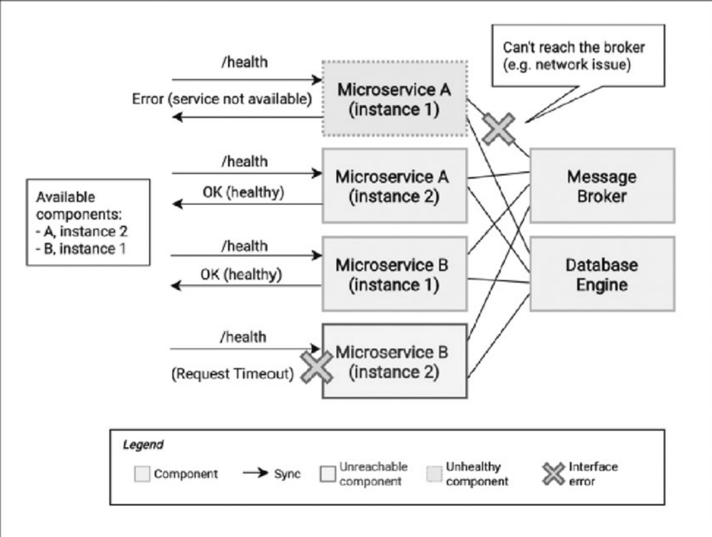

Health Check
==================================================
A system running on a production environment is never safe from errors. Network 
connections may fail, or a microservice instance may crash due to an out-of-memory 
problem caused by a bug in the code. You’re determined to build a resilient system, 
so you want to be prepared against these errors with mechanisms like redundancy
(multiple replicas of the same microservice) to minimize the impact of these incidents.

So, how do you know when a microservice is not working? If it’s exposing an 
interface (like a REST API or RabbitMQ), you could interact with a sample probe and 
see if it reacts to it. But then, you should be careful when selecting that probe since you 
want to cover all possible scenarios that would make your microservice transition to 
an unhealthy state (not functional). Instead of leaking the logic to determine whether 
a service is working or not to the caller, it’s much better to provide a standard, dumb 
probe interface that just indicates whether the service is healthy. It’s up to the service’s 
logic to decide when to transition to an unhealthy state, based on the availability of the 
interfaces it uses, its own availability, and the criticality of the error. If the service can’t 
even provide a response, the callers can also assume that it’s unhealthy.

This simple interface convention to determine the healthiness of services is required 
by many tools and frameworks (and not only for microservices). For example, load 
balancers can temporarily stop diverting traffic to an instance that doesn’t respond to 
the health probe or responds with a non-ready state. Service discovery tools may remove 
an instance from the registry if it’s unhealthy. Container platforms like Kubernetes can 
decide to restart a service if it’s not healthy for a configured period 

Each service registers itself with 
a configured health check to be polled every ten seconds (the default value, but you can 
change it). The registry doesn’t know in real time when services are not ready to handle 
the traffic. It could be the case that Consul successfully checks the health of a given 
instance and that one goes down immediately after. The registry will list this instance 
as healthy for a few seconds (almost ten with your configuration) until it notices it’s not 
available during the next check. Since you want to minimize request errors during that 
interval too, you can take advantage of the retry pattern to cover these situations. Once 
the registry is updated, the Gateway won’t get the unhealthy instance in the service list, 
so the retries won’t be necessary anymore. Note that lowering the time between checks 
can reduce the number of errors, but it increases the network traffic