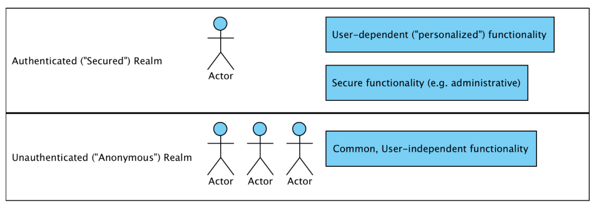

# Security 
## Security Standards and rules
> TODO Read Payment Card Industry Data Security Standard

> TODO Read Health Insurance Privacy and Accountability Act (HIPAA)

the **Payment Card Industry Data Security Standard (PCI DSS)** and **the Health Insurance 
Privacy and Accountability Act (HIPAA)** privacy rules, both standards are intended to 
ensure the safety of specific sensitive information (such as credit card and medical information) 
through a combination of process and software controls.

Many other industries and countries have similar rules about sensitive or Personally Identifiable 
Information (PII). Failure to follow these standards is not only bad practice but also something 
that could expose you or your company to significant liability (not to mention bad press) in 
the event of a security breach.

## Security Audits
Typically, the goal of security audits is to provide management or clients with the assurance that basic 
secure development practices have been followed to ensure the integrity and safety of the customer’s 
data and system functions. Depending on the industry the software is targeted at, the auditor may 
also test it using industry-specific standards or compliance metrics.

Third-party security specialists are often hired by companies (or their partners or customers) to audit 
the effectiveness of their software security through a combination of white hat hacking, source code 
review, and formal or informal conversations with application developers and architects.

White hat hacking or ethical hacking is done by professionals who are hired to instruct companies 
on how to protect themselves better, rather than with the intent to be malicious.

## Authentication
Authentication identifies who is attempting to request a resource. You may be familiar with authentication in your daily online and offline life, in very different 
contexts, as follows:
* **Credential-based authentication**: When you log in to your web-based email account, you most likely provide your username and password. 
  The email provider matches your username with a known user in its database and verifies that your password matches what they have on 
record. These credentials are what the email system uses to validate that you are a valid user of the system
* **Two-factor authentication**
* **Hardware authentication**

Typically, a software system will be divided into two high-level realms, such as unauthenticated (or anonymous) and authenticated

Application functionality in the anonymous realm is the functionality that is independent of a user’s identity (think of a welcome page for an online application). Anonymous areas do not do the following:
* Require a user to log in to the system or otherwise identify themselves to be usable
* Display sensitive information, such as names, addresses, credit cards, and orders
* Provide functionality to manipulate the overall state of the system or its data

## Authorization
**Authorization** uses the information that was validated during authentication to determine whether access should be granted to a particular resource. Built around 
the authorization model for the application, authorization partitions the application functionality and data so that the availability of these items can be controlled by matching the combination of privileges, functionality, and data to users.

**A secured resource** may be any aspect of the system that should be conditionally available based on the authority of the user.
Secured resources of a web-based application could be individual web pages, entire portions of the website, or portions of individual pages. Conversely, secured business resources might be method calls on classes or individual business objects.

Authorization typically involves the following two separate aspects that combine to describe the accessibility of the secured system:
* The first is the mapping of an authenticated principal to one or more authorities (often called roles). For example, a casual user of your website might be viewed as having visitor authority, while a site administrator might be assigned administrative authority.
* The second is the assignment of authority checks to secured resources in the system. This is typically done when the system is developed, either through an explicit declaration in code or through configuration parameters. For example, the screen that allows for the viewing of other users’ events should be made available only to those users with administrative authority.

## Database credential security
database credentials typically refer to the information required to establish 
a connection between aى application and a database. These credentials include the following:
* Username: The username or user ID associated with the database account that the  application uses to connect.
* Password: The corresponding password for the specified username, providing authentication for access to the database.
* Database URL: The URL that specifies the location and details of the database. It includes information such as the host, port, and database name.

## Transport-level protection
SSL protection ensures that communication between the browser client and the web application server is secure against many kinds of tampering and snooping.