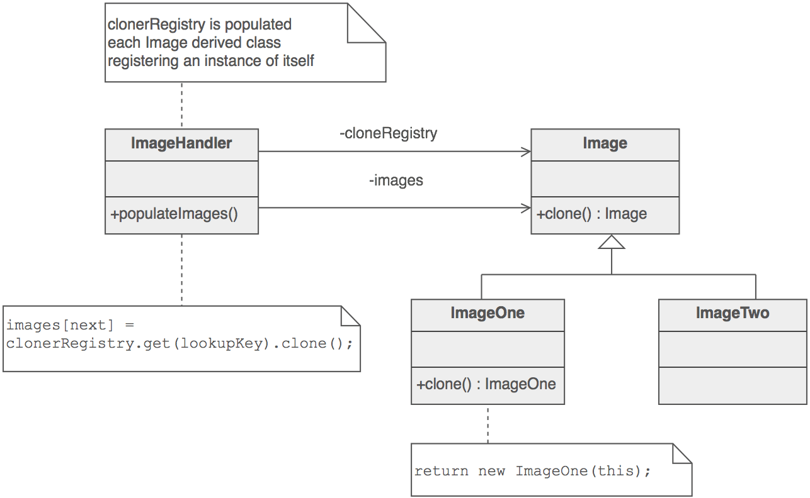

Prototype Design Pattern
========================

### Intent

*   Specify the kinds of objects to create using a prototypical instance, and create new objects by copying this prototype.
*   Co-opt one instance of a class for use as a breeder of all future instances.
*   The `new` operator considered harmful.

### Problem

Application "hard wires" the class of object to create in each "new" expression.

### Discussion

Declare an abstract base class that specifies a pure virtual "clone" method, and, maintains a dictionary of all "cloneable" concrete derived classes. Any class that needs a "polymorphic constructor" capability: derives itself from the abstract base class, registers its prototypical instance, and implements the `clone()` operation.

The client then, instead of writing code that invokes the "new" operator on a hard-wired class name, calls a "clone" operation on the abstract base class, supplying a string or enumerated data type that designates the particular concrete derived class desired.

### Structure

The Factory knows how to find the correct Prototype, and each Product knows how to spawn new instances of itself.

### Example

The Prototype pattern specifies the kind of objects to create using a prototypical instance. Prototypes of new products are often built prior to full production, but in this example, the prototype is passive and does not participate in copying itself. The mitotic division of a cell - resulting in two identical cells - is an example of a prototype that plays an active role in copying itself and thus, demonstrates the Prototype pattern. When a cell splits, two cells of identical genotype result. In other words, the cell clones itself.

### Check list

1.  Add a `clone()` method to the existing "product" hierarchy.
2.  Design a "registry" that maintains a cache of prototypical objects. The registry could be encapsulated in a new `Factory` class, or in the base class of the "product" hierarchy.
3.  Design a factory method that: may (or may not) accept arguments, finds the correct prototype object, calls `clone()` on that object, and returns the result.
4.  The client replaces all references to the `new` operator with calls to the factory method.

### Rules of thumb

*   Sometimes creational patterns are competitors: there are cases when either Prototype or Abstract Factory could be used properly. At other times they are complementary: Abstract Factory might store a set of Prototypes from which to clone and return product objects. Abstract Factory, Builder, and Prototype can use Singleton in their implementations.
*   Abstract Factory classes are often implemented with Factory Methods, but they can be implemented using Prototype.
*   Factory Method: creation through inheritance. Prototype: creation through delegation.
*   Often, designs start out using Factory Method (less complicated, more customizable, subclasses proliferate) and evolve toward Abstract Factory, Prototype, or Builder (more flexible, more complex) as the designer discovers where more flexibility is needed.
*   Prototype doesn't require subclassing, but it does require an "initialize" operation. Factory Method requires subclassing, but doesn't require Initialize.
*   Designs that make heavy use of the Composite and Decorator patterns often can benefit from Prototype as well.
*   Prototype co-opts one instance of a class for use as a breeder of all future instances.
*   Prototypes are useful when object initialization is expensive, and you anticipate few variations on the initialization parameters. In this context, Prototype can avoid expensive "creation from scratch", and support cheap cloning of a pre-initialized prototype.
*   Prototype is unique among the other creational patterns in that it doesn't require a class – only an object. Object-oriented languages like Self and Omega that do away with classes completely rely on prototypes for creating new objects.