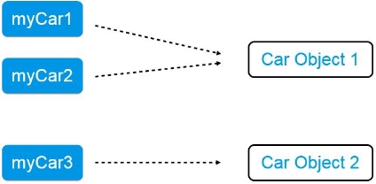

---
title: Object Identity and Object Equality in Java
parent: Java Basics Articles
grand_parent: Basics
nav_order: 1
---
Object Identity and Object Equality in Java
===============================
*Source: https://marcus-biel.com/identity-and-equality-in-java-video/*

**Introduction**
----------------
In this article from my free Java 8 course, I will discuss Object Identity and Object Equality in Java. 

**Object Identity**
----------------
When we create objects in Java, the computer stores them in its memory. To be able to locate an object, the computer assigns it an address in the memory. Every new object we create gets a new address. If this yellow area represents an area of the computer’s memory, the blue area represents our object being stored in the memory at some address. 


Example 1 

To illustrate this feature, let us imagine the building featured in Example 2 below. If we are looking at the building, we might be wondering if it is **the** White House or just another white house object. To check, we can compare this object’s unique address to the White House’s address. We would check our object’s identity using ‘==’, the equals operator. Hopefully the address of that house is “1600 Pennsylvania Avenue North West, Washington DC”, otherwise we’re looking at a different white house object, and the president isn’t waiting inside to meet us. 


Example 2 

Now, let’s declare three variables and discuss their memory locations: 

```java
Car myCar1 = new Car("blue"); 
Car myCar2 = myCar1; 

Car myCar3 = new Car("blue"); 

```
Example 3 

In Example 3 we have reference variables myCar1, myCar2 and myCar3. myCar1 was assigned a new Car object, as was myCar3, but myCar2 was assigned the value of myCar1. This difference is key. myCar2 is not a new object. It is simply a second reference variable ‘pointing’ to the same object in the memory. So while we have three variables that we created, we actually have only placed two objects in the memory (Example 4). 



Example 4 

Now, let’s take these reference variables and compare them using the equals operator, ‘==’. When we use the equals operator, we can see if both variables refer to the same object in the memory. Take a look at the three ‘if’ statements below: 

```java
if(myCar1 == myCar1){ // true  

if(myCar1 == myCar2){ // true } 

if(myCar1 == myCar3){ // false  } 
```

Example 5 

When we compare myCar1 to itself, it evaluates to true, because they are referring to the same object in the memory. Similarly, myCar1 == myCar2 evaluates to true as well. Again, although they are different reference variables, they are referencing the same object in the memory. Finally, myCar1 == myCar3 evaluates to false, because they are pointing to different objects in the memory. 

**Object Equality**
----------------
Another way that one can test equality is by using the equals() method. The equals method tells us if two objects are considered equal. Let us suppose that our program requires that two cars are ‘equal’ if they are of the same color. So let’s look at the same three ‘if’ statements: 

```java
if(myCar1.equals(myCar1)){ // true }   

if(myCar1.equals(myCar2)){ // true } 

if(myCar1.equals(myCar3){ // false  } 
```

Example 6 

Based on what you’ve read so far, you’d think that all three statements would evaluate to true. However, that is not how the default equals() method works. If you look at the default equals() method of the Object class, it actually calls ‘==’, giving it the same functionality as simply saying obj1 == obj2. 

```java
public boolean equals(Object obj) { 

return (this == obj); 

} 
```

Example 7 

Obviously, this isn’t what we want. In our example, we want to judge if two Cars are equal based on their color. So, we will have to override the equals() method:

```java
@Override 

public boolean equals(Object obj) { 

if (this == obj) { 

return true; 

} 

if (obj == null) {  

return false; 

} 

if (getClass() != obj.getClass()) { 

return false; 

} 

Car other = (Car) obj; 

return this.color.equals(other.color); } 

@Override 

public int hashCode() { 

return color.hashCode(); } 
```

Example 8 

Now, we are expressing in code what we consider equal or unequal. Again, this totally depends on what our client considers equal or unequal. We have to override these methods not because the creators of Java thought that it would be a good idea, but because there wasn’t any other option. When they wrote the object class, they didn’t really have in mind our car class and the specific way in which we would compare them, so they came up with a generic method that they welcome us to change. You might also notice that I didn’t just overwrite the equals() method. I also overrode the hashCode() method. Java specifies that **equal objects must have equal hashCodes as well**.
