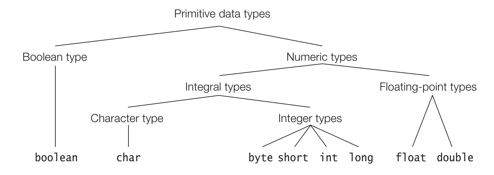
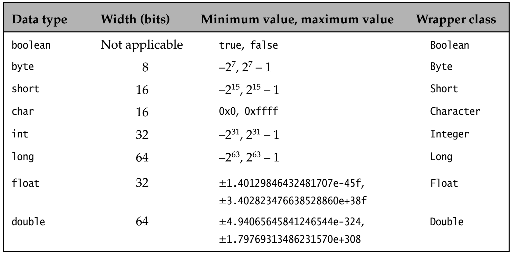
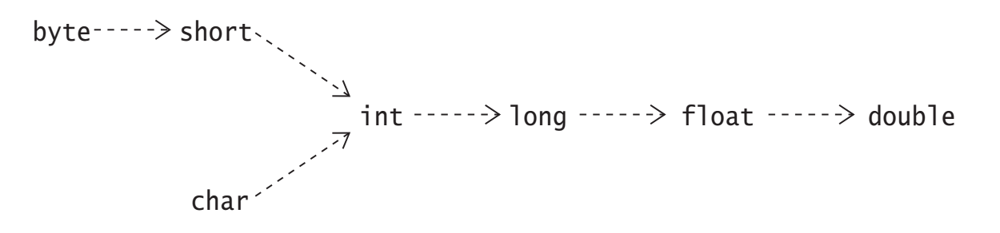

# Java
## Primitive Data Types


   
* Primitive data values are not objects, but each primitive data type has a corresponding wrapper class that can be used to represent a primitive value as an object
  
## Conversions
### Widening Primitive Conversions
For the primitive data types, the value of a narrower data type can be converted to
a value of a wider data type



* Widening primitive conversions are usually done implicitly, whereas narrowing
primitive conversions usually require a cast
* Regardless of any loss of magnitude or
precision, widening and narrowing primitive conversions never result in a runtime
exception.

```java
long year = 2020; // (1) Implicit widening: long <----- int, assigned 2020L
int pi = (int) 3.14; // (2) Narrowing requires cast: int <----- double, assigned 3
```
### Widening and Narrowing Reference Conversions
Conversions up the type hierarchy are called widening reference conversions (also called upcasting). Such a conversion converts from a subtype to a supertype:
```java 
Object obj = "Upcast me"; // (1) Widening: Object <----- String
```
Conversions down the type hierarchy represent narrowing reference conversions (also
called downcasting):
```java 
String str = (String) obj; // (2) Narrowing requires cast: String <----- Object
```
A subtype is a narrower type than its supertype in the sense that it is a specialization
of its supertype

Widening reference conversions are usually done implicitly, whereas narrowing
reference conversions usually require a cast.

Widening reference conversions do not require any runtime checks and never result in an exception during execution. narrowing reference conversions require a runtime check and can throw a ClassCastException if the conversion is not legal.

### Boxing and Unboxing Conversions
A boxing conversion converts the value of a primitive type to a corresponding value
of its wrapper type, and an unboxing conversion converts the value of a wrapper
type to a value of its corresponding primitive type. 

Both boxing and unboxing conversion are applied implicitly in the right context, but the wrapper classes also provide the static method valueOf() to explicitly box a primitive value in a wrapper object, and the method primitiveTypeValue() to explicitly unbox the value in a
wrapper object as a value of primitiveType.

Unboxing a wrapper reference that has the null value results in a NullPointer-
Exception

```java
// We say that the int value 10 has beenboxed in an object of the wrapper type Integer. 
// This implicit boxing conversion is also called autoboxing.
Integer iRef = 10; // (1) Implicit boxing: Integer <----- int
// An explicit boxing by the valueOf() method of the wrapper classes is used to box a double value.
Double dRef = Double.valueOf(3.14); // (2) Explicit boxing: Double <----- double

// Implicit unboxing is applied to unbox the value in the Integer object
int i = iRef; // (3) Implicit unboxing: int <----- Integer
// and explicit unboxing is applied by calling the doubleValue() method of the Double class
double d = dRef.doubleValue(); // (4) Explicit unboxing: double <----- Double
```

## Control Flow
### Switch
Summary of the switch Statement and the switch Expression
<table>
<tr>
<td>Notation</td>
<td>The switch statement</td>
<td>The switch expression</td>
</tr>
<tr>
<td>
The colon (:) notation:

> case label:
statements
</td>
<td>

* Executes statements associated with the matching case label.
* Fall-through can occur.
* No compile-time check for exhaustiveness.
* Only break and return statements allowed to control fall-through.

```java
switch (selector_expression) {
// Switch block with statement groups defined using colon notation: 
case CC: statements
case CC1: case CC2: ... case CCn: statements
case CC3, CC4, ..., CCm: statements
...
default: ...
}
```
</td>
<td>

* Executes statements associated with the matching case label, 
but must have a yield statement to return a value.
* Fall-through can occur.
* Compile-time check for exhaustiveness.
* No break or return statement allowed.


</td>
</tr>
<tr>
<td>
The arrow (->) notation:

> case label ->
action
</td>
<td>

* Action associated with a 
switch rule can be an 
expression statement, can 
be a block, or can throw an 
exception.
* Mutually exclusive 
switch rules: no fall-
through can occur.
* No compile-time check 
for exhaustiveness.
* break and return
statements allowed.
</td>
<td>

* Action associated with a switch rule can be any expression, can be a block, or can throw an exception.
* Mutually exclusive switch rules: no fall-through can occur.
* Compile-time check for exhaustiveness.
* No break or return statement allowed.
* Must return a value that is either the value of a stand-alone 
expression or the value of the expression in a yield statement 
that can occur as the last statement in a block.
</td>
</tr>
</table>
  
