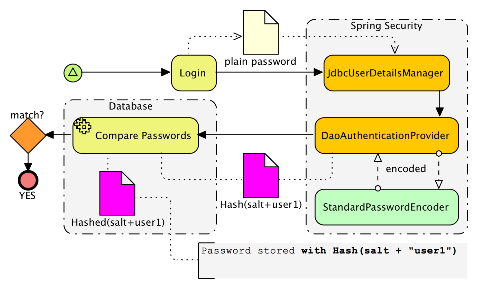

# Authentication
With spring boot default configuration, the app has two different authentication mechanisms in place: HTTP Basic and Form Login, including a username and a password, when you start the application.

HTTP Basic is a way in which a web app authenticates a user by means of a set of credentials (username and password) that the app gets in the header of the HTTP request.

## Authentication flow in Spring Security
The AuthenticationFilter captures the incoming request and passes the task of authentication to the AuthenticationManager. The AuthenticationManager, in turn, utilizes an authentication provider to carry out the authentication 
process. For verifying the username and password, the AuthenticationProvider relies on a UserDetailsService and a PasswordEncoder.


## Password Storage
Password hashing in Spring Security is encapsulated and defined by implementations of the 
o.s.s.authentication.encoding.PasswordEncoder interface. The simple configuration 
of a password encoder is possible through the createDelegatingPasswordEncoder()
method within the PasswordEncoderFactories element, as follows:
```java
@Bean
public PasswordEncoder encoder() {
 return PasswordEncoderFactories.createDelegatingPasswordEncoder();
}
```

The following table provides a list of the out-of-the-box implementation classes and their benefits.

|Encoder                      |Algorithm                              |Usage           |
|:----------------------------|:--------------------------------------|:---------------|
|bkdf2PasswordEncoder         |PBKDF2                                 |Provides key strengthening with configurable iteration count, suitable for password hashing.Suitable for password storage.|
|SCryptPasswordEncoder        |Scrypt                                 |Memory-hard key derivation function, making it resistant to brute-force attacks.Suitable for password storage.
|StandardPasswordEncoder      |SHA-256                                |Uses a standard SHA-256 algorithm. Note that SHA-256 alone is not recommended for password hashing due to its speed.Suitable for legacy systems but not recommended for new applications.
|NoOpPasswordEncoder          |No operation|No hashing or encoding; passwords are stored as plain text.Not recommended for production. Useful for testing and development.
|LdapShaPasswordEncoder       |SHA-1                                  |Performs SHA-1 hashing with optional salt. Suitable for compatibility with LDAP directories.Suitable for integration with LDAP-based systems.|
|BCryptPasswordEncoder        |BCrypt                                 |One-way hash function with adaptive hashing, suitable for password hashing.Recommended for password storage.
|MessageDigest PasswordEncoder|Configurable(e.g., MD5,SHA-256,SHA-512)|Uses various message digest algorithms, but the choice of algorithm is crucial for security.Depends on the selected algorithm. Not recommended for new applications due to weaknesses in some algorithms.|

```java
@Bean
public PasswordEncoder passwordEncoder() {
    String idForEncode = "SHA-256";
    Map<String, PasswordEncoder> encoders = new HashMap<>();
    encoders.put("SHA-256",
            new org.springframework.security.crypto.password.MessageDigestPasswordEncoder("SHA-256"));
    return new DelegatingPasswordEncoder(idForEncode, encoders);
}
```
to generate your own passwords
```java
ShaPasswordEncoder encoder = new ShaPasswordEncoder(256);
String encodedPassword = encoder.encodePassword(password, null);
```
### Using salt in Spring Security
Spring Security provides a cryptography module that are included in the spring-security-
core module and are available separately in spring-security-crypto. The crypto module
contains its own o.s.s.crypto.password.PasswordEncoder interface. In fact, using this 
interface is the preferred method for encoding passwords, because it will salt passwords using a random 
salt. At the time of this writing, there are the following three implementations of o.s.s.crypto.
password.PasswordEncoder
|Class                      |Description                            |
|:--------------------------|:--------------------------------------|
|o.s.s.crypto.bcrypt.BCryptPasswordEncoder |This class uses the bcrypt hashing function. It supports salt and the ability to slow down to perform over time as technology improves. This helps protect against brute- force search attacks.|
|o.s.s.crypto.password.NoOpPasswordEncoder |This class does no encoding (it returns the password in its plaintext form). Provided for legacy and testing purposes only and is not considered secure.|
|o.s.s.crypto.password.StandardPasswordEncoder |This class uses SHA-256 with multiple iterations and a random salt value. Provided for legacy and testing purposes only and is not considered secure.|

```java
import org.springframework.security.crypto.password.StandardPasswordEncoder;
@Bean
public PasswordEncoder passwordEncoder() {
 return new StandardPasswordEncoder();
}
```

to generate your own passwords
```java
StandardPasswordEncoder encoder = new StandardPasswordEncoder();
String encodedPassword = encoder.encode("password");
```
The stored password can be summarized as follows:
```java
salt = randomsalt()
hash = hash(salt+originalPassword)
storedPassword = salt + hash
```
This is the pseudocode for hashing a newly created password.
To authenticate a user, salt and hash can be extracted from the stored password, since both salt and hash are fixed lengths. Then, the extracted hash can be compared against a new hash, computed with extracted salt and the inputted password

The following is the pseudocode for validating a salted password:
```java
storedPassword = datasource.lookupPassword(username) 
salt, expectedHash = extractSaltAndHash(storedPassword) 
actualHash = hash(salt+inputedPassword)
authenticated = (expectedHash == actualHash)
```


Salting the stored passwords workflow
{: .flex-justify-between }
## Examples
* [Baeldung Spring Security OAuth Authorization Server](https://github.com/spring-kb/baeldung-spring-security-oauth-auth-server)