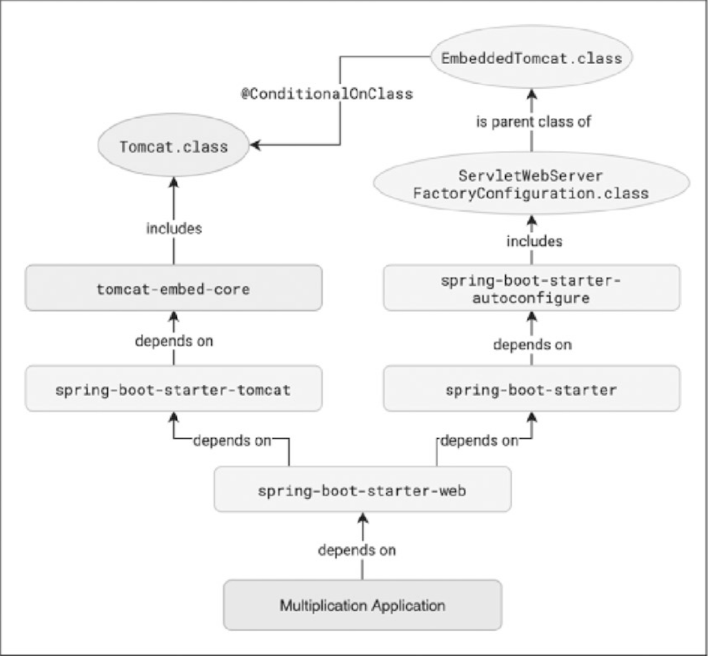
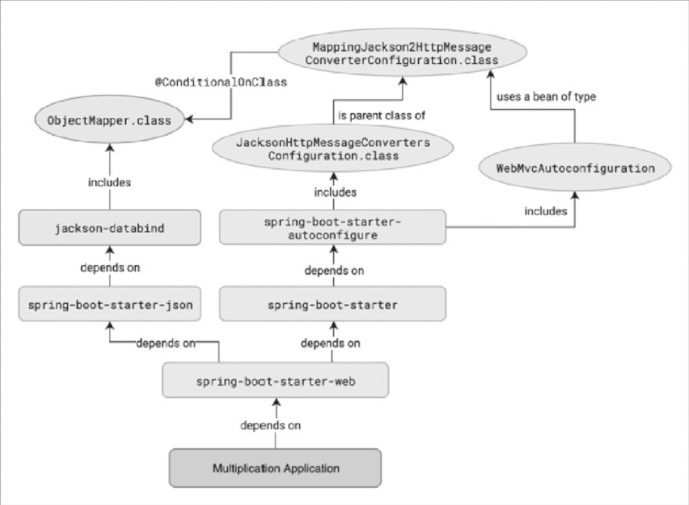
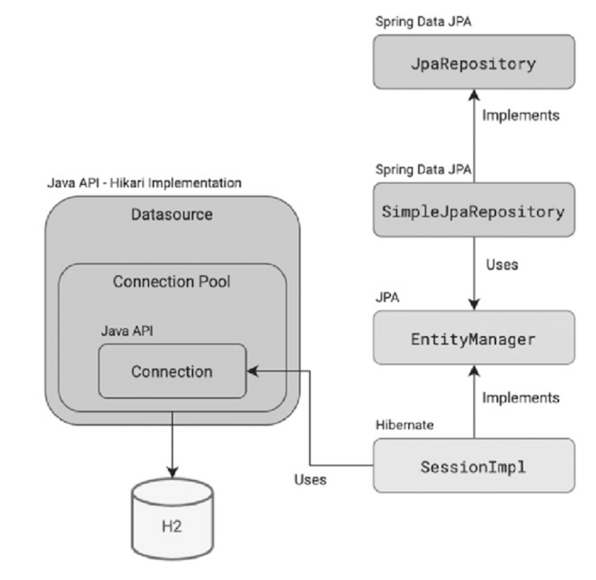
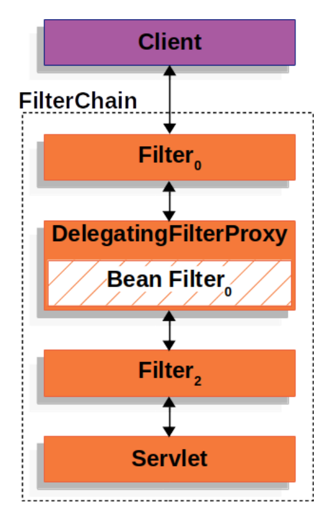

Spring Framework Internals
========================================================================================
{: .no_toc }

## Table of contents
{: .no_toc .text-delta }

1. TOC
{:toc}

# Spring Boot Autoconfiguration
Spring Boot Starters are a set of convenient dependency descriptors that you can include in your application. You get a one-stop-shop for all the Spring and related technology that you need without having to hunt through sample code and copy paste loads of dependency descriptors. For example, if you want to get started using Spring and JPA for database access include the spring-boot-starter-data-jpa dependency in your project, and you are good to go.

https://github.com/spring-projects/spring-boot/tree/main/spring-boot-project/spring-boot-starters

https://github.com/spring-projects/spring-boot/tree/main/spring-boot-project/spring-boot-autoconfigure/src/main/java/org/springframework/boot/autoconfigure

The spring-boot-starter-web simplifies dependency management and includes everything needed for developing web applications and RESTful web services, including the embedded Tomcat server, validations,and the Jackson library to serialize-deserialize Java objects to JSON and logging. The spring-boot-starter is a core starter in Spring Boot and serves as a parent starter for dependencies and autoconfiguration. The spring-boot-starter-autoconfigure
includes all the autoconfiguration classes responsible for configuring
different parts of
the Spring application based on certain conditions, such as the presence
or absence of
certain Java classes in the classpath or beans in the context

## SpringBootApplication

The Spring Boot application has a main class annotated with \@SpringBootApplication. This is a shortcut annotation because it groups
several others, among them \@EnableAutoConfiguration. As its name suggests, with this one you're enabling the autoconfiguration feature.
Therefore, Spring activates this smart mechanism and finds and processes
classes annotated with the \@Configuration annotation, from your own code but also from your dependencies.

spring-boot-starter That's the core Spring Boot starter, which includes the artifact
spring-bootautoconfigure(https://github.com/springprojects/spring-boot/blob/main/spring-boot-project/spring-boot-starters/
spring-boot-starter/build.gradle). That Spring Boot artifact has a whole
set of classes annotated with \@Configuration, which are responsible for
a big part of the whole Spring Boot magic. There classes are intended to
configure web servers, message brokers, error handlers, databases, and
many more.

The @SpringBootApplication annotation is a shortcut that includes three different annotations:
* @Configuration marks the class as a source of beans definitions.
* @ComponentScan enables component scanning to find and register beans in the Spring context automatically.
* @EnableAutoConfiguration enables the auto-configuration capabilities offered by Spring Boot.

Spring Boot auto-configuration is triggered by several conditions, such as the presence of certain classes in the classpath, the existence of specific beans, or the values of some properties.
### Embedded Tomcat



The spring-boot-starter-web includes the spring-boot-starter-tomcat
dependency, which provides the embedded Tomcat servlet container.
Embedded Tomcat is the trimmed-down version of Tomcat optimized for
programmatic use, consisting of the classes to start and manage a Tomcat
instance within your application. The
ServletWebServerFactoryConfiguration class is part of the
autoconfiguration that\'s responsible for setting up the embedded
servlet web server, such as Tomcat (https://tomcat.apache.org/), Jetty
(https:// eclipse.dev/jetty/), or Undertow (https://undertow.io/). This
configuration class plays a critical role in defining and customizing
the behavior of the embedded web server. They often use conditional
annotations like \@ConditionalOnClass. The \@ConditionalOnClass
annotation is used to define a conditional situation, which allows you
to specify that a particular bean should be created only if a specific
class is present in the classpath. The tomcat-embed-core provides the
core functionality required to embed Tomcat within a Java application.
The Spring scans all the classes and, given that the condition stated in
the EmbeddedTomcat is fulfilled (the Tomcat library is an included
dependency), it loads a TomcatServletWebServerFactory bean in the
context. This factoryclass starts an embedded Tomcat server with the
default configuration, exposing an HTTP interface on the port 8080.

-   The spring-boot-starter-web dependency is one of the main Spring
    > Boot components, which has all the tooling to build a web
    > application, including the embedded Tomcat server. Inside this
    > artifact's dependencies, the Spring Boot developers added another
    > starter,calledspring-boot-starter-tomcat(https://github.com/spring-projects/spring-boot/blob/main/spring-boot-project/spring-boot-starters/spring-boot-starter-web/
    > build.gradle).

-   spring-boot-starter-tomcat
    > artifact(https://github.com/spring-projects/spring-boot/blob/main/spring-boot-project/spring-boot-starters/spring-boot-starter-tomcat/
    > build.gradle), it contains a library that doesn't belong to the
    > Spring family, tomcat-embed-core. This is an Apache library that
    > you can use to start a Tomcat embedded server. Its main logic is
    > included in a class named Tomcat

-   the spring-boot-starter-web also depends on spring-boot-starter (see
    > Listing 3-1 and Figure 3-3 for some contextual help). That's the
    > core Spring Boot starter, which includes the artifact
    > spring-bootautoconfigure which contains classes intended to
    > configure web servers

-   the relevant class that takes care of the embedded Tomcat server
    > autoconfiguration is ServletWebServerFactoryConfiguration(https://
    > github.com/spring-projects/spring-boot/blob/main/spring-boot-project/
    > spring-boot-autoconfigure/src/main/java/org/springframework/boot/
    > autoconfigure/web/servlet/ServletWebServerFactoryConfiguration.java).\
    > This class defines some inner classes, one of them being
    > EmbeddedTomcat. As you can see, that one is annotated with this
    > annotation:

> \@ConditionalOnClass({ Servlet.class, Tomcat.class,
> UpgradeProtocol.class })
>
> Spring processes the \@ConditionalOnClass annotation, which is used to
> load beans in the context if the linked class can be found in the
> classpath. In this case, the condition matches, since you already saw
> how the Tomcat class got into the classpath via the starter hierarchy.
> Therefore, Spring loads the bean declared in EmbeddedTomcat, which
> turns out to be a TomcatServletWebServerFactory.
>
> That factory is contained inside Spring Boot's core artifact
> (spring-boot, a dependency included in spring-boot-starter). It sets
> up a Tomcat embedded server with some default configuration. This is
> where the logic to create an embedded web server finally lives.

-   
-   

### Automatic Serialization



-   The WebMvcAutoConfiguration class
    > (https://github.com/spring-projects/springboot/blob/main/spring-boot-project/spring-boot-autoconfigure/src/main/java/org/springframework/boot/autoconfigure/web/servlet/WebMvcAutoConfiguration.java).
    > This class collects all available HTTP message converters in the
    > context together for later use

  -----------------------------------------------------------------------
  Override
  public void
  configureMessageConverters(List\<HttpMessageConverter\<?\>\>
  converters) {\
  this.messageConvertersProvider\
  .ifAvailable((customConverters) -\>
  converters.addAll(customConverters.getConverters()));
  }
  -----------------------------------------------------------------------

  -----------------------------------------------------------------------

-   The HttpMessageConverter interface
    > (https://github.com/spring-projects/
    > spring-framework/blob/main/spring-web/src/main/java/org/springframework/
    > http/converter/HttpMessageConverter.java) is included in the core
    > spring-web artifact. It defines the media types supported by the
    > converter, which classes can convert to and from, and the read and
    > write methods to do conversions

-   Spring Boot includes a JacksonHttpMessageConvertersConfiguration
    > class (https://github.
    > com/spring-projects/spring-boot/blob/main/spring-boot-project/spring-bootautoconfigure/src/main/java/org/springframework/boot/autoconfigure/http/
    > JacksonHttpMessageConvertersConfiguration.java) that has some
    > logic to load a bean of type MappingJackson2HttpMessageConverter.
    > This logic is conditional on the presence of the ObjectMapper
    > class in the classpath. That one is a core class of the Jackson
    > libraries, the most popular implementation of JSON serialization
    > for Java. The ObjectMapper class is included in the
    > jackson-databind dependency. The class is in the classpath because
    > its artifact is a dependency included in spring-boot-starter-json,
    > which is itself included in the spring-boot-starter-web

  ------------------------------------------------------------------------------------------------
  Bean
  ConditionalOnMissingBean**(value = MappingJackson2HttpMessageConverter.class,\
  ignoredType = {
  \"org.springframework.hateoas.server.mvc.TypeConstrainedMappingJackson2HttpMessageConverter\",
  \"org.springframework.data.rest.webmvc.alps.AlpsJsonHttpMessageConverter\" })\
  MappingJackson2HttpMessageConverter mappingJackson2HttpMessageConverter(ObjectMapper
  objectMapper) {\
  return new MappingJackson2HttpMessageConverter(objectMapper);
  }
  ------------------------------------------------------------------------------------------------

  ------------------------------------------------------------------------------------------------

-   The default ObjectMapper bean is configured in the
    > JacksonAutoConfiguration class
    > (https://github.com/spring-projects/spring-boot/blob/main/spring-bootproject/spring-boot-autoconfigure/src/main/java/org/springframework/boot/
    > autoconfigure/jackson/JacksonAutoConfiguration.java). Everything
    > there is set up in a flexible way

  -----------------------------------------------------------------------
  Bean
  Primary
  ConditionalOnMissingBean
  ObjectMapper jacksonObjectMapper(Jackson2ObjectMapperBuilder
  builder) {\
  return builder.createXmlMapper(false).build();
  }
  -----------------------------------------------------------------------

  -----------------------------------------------------------------------

-   you could declare a custom ObjectMapper in the app configuration
    > that will be loaded instead of the default one

+-----------------------------------------------------------------------+
| Bean                                                           |
| public ObjectMapper objectMapper() {                          |
|                                                                       |
| > var om = new ObjectMapper();                                   |
| > om.setPropertyNamingStrategy(PropertyNamingStrategy.SNAKE_CASE);    |
| >                                                                     |
| > return om;                                                      |
|                                                                       |
| }                                                                     |
+=======================================================================+
+-----------------------------------------------------------------------+

> This specific case works because the default ObjectMapper is annotated
> with \@ConditionalOnMissingBean, which makes Spring Boot load the bean
> only if there is no other bean of the same type defined in the
> context. Remember to remove this custom ObjectMapper since you use
> just Spring Boot defaults for now

-   
-   

### Handling Errors 

  -----------------------------------------------------------------------
  Positive**(message = \"How could you possibly get a negative result
  here? Try again.\")\
  int guess;
  -----------------------------------------------------------------------

  -----------------------------------------------------------------------

What Spring Boot does in this case to handle the errors is to sneakily
add a \@Controller to your context: the BasicErrorController (see
https://docs.
spring.io/spring-boot/docs/current/api/org/springframework/boot/
autoconfigure/web/servlet/error/BasicErrorController.html). This one
uses the DefaultErrorAttributes class
(https://docs.spring.io/springboot/docs/current/api/org/springframework/boot/web/servlet/error/
DefaultErrorAttributes.html) to compose the error response

### Spring Boot Data JPA

{width="5.088542213473316in"
height="4.839768153980752in"}

-   There are some core Java APIs to handle SQL databases in the
    > java.sql and javax.sql packages. There, you can find the
    > DataSource and Connection interfaces and some others for pooled
    > resources, such as PooledConnection or ConnectionPoolDataSource.
    > You can find multiple implementations of these APIs by different
    > vendors.

-   Spring Boot comes with HikariCP
    > ([[https://github.com/brettwooldridge/HikariCP]{.underline}](https://github.com/brettwooldridge/HikariCP)).

-   Hibernate uses these APIs (and therefore the HikariCP
    > implementation) to connect to the H2 database.

-   The JPA flavor in Hibernate for managing the database is the
    > SessionImpl class
    > (https://github.com/hibernate/hibernate-orm/blob/main/hibernate-core/src/main/java/org/hibernate/internal/SessionImpl.
    > java), which includes a lot of code to perform statements, execute
    > queries, handle the session's connections, and so on. This class,
    > via its hierarchy tree, implements the JPA interface
    > EntityManager(https://jakarta.ee/specifications/persistence/3.1/apidocs/jakarta.persistence/jakarta/persistence/entitymanager).
    > This interface is part of the JPA specification. Its
    > implementation, in Hibernate, does the complete ORM.\
    > {width="5.067708880139983in"
    > height="4.929761592300962in"}

-   On top of JPA's EntityManager, Spring Data JPA defines a
    > JpaRepository interface
    > (https://github.com/spring-projects/spring-data-jpa/blob/main/spring-data-jpa/src/main/java/org/springframework/data/jpa/repository/JpaRepository.java)
    > with the most common methods you need to use normally: find, get,
    > delete, update, and so on.

-   The SimpleJpaRepository\<T,ID\>
    > class(https://github.com/spring-projects/spring-data-jpa/blob/main/spring-data-jpa/src/main/java/org/springframework/data/jpa/repository/support/SimpleJpaRepository.java)
    > is the default implementation in Spring and uses the EntityManager
    > under the hood

-   you configure the data source using some values in your application.
    > properties. These properties are defined by the
    > DataSourceProperties class
    > (https://github.com/spring-projects/spring-boot/blob/main/spring-boot-project/spring-boot-autoconfigure/src/main/java/org/springframework/boot/autoconfigure/jdbc/DataSourceProperties.java)
    > within the Spring Boot autoconfiguration dependency, which
    > contains the database's URL, username, and password, for example.\
    > /\*

  -----------------------------------------------------------------------
  package org.springframework.boot.autoconfigure.jdbc;
  import java.util.LinkedHashMap;
  import java.util.Map;
  import java.util.UUID;
  import javax.sql.DataSource;
  import org.springframework.beans.factory.BeanClassLoaderAware;
  import org.springframework.beans.factory.BeanCreationException;
  import org.springframework.beans.factory.InitializingBean;
  import
  org.springframework.boot.context.properties.ConfigurationProperties;
  import org.springframework.boot.jdbc.DataSourceBuilder;
  import org.springframework.boot.jdbc.DatabaseDriver;
  import org.springframework.boot.jdbc.EmbeddedDatabaseConnection;
  import org.springframework.util.Assert;
  import org.springframework.util.ClassUtils;
  import org.springframework.util.StringUtils;
  \* Base class for configuration of a data source.\
  \*\
  @author Dave Syer
  @author Maciej Walkowiak
  @author Stephane Nicoll
  @author Benedikt Ritter
  @author Eddú Meléndez
  @author Scott Frederick
  @since 1.1.0
  \*/*\
  ConfigurationProperties**(prefix = \"spring.datasource\")\
  public class DataSourceProperties implements
  BeanClassLoaderAware, InitializingBean {\
  \
  private ClassLoader classLoader;
  \* Whether to generate a random datasource name.\
  \*/*\
  private boolean generateUniqueName = true;
  \* Datasource name to use if \"generate-unique-name\" is false.
  Defaults to \"testdb\"\
  \* when using an embedded database, otherwise null.\
  \*/*\
  private String name;
  \* Fully qualified name of the connection pool implementation to use.
  By default, it\
  \* is auto-detected from the classpath.\
  \*/*\
  private Class\<? extends DataSource\> type;
  \* Fully qualified name of the JDBC driver. Auto-detected based on the
  URL by default.\
  \*/*\
  private String driverClassName;
  \* JDBC URL of the database.\
  \*/*\
  private String url;
  \* Login username of the database.\
  \*/*\
  private String username;
  \* Login password of the database.\
  \*/*\
  private String password;
  \* JNDI location of the datasource. Class, url, username and password
  are ignored when\
  \* set.\
  \*/*\
  private String jndiName;
  \* Connection details for an embedded database. Defaults to the most
  suitable embedded\
  \* database that is available on the classpath.\
  \*/*\
  private EmbeddedDatabaseConnection embeddedDatabaseConnection;
  private Xa xa = new Xa();
  private String uniqueName;
  Override
  public void setBeanClassLoader(ClassLoader classLoader) {\
  this.classLoader = classLoader;
  }\
  \
  Override
  public void afterPropertiesSet() throws Exception {\
  if (this.embeddedDatabaseConnection == null) {\
  this.embeddedDatabaseConnection =
  EmbeddedDatabaseConnection.get(this.classLoader);
  }\
  }\
  \
  */\*\*\
  \* Initialize a {@link DataSourceBuilder} with the state of this
  instance.\
  \* \@return a {@link DataSourceBuilder} initialized with the
  customizations defined on\
  \* this instance\
  \*/*\
  public DataSourceBuilder\<?\> initializeDataSourceBuilder() {\
  return DataSourceBuilder.create(getClassLoader())\
  .type(getType())\
  .driverClassName(determineDriverClassName())\
  .url(determineUrl())\
  .username(determineUsername())\
  .password(determinePassword());
  }\
  \
  public boolean isGenerateUniqueName() {\
  return this.generateUniqueName;
  }\
  \
  public void setGenerateUniqueName(boolean
  generateUniqueName) {\
  this.generateUniqueName = generateUniqueName;
  }\
  \
  public String getName() {\
  return this.name;
  }\
  \
  public void setName(String name) {\
  this.name = name;
  }\
  \
  public Class\<? extends DataSource\> getType() {\
  return this.type;
  }\
  \
  public void setType(Class\<? extends DataSource\> type) {\
  this.type = type;
  }\
  \
  */\*\*\
  \* Return the configured driver or {@code null} if none was
  configured.\
  @return the configured driver
  @see #determineDriverClassName()
  \*/*\
  public String getDriverClassName() {\
  return this.driverClassName;
  }\
  \
  public void setDriverClassName(String driverClassName) {\
  this.driverClassName = driverClassName;
  }\
  \
  */\*\*\
  \* Determine the driver to use based on this configuration and the
  environment.\
  @return the driver to use
  @since 1.4.0
  \*/*\
  public String determineDriverClassName() {\
  if (StringUtils.hasText(this.driverClassName)) {\
  Assert.state(driverClassIsLoadable(), () -\> \"Cannot load driver
  class: \" + this.driverClassName);
  return this.driverClassName;
  }\
  String driverClassName = null;
  if (StringUtils.hasText(this.url)) {\
  driverClassName =
  DatabaseDriver.fromJdbcUrl(this.url).getDriverClassName();
  }\
  if (!StringUtils.hasText(driverClassName)) {\
  driverClassName =
  this.embeddedDatabaseConnection.getDriverClassName();
  }\
  if (!StringUtils.hasText(driverClassName)) {\
  throw new DataSourceBeanCreationException(\"Failed to determine
  a suitable driver class\", this,\
  this.embeddedDatabaseConnection);
  }\
  return driverClassName;
  }\
  \
  private boolean driverClassIsLoadable() {\
  try {\
  ClassUtils.forName(this.driverClassName, null);
  return true;
  }\
  catch (UnsupportedClassVersionError ex) {\
  *// Driver library has been compiled with a later JDK, propagate
  error*\
  throw ex;
  }\
  catch (Throwable ex) {\
  ex.printStackTrace();
  return false;
  }\
  }\
  \
  */\*\*\
  \* Return the configured url or {@code null} if none was configured.\
  @return the configured url
  @see #determineUrl()
  \*/*\
  public String getUrl() {\
  return this.url;
  }\
  \
  public void setUrl(String url) {\
  this.url = url;
  }\
  \
  */\*\*\
  \* Determine the url to use based on this configuration and the
  environment.\
  @return the url to use
  @since 1.4.0
  \*/*\
  public String determineUrl() {\
  if (StringUtils.hasText(this.url)) {\
  return this.url;
  }\
  String databaseName = determineDatabaseName();
  String url = (databaseName != null) ?
  this.embeddedDatabaseConnection.getUrl(databaseName) : null;
  if (!StringUtils.hasText(url)) {\
  throw new DataSourceBeanCreationException(\"Failed to determine
  suitable jdbc url\", this,\
  this.embeddedDatabaseConnection);
  }\
  return url;
  }\
  \
  */\*\*\
  \* Determine the name to used based on this configuration.\
  @return the database name to use or {@code null}
  @since 2.0.0
  \*/*\
  public String determineDatabaseName() {\
  if (this.generateUniqueName) {\
  if (this.uniqueName == null) {\
  this.uniqueName = UUID.randomUUID().toString();
  }\
  return this.uniqueName;
  }\
  if (StringUtils.hasLength(this.name)) {\
  return this.name;
  }\
  if (this.embeddedDatabaseConnection !=
  EmbeddedDatabaseConnection.NONE) {\
  return \"testdb\";
  }\
  return null;
  }\
  \
  */\*\*\
  \* Return the configured username or {@code null} if none was
  configured.\
  @return the configured username
  @see #determineUsername()
  \*/*\
  public String getUsername() {\
  return this.username;
  }\
  \
  public void setUsername(String username) {\
  this.username = username;
  }\
  \
  */\*\*\
  \* Determine the username to use based on this configuration and the
  environment.\
  @return the username to use
  @since 1.4.0
  \*/*\
  public String determineUsername() {\
  if (StringUtils.hasText(this.username)) {\
  return this.username;
  }\
  if
  (EmbeddedDatabaseConnection.isEmbedded(determineDriverClassName(),
  determineUrl())) {\
  return \"sa\";
  }\
  return null;
  }\
  \
  */\*\*\
  \* Return the configured password or {@code null} if none was
  configured.\
  @return the configured password
  @see #determinePassword()
  \*/*\
  public String getPassword() {\
  return this.password;
  }\
  \
  public void setPassword(String password) {\
  this.password = password;
  }\
  \
  */\*\*\
  \* Determine the password to use based on this configuration and the
  environment.\
  @return the password to use
  @since 1.4.0
  \*/*\
  public String determinePassword() {\
  if (StringUtils.hasText(this.password)) {\
  return this.password;
  }\
  if
  (EmbeddedDatabaseConnection.isEmbedded(determineDriverClassName(),
  determineUrl())) {\
  return \"\";
  }\
  return null;
  }\
  \
  public String getJndiName() {\
  return this.jndiName;
  }\
  \
  */\*\*\
  \* Allows the DataSource to be managed by the container and obtained
  through JNDI. The\
  \* {@code URL}, {@code driverClassName}, {@code username} and {@code
  password} fields\
  \* will be ignored when using JNDI lookups.\
  @param jndiName the JNDI name
  \*/*\
  public void setJndiName(String jndiName) {\
  this.jndiName = jndiName;
  }\
  \
  public EmbeddedDatabaseConnection
  getEmbeddedDatabaseConnection() {\
  return this.embeddedDatabaseConnection;
  }\
  \
  public void
  setEmbeddedDatabaseConnection(EmbeddedDatabaseConnection
  embeddedDatabaseConnection) {\
  this.embeddedDatabaseConnection = embeddedDatabaseConnection;
  }\
  \
  public ClassLoader getClassLoader() {\
  return this.classLoader;
  }\
  \
  public Xa getXa() {\
  return this.xa;
  }\
  \
  public void setXa(Xa xa) {\
  this.xa = xa;
  }\
  \
  */\*\*\
  \* XA Specific datasource settings.\
  \*/*\
  public static class Xa {\
  \
  */\*\*\
  \* XA datasource fully qualified name.\
  \*/*\
  private String dataSourceClassName;
  \* Properties to pass to the XA data source.\
  \*/*\
  private Map\<String, String\> properties = new
  LinkedHashMap\<\>();
  public String getDataSourceClassName() {\
  return this.dataSourceClassName;
  }\
  \
  public void setDataSourceClassName(String
  dataSourceClassName) {\
  this.dataSourceClassName = dataSourceClassName;
  }\
  \
  public Map\<String, String\> getProperties() {\
  return this.properties;
  }\
  \
  public void setProperties(Map\<String, String\> properties)
  {\
  this.properties = properties;
  }\
  \
  }\
  \
  static class DataSourceBeanCreationException extends
  BeanCreationException {\
  \
  private final DataSourceProperties properties;
  private final EmbeddedDatabaseConnection connection;
  DataSourceBeanCreationException(String message, DataSourceProperties
  properties,\
  EmbeddedDatabaseConnection connection) {\
  super(message);
  this.properties = properties;
  this.connection = connection;
  }\
  \
  DataSourceProperties getProperties() {\
  return this.properties;
  }\
  \
  EmbeddedDatabaseConnection getConnection() {\
  return this.connection;
  }\
  \
  }\
  \
  }
  -----------------------------------------------------------------------

  -----------------------------------------------------------------------

-   As usual, there is also a DataSourceAutoConfiguration class\
    > (https://github.com/spring-projects/spring-boot/blob/main/spring-bootproject/spring-boot-autoconfigure/src/main/java/org/springframework/boot/
    > autoconfigure/jdbc/DataSourceAutoConfiguration.java) that uses
    > these properties to create the necessary beans in the context. In
    > this case, it creates the DataSource bean to connect to the
    > database

-   

# Spring Web
# DispatcherServlet
The DispatcherServlet component provides a central entry point for request process-
ing. When a client sends a new HTTP request for a specific URL pattern, Dispatcher-
Servlet asks the HandlerMapping component for the controller responsible for that
endpoint, and it finally delegates the actual processing of the request to the specified
controller. The controller processes the request, possibly by calling some other ser-
vices, and then returns a response to DispatcherServlet, which finally replies to the
client with an HTTP response.

https://github.com/spring-projects/spring-framework/blob/main/spring-webmvc/src/main/java/org/springframework/web/servlet/DispatcherServlet.java
## DelegatingFilterProxy 

The o.s.web.filter.DelegatingFilterProxy class is a Servlet Filter
provided by Spring Web that will delegate all work to a Spring bean from
the ApplicationContext root, which must implement jakarta.servlet.Filter.

DelegatingFilterProxy is a class in Spring’s Web module. It provides features for making HTTP calls pass through filters before reaching the actual destination. With the help of DelegatingFilterProxy, a class implementing the jakarta.Servlet.Filter interface can be wired into the filter chain.

As an example, Spring Security makes use of DelegatingFilterProxy to so it can take advantage of Spring’s dependency injection features and lifecycle interfaces for security filters.

DelegatingFilterProxy also leverages invoking specific or multiple filters as per Request URI paths by providing the configuration in Spring’s application context or in web.xml.

During initialization, DelegatingFilterProxy fetches the filter-name and retrieves the bean with that name from Spring Application Context. This bean must be of Type jakarta.Servlet.Filter, i.e. a “normal” servlet filter. Incoming requests will then be passed to this filter bean.

In short, DelegatingFilterProxy’s doFilter() method will delegate all calls to a Spring bean, enabling us to use all Spring features within our filter bean.

If we’re using Java-based configuration, our filter registration in ApplicationInitializer will be defined as:

```java
@Override
protected Filter[] getServletFilters() {
    DelegatingFilterProxy delegateFilterProxy = new DelegatingFilterProxy();
    delegateFilterProxy.setTargetBeanName("applicationFilter");
    return new Filter[]{delegateFilterProxy};
}
```

If we use XML, then, in the web.xml file:

```xml
<filter>
    <filter-name>applicationFilter</filter-name>
    <filter-class>org.springframework.web.filter.DelegatingFilterProxy</filter-class>
</filter>
```

This means that any request can be made to pass through the filter defined as Spring bean with the name applicationFilter.



### Exercise: Creating a Custom Filter
*Source: https://www.baeldung.com/spring-delegating-filter-proxy*

As described above, DelegatingFilterProxy is a servlet filter itself which delegates to a specific Spring-managed bean that implements the Filter Interface.

In the next few sections, we’ll create a custom filter and configure it using Java & XML-based configuration.

**Filter Class**

We’re going to create a simple filter that logs request information before the request proceeds further.

Let’s first create a custom filter class:

```java
@Component("loggingFilter")
public class CustomFilter implements Filter {

    private static Logger LOGGER = LoggerFactory.getLogger(CustomFilter.class);

    @Override
    public void init(FilterConfig config) throws ServletException {
        // initialize something
    }

    @Override
    public void doFilter(
      ServletRequest request, ServletResponse response, 
      FilterChain chain) throws IOException, ServletException {
 
        HttpServletRequest req = (HttpServletRequest) request;
        LOGGER.info("Request Info : " + req);
        chain.doFilter(request, response);
    }

    @Override
    public void destroy() {
        // cleanup code, if necessary
    }
}
```

CustomFilter implements jakarta.Servlet.Filter. This class has a @Component annotation to register as Spring bean in the application context. This way, the DelegatingFilterProxy class can find our filter class while initializing the filter chain.

Note that the name of the Spring bean must be the same as the value in the filter-name provided during the registration of the custom filter in ApplicationInitializer class or in web.xml later because the DelegatingFilterProxy class will look for the filter bean with the exact same name in the application context.

If it can’t find a bean with this name, it will raise an exception at application startup.

**Configuring the Filter via Java Configuration**

To register a custom filter using Java configuration, we need to override the getServletFilters() method of AbstractAnnotationConfigDispatcherServletInitializer:

```java
public class ApplicationInitializer 
  extends AbstractAnnotationConfigDispatcherServletInitializer {
    // some other methods here
 
    @Override
    protected Filter[] getServletFilters() {
        DelegatingFilterProxy delegateFilterProxy = new DelegatingFilterProxy();
        delegateFilterProxy.setTargetBeanName("loggingFilter");
        return new Filter[]{delegateFilterProxy};
    }
}
```

**Configuring the Filter via web.xml**

Let’s see how the filter configuration in web.xml looks like:

```xml
<filter>
    <filter-name>loggingFilter</filter-name>
    <filter-class>org.springframework.web.filter.DelegatingFilterProxy</filter-class>
</filter>
<filter-mapping>
    <filter-name>loggingFilter</filter-name>
    <url-pattern>/*</url-pattern>
</filter-mapping>
```

The filter-class argument is of type DelegatingFilterProxy and not the filter class we created. If we run this code and hit any URL, then doFilter() method of the CustomFilter will get executed and display the request info details in the log file

## Rest Client

The Spring Web module offers a tool for that purpose: the RestTemplate
class. Spring Boot provides an extra layer on top: the
RestTemplateBuilder. This builder is injected by default when you use
the Spring Boot Web starter, and you can use its methods to create
RestTemplate objects in a fluent way with multiple configuration
options. You can add specific message converters, security credentials
if you need them to access the server, HTTP interceptors, and so on


# Spring Cloud Gateway

The auto configuration logic is located in this case in the core Spring
Cloud Gateway artifact, and not in the Spring Boot's autoconfigure
package. The class name is GatewayAutoConfiguration (
https://github.com/spring-cloud/spring-cloud-gateway/blob/main/spring-cloud-gateway-server/src/main/java/org/springframework/cloud/gateway/config/GatewayAutoConfiguration.java),

and, among other tasks, it reads the application.yml configuration and
builds the corresponding routing filters, predicates, and so on.

#  

# Spring AMQP

Spring AMQP module contains two dependencies:

-   spring-rabbit, a set of utils to work with a RabbitMQ broker.

-   spring-amqp, which includes all the AMQP abstractions, so that you
    > can make your implementation vendor-independent.

Spring Boot provides a starter for AMQP with extra utilities such as
autoconfiguration: spring-boot-starter-amqp. This starter uses both
dependencies described earlier, so it implicitly assumes that you'll use
a RabbitMQ broker (since it's the only implementation available).

  -----------------------------------------------------------------------
  \<dependencies\>\
  *\<!\-- \... existing dependencies \--\>*\
  \<dependency\>\
  \<groupId\>org.springframework.boot\</groupId\>\
  \<artifactId\>spring-boot-starter-amqp\</artifactId\>\
  \</dependency\>\
  \</dependencies\>
  -----------------------------------------------------------------------

  -----------------------------------------------------------------------

The transitive dependency spring-boot-autoconfigure, includes some
classes that take care of the connection to RabbitMQ and the setup of
some convenient defaults.RabbitAutoConfiguration (see

https://github.com/spring-projects/spring-boot/blob/main/spring-boot-project/spring-boot-autoconfigure/src/main/java/org/springframework/boot/autoconfigure/amqp/RabbitAutoConfiguration.java).

It uses a group of properties defined in the RabbitProperties class

(https://github.com/spring-projects/spring-boot/blob/main/spring-boot-project/spring-boot-autoconfigure/src/main/java/org/springframework/boot/autoconfigure/amqp/RabbitProperties.java)

that you can override in your application.properties file. There, you
can find for example the predefined port (15672), username (guest), and
password (guest).

The autoconfiguration class builds the connection factory and the
configurer for RabbitTemplate objects, which you can use to send (and
even receive) messages to RabbitMQ.

You'll use the abstraction interface, AmqpTemplate

([[https://docs.spring.io/spring-amqp/api/org/springframework/amqp/core/AmqpTemplate.html]{.underline}](https://docs.spring.io/spring-amqp/api/org/springframework/amqp/core/AmqpTemplate.html)).

The autoconfiguration package also includes some default configuration
for

receiving messages using an alternative mechanism: the RabbitListener
annotation.

# Spring Boot Actuator

## RabbitHealthIndicator

The RabbitHealthContributorAutoConfiguration

class, included in the artifact spring-boot-actuator-autoconfigure (part
of Spring

Boot Actuator dependency), takes care of that. See Listing 8-10 (also
available at https://

github.com/spring-projects/spring-boot/blob/main/spring-boot-project/

spring-boot-actuator-autoconfigure/src/main/java/org/springframework/boot/

actuate/autoconfigure/amqp/RabbitHealthContributorAutoConfiguration.java).

This configuration is conditional on the existence of a RabbitTemplate
bean, which

means you're using the RabbitMQ module. It creates a HealthContributor
bean, in this

case, a RabbitHealthIndicator that will be detected and aggregated by
the overall health

autoconfiguration.

# 

# Spring Cloud Consul

The included Spring Boot autoconfiguration defaults for Consul are fine
for this case:

the server is located at http://localhost:8500. See the source code
(https://github

.com/spring-cloud/spring-cloud-consul/blob/main/spring-cloud-consul-core/

src/main/java/org/springframework/cloud/consul/ConsulProperties.java) of

ConsulProperties if you want to see these default values. If you need to
change them,

you can use these and other properties available under the
spring.cloud.consul prefix.

For a complete list of settings that you can override, check out Spring
Cloud Consul's

reference docs
(https://cloud.spring.io/spring-cloud-consul/reference/html/).

## References
[Demystifying Spring Internals](https://www.youtube.com/watch?v=LeoCh7VK9cg)
