Spring Framework Internals
========================================================================================
{: .no_toc }

## Table of contents
{: .no_toc .text-delta }

1. TOC
{:toc}
# Spring Security

The o.s.web.filter.DelegatingFilterProxy class is a Servlet Filter
provided by Spring Web that will delegate all work to a Spring bean from
the ApplicationContext root, which must implement
jakarta.servlet.Filter. Since, by default, the bean is looked up by
name, using the \<filter-name\> value, we must ensure we use
springSecurityFilterChain as the value of \<filter-name\>.

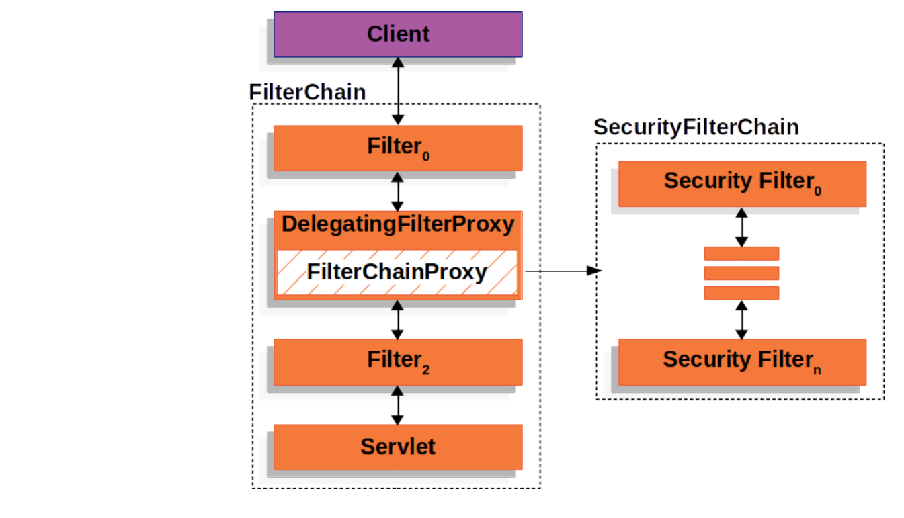

The pseudocode for how o.s.web.filter.DelegatingFilterProxy works for
our web.xml file can be found in the following code snippet:

  
```java
  // DelegatingFilterProxy Pseudo Code
  public void doFilter(ServletRequest request,
    ServletResponse response,
    FilterChain chain) {

    Filter delegate = getFilterBean(someBeanName);
    delegate.doFilter(request, response);
  }
```
  

## FilterChainProxy class

When working in conjunction with Spring Security,
o.s.web.filter.DelegatingFilterProxy will delegate to the o.s.s.web.FilterChainProxy interface of Spring
Security. The FilterChainProxy class allows Spring Security to
conditionally apply any number of Servlet Filters to the Servlet Request

The pseudocode for how FilterChainProxy works is as follows:

public class FilterChainProxy implements Filter { 
  void doFilter**(request, response, filterChain) {
// lookup all the Filters for this request*\                         |
| List\<Filter\> delegates = lookupDelegates(request,response)\         |
| *// invoke each filter unless the delegate decided to stop*\          |
| **for** delegate in delegates { **if** **continue** processing\       |
| delegate.doFilter(request,response,filterChain)\                      |
| }                                                                     |
|                                                                       |
| // if all the filters decide it is ok allow the                       |
|                                                                       |
| // rest of the application to run if continue processing              |
|                                                                       |
| filterChain.doFilter(request,response) }                              |
|                                                                       |
| }                                                                     |
+=======================================================================+
+-----------------------------------------------------------------------+

Bellow figure shows the big picture of the main actors (components) in the Spring Security architecture and the relationships among them
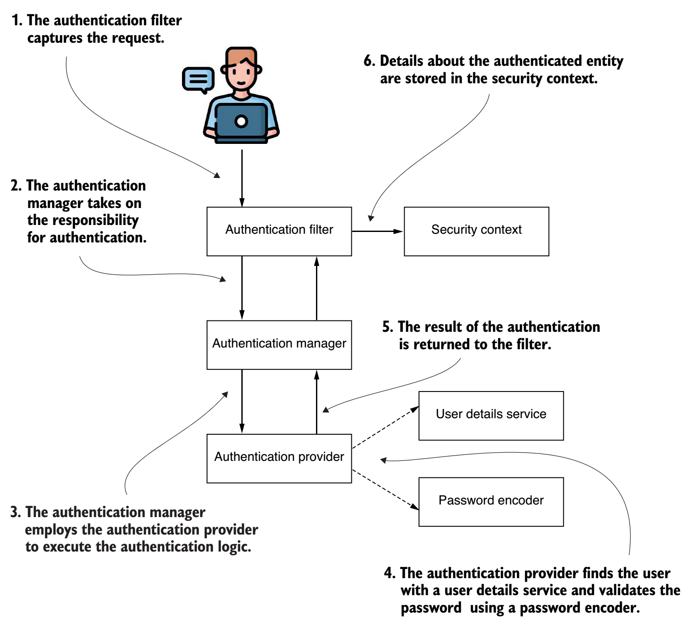
Figure shows that
1. The authentication filter delegates the authentication request to the authentication manager, and based on the response, it configures the security context.
2. The authentication manager uses the authentication provider to process 
authentication.
1. The authentication provider implements the authentication logic.
2. The user details service implements user management responsibility, which the 
authentication provider uses in the authentication logic.
1. The password encoder implements password management, which the authenti-
cation provider uses in the authentication logic.
1. The security context keeps the authentication data after the authentication process. The security context will hold the data until the action ends. Usually, in a thread-per-request app, that means until the app sends a response back to the 
client.

## Spring Boot Autoconfiguration
### Customization
Customizer is a contract you implement to define the customization for either Spring Security element you configure: the authentication, the authorization, or particular protection mechanisms such as CSRF or CORS.

Customizer is a functional interface (so we can use lambda expressions to implement it), and the withDefaults() implementation that does nothing:
```java
@FunctionalInterface
public interface Customizer<T> {
 void customize(T t);
 static <T> Customizer<T> withDefaults() {
 return (t) -> {
 };
 }
}
```
### SecurityAutoConfiguration
With spring boot default configuration, the app has two different authentication 
mechanisms in place: HTTP Basic and Form Login, including a username and a password, when you start the application.
Spring Boot also chooses an authentication method when configuring the defaults: 
HTTP Basic access authentication. It’s the most straightforward access authentication method. Basic authentication only requires the client to send a username and a password through the HTTP Authorization header. In the value of the header, the client attaches the prefix Basic, followed by the Base64 encoding of the string that contains the username and password, separated by a colon (:).
[[https://github.com/spring-projects/spring-boot/blob/main/spring-boot-project/spring-boot-autoconfigure/src/main/java/org/springframework/boot/autoconfigure/security/servlet/SecurityAutoConfiguration.java]{.underline}](https://github.com/spring-projects/spring-boot/blob/main/spring-boot-project/spring-boot-autoconfigure/src/main/java/org/springframework/boot/autoconfigure/security/servlet/SecurityAutoConfiguration.java)

  -----------------------------------------------------------------------
  */\*\*\
  \* {@link EnableAutoConfiguration Auto-configuration} for Spring
  Security.\
  \*\
  \* \@author Dave Syer\
  \* \@author Andy Wilkinson\
  \* \@author Madhura Bhave\
  \* \@since 1.0.0\
  \*/*\
  **\@AutoConfiguration**(before =
  UserDetailsServiceAutoConfiguration.class)\
  **\@ConditionalOnClass**(DefaultAuthenticationEventPublisher.class)\
  **\@EnableConfigurationProperties**(SecurityProperties.class)\
  **\@Import**({ SpringBootWebSecurityConfiguration.class,
  SecurityDataConfiguration.class })\
  **public** **class** **SecurityAutoConfiguration** {\
  \
  **\@Bean**\
  **\@ConditionalOnMissingBean**(AuthenticationEventPublisher.class)\
  **public** DefaultAuthenticationEventPublisher
  **authenticationEventPublisher**(ApplicationEventPublisher publisher)
  {\
  **return** **new** DefaultAuthenticationEventPublisher(publisher);\
  }\
  \
  }
  -----------------------------------------------------------------------

  -----------------------------------------------------------------------

### SpringBootWebSecurityConfiguration
A default implementation of an Authentication-
Provider uses the default implementations provided for the UserDetailsService
and the PasswordEncoder. Implicitly, your application secures all the endpoints. 
[https://github.com/spring-projects/spring-boot/blob/main/spring-boot-project/spring-boot-autoconfigure/src/main/java/org/springframework/boot/autoconfigure/security/servlet/SpringBootWebSecurityConfiguration.java](https://github.com/spring-projects/spring-boot/blob/main/spring-boot-project/spring-boot-autoconfigure/src/main/java/org/springframework/boot/autoconfigure/security/servlet/SpringBootWebSecurityConfiguration.java)

+-----------------------------------------------------------------------+
| */\*\*\                                                               |
| \* {@link Configuration \@Configuration} class securing servlet       |
| applications.\                                                        |
| \*\                                                                   |
| \* \@author Madhura Bhave\                                            |
| \*/*\                                                                 |
| **\@Configuration**(proxyBeanMethods = **false**)\                    |
| **\@ConditionalOnWebApplication**(type = Type.SERVLET)\               |
| **class** **SpringBootWebSecurityConfiguration** {\                   |
| \                                                                     |
| */\*\*\                                                               |
| \* The default configuration for web security. It relies on Spring    |
| Security\'s\                                                          |
| \* content-negotiation strategy to determine what sort of             |
| authentication to use. If\                                            |
| \* the user specifies their own {@link SecurityFilterChain} bean,     |
| this will back-off\                                                   |
| \* completely and the users should specify all the bits that they     |
| want to configure as\                                                 |
| \* part of the custom security configuration.\                        |
| \*/*\                                                                 |
| **\@Configuration**(proxyBeanMethods = **false**)\                    |
| **\@ConditionalOnDefaultWebSecurity**\                                |
| **static** **class** **SecurityFilterChainConfiguration** {\          |
| \                                                                     |
| **\@Bean**\                                                           |
| **\@Order**(SecurityProperties.BASIC_AUTH_ORDER)\                     |
| SecurityFilterChain **defaultSecurityFilterChain**(HttpSecurity http) |
| **throws** Exception {\                                               |
| http.authorizeHttpRequests((requests) -\>                             |
| requests.anyRequest().authenticated());\                              |
| http.formLogin(withDefaults());\                                      |
| http.httpBasic(withDefaults());\                                      |
| **return** http.build();\                                             |
| }\                                                                    |
| \                                                                     |
| }\                                                                    |
| \                                                                     |
| */\*\*\                                                               |
| \* Adds the {@link EnableWebSecurity \@EnableWebSecurity} annotation  |
| if Spring Security\                                                   |
| \* is on the classpath. This will make sure that the annotation is    |
| present with\                                                         |
| \* default security auto-configuration and also if the user adds      |
| custom security and\                                                  |
| \* forgets to add the annotation. If {@link EnableWebSecurity         |
| \@EnableWebSecurity} has\                                             |
| \* already been added or if a bean with name\                         |
| \* {@value BeanIds#SPRING_SECURITY_FILTER_CHAIN} has been configured  |
| by the user, this\                                                    |
| \* will back-off.\                                                    |
| \*/*\                                                                 |
| **\@Configuration**(proxyBeanMethods = **false**)                     |
|                                                                       |
| > [//public static final String SPRING_SECURITY_FILTER_CHAIN =        |
| > \"springSecurityFilterChain\";]{.mark}                              |
| >                                                                     |
| > [//from                                                             |
| > //[[https://gith                                                    |
| ub.com/spring-projects/spring-security/blob/main/config/src/main/java |
| ///org/springframework/security/config/BeanIds.java]{.underline}](htt |
| ps://github.com/spring-projects/spring-security/blob/main/config/src/ |
| main/java///org/springframework/security/config/BeanIds.java)]{.mark} |
|                                                                       |
| **\@ConditionalOnMissingBean**(name =                                 |
| BeanIds.SPRING_SECURITY_FILTER_CHAIN)\                                |
| **\@ConditionalOnClass**(EnableWebSecurity.class)\                    |
| **\@EnableWebSecurity**\                                              |
| **static** **class** **WebSecurityEnablerConfiguration** {\           |
| \                                                                     |
| }\                                                                    |
| \                                                                     |
| }                                                                     |
+=======================================================================+
+-----------------------------------------------------------------------+

[[https://github.com/spring-projects/spring-boot/blob/main/spring-boot-project/spring-boot-autoconfigure/src/main/java/org/springframework/boot/autoconfigure/security/DefaultWebSecurityCondition.java]{.underline}](https://github.com/spring-projects/spring-boot/blob/main/spring-boot-project/spring-boot-autoconfigure/src/main/java/org/springframework/boot/autoconfigure/security/DefaultWebSecurityCondition.java)

  -----------------------------------------------------------------------
  */\*\*\
  \* {@link Condition} for\
  \* {@link ConditionalOnDefaultWebSecurity
  \@ConditionalOnDefaultWebSecurity}.\
  \*\
  \* \@author Phillip Webb\
  \*/*\
  **class** **DefaultWebSecurityCondition** **extends**
  **AllNestedConditions** {\
  \
  DefaultWebSecurityCondition() {\
  **super**(ConfigurationPhase.REGISTER_BEAN);\
  }\
  \
  **\@ConditionalOnClass**({ SecurityFilterChain.class,
  HttpSecurity.class })\
  **static** **class** **Classes** {\
  \
  }\
  \
  **\@ConditionalOnMissingBean**({ SecurityFilterChain.class })\
  **static** **class** **Beans** {\
  \
  }\
  \
  }
  -----------------------------------------------------------------------

  -----------------------------------------------------------------------

[[https://github.com/spring-projects/spring-boot/blob/main/spring-boot-project/spring-boot-autoconfigure/src/main/java/org/springframework/boot/autoconfigure/security/ConditionalOnDefaultWebSecurity.java]{.underline}](https://github.com/spring-projects/spring-boot/blob/main/spring-boot-project/spring-boot-autoconfigure/src/main/java/org/springframework/boot/autoconfigure/security/ConditionalOnDefaultWebSecurity.java)

  -----------------------------------------------------------------------
  \* {**\@link** Conditional **\@Conditional**} that only matches when
  web security is available and\
  \* the user has not defined their own configuration.\
  \*\
  \* **\@author** Phillip Webb\
  \* **\@since** 2.4.0\
  \*/\
  **\@Target**({ ElementType.TYPE, ElementType.METHOD })\
  **\@Retention**(RetentionPolicy.RUNTIME)\
  **\@Documented**\
  **\@Conditional**(DefaultWebSecurityCondition.class)\
  **public** **\@interface** ConditionalOnDefaultWebSecurity {\
  \
  }
  -----------------------------------------------------------------------

  -----------------------------------------------------------------------

### UserDetailsServiceAutoConfiguration
the default implementation provided by Spring Boot registers the default credentials in the internal memory of the application. These default credentials are “user” with a default password that’s a universally unique identifier (UUID). The default password is generated randomly when the Spring context is loaded (at the app startup). At this time, the application writes the password to the console where you can see it.
[[https://github.com/spring-projects/spring-boot/blob/main/spring-boot-project/spring-boot-autoconfigure/src/main/java/org/springframework/boot/autoconfigure/security/servlet/UserDetailsServiceAutoConfiguration.java]{.underline}](https://github.com/spring-projects/spring-boot/blob/main/spring-boot-project/spring-boot-autoconfigure/src/main/java/org/springframework/boot/autoconfigure/security/servlet/UserDetailsServiceAutoConfiguration.java)

  ---------------------------------------------------------------------------------------------------------
  */\*\*\
  \* {@link EnableAutoConfiguration Auto-configuration} for a Spring Security in-memory\
  \* {@link AuthenticationManager}. Adds an {@link InMemoryUserDetailsManager} with a\
  \* default user and generated password.\
  \*\
  \* \@author Dave Syer\
  \* \@author Rob Winch\
  \* \@author Madhura Bhave\
  \* \@since 2.0.0\
  \*/*\
  **\@AutoConfiguration**\
  **\@ConditionalOnClass**(AuthenticationManager.class)\
  **\@Conditional**(MissingAlternativeOrUserPropertiesConfigured.class)\
  **\@ConditionalOnBean**(ObjectPostProcessor.class)\
  **\@ConditionalOnMissingBean**(value = { AuthenticationManager.class, AuthenticationProvider.class,
  UserDetailsService.class,\
  AuthenticationManagerResolver.class }, type = \"org.springframework.security.oauth2.jwt.JwtDecoder\")\
  **public** **class** **UserDetailsServiceAutoConfiguration** {\
  \
  **private** **static** **final** String NOOP_PASSWORD_PREFIX = \"{noop}\";\
  \
  **private** **static** **final** Pattern PASSWORD_ALGORITHM_PATTERN =
  Pattern.compile(\"\^\\\\{.+}.\*\$\");\
  \
  **private** **static** **final** Log logger =
  LogFactory.getLog(UserDetailsServiceAutoConfiguration.class);\
  \
  **\@Bean**\
  **public** InMemoryUserDetailsManager **inMemoryUserDetailsManager**(SecurityProperties properties,\
  ObjectProvider\<PasswordEncoder\> passwordEncoder) {\
  SecurityProperties.User user = properties.getUser();\
  List\<String\> roles = user.getRoles();\
  **return** **new** InMemoryUserDetailsManager(User.withUsername(user.getName())\
  .password(getOrDeducePassword(user, passwordEncoder.getIfAvailable()))\
  .roles(StringUtils.toStringArray(roles))\
  .build());\
  }\
  \
  **private** String **getOrDeducePassword**(SecurityProperties.User user, PasswordEncoder encoder) {\
  String password = user.getPassword();\
  **if** (user.isPasswordGenerated()) {\
  logger.warn(String.format(\
  \"%n%nUsing generated security password: %s%n%nThis generated password is for development use only. \"\
  + \"Your security configuration must be updated before running your application in \"\
  + \"production.%n\",\
  user.getPassword()));\
  }\
  **if** (encoder != **null** \|\| PASSWORD_ALGORITHM_PATTERN.matcher(password).matches()) {\
  **return** password;\
  }\
  **return** NOOP_PASSWORD_PREFIX + password;\
  }\
  \
  **static** **final** **class** **MissingAlternativeOrUserPropertiesConfigured** **extends**
  **AnyNestedCondition** {\
  \
  MissingAlternativeOrUserPropertiesConfigured() {\
  **super**(ConfigurationPhase.PARSE_CONFIGURATION);\
  }\
  \
  **\@ConditionalOnMissingClass**({\
  \"org.springframework.security.oauth2.client.registration.ClientRegistrationRepository\",\
  \"org.springframework.security.oauth2.server.resource.introspection.OpaqueTokenIntrospector\",\
  \"org.springframework.security.saml2.provider.service.registration.RelyingPartyRegistrationRepository\"
  })\
  **static** **final** **class** **MissingAlternative** {\
  \
  }\
  \
  **\@ConditionalOnProperty**(prefix = \"spring.security.user\", name = \"name\")\
  **static** **final** **class** **NameConfigured** {\
  \
  }\
  \
  **\@ConditionalOnProperty**(prefix = \"spring.security.user\", name = \"password\")\
  **static** **final** **class** **PasswordConfigured** {\
  \
  }\
  \
  }\
  \
  }

### PasswordEncoder
the PasswordEncoder is mandatory for the Basic authentication flow. The simplest implementation manages the passwords in plain text and doesn’t encode these.PasswordEncoder exists together with the default UserDetailsService. When we replace the default implementation of the UserDetailsService, we must also specify 
a PasswordEncoder.
 

## Configuration

### EnableWebSecurity

[[https://github.com/spring-projects/spring-security/blob/main/config/src/main/java/org/springframework/security/config/annotation/web/configuration/EnableWebSecurity.java]{.underline}](https://github.com/spring-projects/spring-security/blob/main/config/src/main/java/org/springframework/security/config/annotation/web/configuration/EnableWebSecurity.java)

  -----------------------------------------------------------------------
  **\@Retention**(RetentionPolicy.RUNTIME)\
  **\@Target**(ElementType.TYPE)\
  **\@Documented**\
  **\@Import**({ WebSecurityConfiguration.class,
  SpringWebMvcImportSelector.class, OAuth2ImportSelector.class,\
  HttpSecurityConfiguration.class })\
  **\@EnableGlobalAuthentication**\
  **public** **\@interface** EnableWebSecurity {\
  \
  */\*\*\
  \* Controls debugging support for Spring Security. Default is false.\
  \* \@return if true, enables debug support with Spring Security\
  \*/*\
  **boolean** **debug**() **default** **false**;\
  \
  }
  -----------------------------------------------------------------------

  -----------------------------------------------------------------------

### EnableGlobalAuthentication

[[https://github.com/spring-projects/spring-security/blob/main/config/src/main/java/org/springframework/security/config/annotation/authentication/configuration/EnableGlobalAuthentication.java]{.underline}](https://github.com/spring-projects/spring-security/blob/main/config/src/main/java/org/springframework/security/config/annotation/authentication/configuration/EnableGlobalAuthentication.java)

  -----------------------------------------------------------------------
  **\@Retention**(RetentionPolicy.RUNTIME)\
  **\@Target**(ElementType.TYPE)\
  **\@Documented**\
  **\@Import**(AuthenticationConfiguration.class)\
  **public** **\@interface** EnableGlobalAuthentication {\
  \
  }
  -----------------------------------------------------------------------

  -----------------------------------------------------------------------

## Filters

Each filter has an order number, which determines the order in which
filters are applied to a request. You can add custom filters along with
the filters provided by Spring Security.

### SecurityWebFiltersOrder

  ---------------------------------------------------------------------------------------------
  **package** org.springframework.security.config.web.server;\
  \
  **public** **enum** SecurityWebFiltersOrder {\
  \
  FIRST(Integer.MIN_VALUE),\
  \
  HTTP_HEADERS_WRITER,\
  \
  */\*\*\
  \* {@link org.springframework.security.web.server.transport.HttpsRedirectWebFilter}\
  \*/*\
  HTTPS_REDIRECT,\
  \
  */\*\*\
  \* {@link org.springframework.web.cors.reactive.CorsWebFilter}\
  \*/*\
  CORS,\
  \
  */\*\*\
  \* {@link org.springframework.security.web.server.csrf.CsrfWebFilter}\
  \*/*\
  CSRF,\
  \
  */\*\*\
  \* {@link org.springframework.security.web.server.context.ReactorContextWebFilter}\
  \*/*\
  REACTOR_CONTEXT,\
  \
  */\*\*\
  \* Instance of AuthenticationWebFilter\
  \*/*\
  HTTP_BASIC,\
  \
  */\*\*\
  \* Instance of AuthenticationWebFilter\
  \*/*\
  FORM_LOGIN, AUTHENTICATION,\
  \
  */\*\*\
  \* Instance of AnonymousAuthenticationWebFilter\
  \*/*\
  ANONYMOUS_AUTHENTICATION,\
  \
  OAUTH2_AUTHORIZATION_CODE,\
  \
  LOGIN_PAGE_GENERATING,\
  \
  LOGOUT_PAGE_GENERATING,\
  \
  */\*\*\
  \* {@link
  org.springframework.security.web.server.context.SecurityContextServerWebExchangeWebFilter}\
  \*/*\
  SECURITY_CONTEXT_SERVER_WEB_EXCHANGE,\
  \
  */\*\*\
  \* {@link org.springframework.security.web.server.savedrequest.ServerRequestCacheWebFilter}\
  \*/*\
  SERVER_REQUEST_CACHE,\
  \
  LOGOUT,\
  \
  EXCEPTION_TRANSLATION,\
  \
  AUTHORIZATION,\
  \
  LAST(Integer.MAX_VALUE);\
  \
  **private** **static** **final** **int** INTERVAL = 100;\
  \
  **private** **final** **int** order;\
  \
  SecurityWebFiltersOrder() {\
  **this**.order = ordinal() \* INTERVAL;\
  }\
  \
  SecurityWebFiltersOrder(**int** order) {\
  **this**.order = order;\
  }\
  \
  **public** **int** **getOrder**() {\
  **return** **this**.order;\
  }\
  \
  }
  ---------------------------------------------------------------------------------------------

  ---------------------------------------------------------------------------------------------

### Practice: Custom Filter

  -----------------------------------------------------------------------
  **\@Component**\
  **public** **class** **AuthenticationLoggingFilter** **extends**
  **OncePerRequestFilter** {\
  **private** **static** Logger logger =
  Logger.getLogger(AuthenticationLoggingFilter.class.getName());\
  \
  **\@Override**\
  **protected** **void** **doFilterInternal**(HttpServletRequest request,
  HttpServletResponse response, FilterChain filterChain)\
  **throws** ServletException, IOException {\
  logger.info(\"AuthenticationLoggingFilter called\");\
  filterChain.doFilter(request, response);\
  }\
  \
  }
  -----------------------------------------------------------------------

  -----------------------------------------------------------------------

  -----------------------------------------------------------------------
  */\*\
  \* We start with implementing the filter class, named
  StaticKeyAuthenticationFilter. This class reads the value of the static
  key from the properties file and verifies whether the value of the
  Authorization header is equal to it. If the values are\
  the same, the filter forwards the request to the next component in the
  filter chain.\
  If not, the filter sets the value 401 Unauthorized to the HTTP status
  of the response\
  without forwarding the request in the filter chain\
  \*/*\
  **\@Component**\
  **public** **class** **StaticKeyAuthenticationFilter** **implements**
  **Filter** {\
  **private** **final** Logger logger =
  Logger.getLogger(StaticKeyAuthenticationFilter.class.getName());\
  \
  **\@Value**(\"\${authorization.key}\")\
  **private** String authorizationKey;\
  \
  **\@Override**\
  **public** **void** **doFilter**(\
  ServletRequest request,\
  ServletResponse response,\
  FilterChain filterChain)\
  **throws** IOException, ServletException {\
  \
  var httpRequest = (HttpServletRequest) request;\
  var httpResponse = (HttpServletResponse) response;\
  \
  String authentication = httpRequest.getHeader(\"Authorization\");\
  logger.info(\"Authentication using StaticKeyAuthenticationFilter\");\
  **if** (authorizationKey.equals(authentication)) {\
  logger.info(\"Successfully authenticated request with Authorization
  \" + authentication);\
  filterChain.doFilter(request, response);\
  } **else** {\
  httpResponse.setStatus(HttpServletResponse.SC_UNAUTHORIZED);\
  }\
  }\
  }
  -----------------------------------------------------------------------

  -----------------------------------------------------------------------

  -----------------------------------------------------------------------
  **\@Configuration**\
  **public** **class** **ProjectConfig** {\
  **\@Autowired**\
  **private** StaticKeyAuthenticationFilter
  staticKeyAuthenticationFilter;\
  **\@Autowired**\
  **private** AuthenticationLoggingFilter authenticationLoggingFilter;\
  \
  */\*\
  \* public ProjectConfig(StaticKeyAuthenticationFilter filter) {\
  \* this.filter = filter;\
  \* }\
  \*/*\
  **\@Bean**\
  **public** SecurityFilterChain **securityFilterChain**(HttpSecurity
  http)\
  **throws** Exception {\
  http.addFilterAt(staticKeyAuthenticationFilter,
  BasicAuthenticationFilter.class)\
  .addFilterAfter(authenticationLoggingFilter,
  BasicAuthenticationFilter.class)\
  .authorizeHttpRequests(authorize -\> authorize\
  .anyRequest()\
  .permitAll());\
  *// .authorizeRequests(c -\> c.anyRequest().permitAll());*\
  **return** http.build();\
  }\
  }
  -----------------------------------------------------------------------

  -----------------------------------------------------------------------

src\\main\\resources\\application.properties

  -----------------------------------------------------------------------
  authorization.key=SD9cICjl1e
  -----------------------------------------------------------------------

  -----------------------------------------------------------------------

  -----------------------------------------------------------------------
  curl.exe -H \"Authorization:SD9cICjl1e\" http://localhost:8080/hello
  -----------------------------------------------------------------------

  -----------------------------------------------------------------------

### 

## BasicAuthenticationFilter

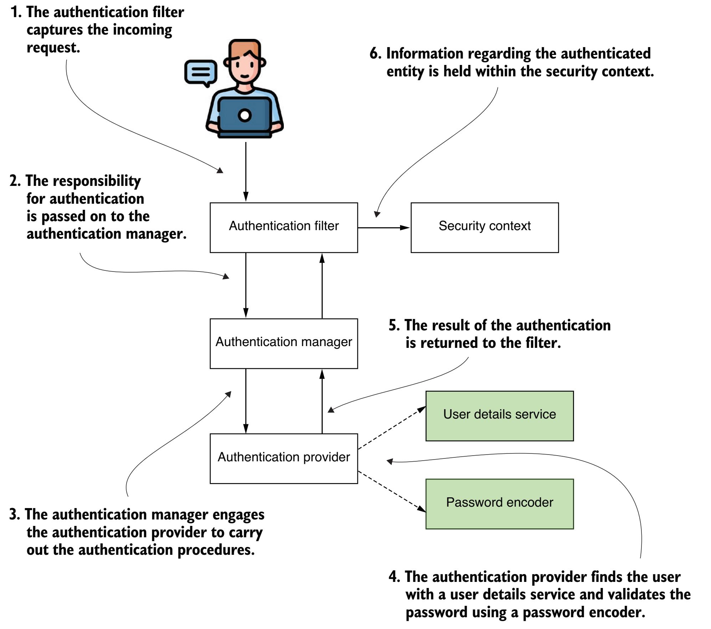{width="7.267716535433071in"
height="6.430555555555555in"}

[[https://github.com/spring-projects/spring-security/blob/main/web/src/main/java/org/springframework/security/web/authentication/AuthenticationFilter.java]{.underline}](https://github.com/spring-projects/spring-security/blob/main/web/src/main/java/org/springframework/security/web/authentication/AuthenticationFilter.java)

  -----------------------------------------------------------------------
  **\@Override**\
  **protected** **void** **doFilterInternal**(HttpServletRequest request,
  HttpServletResponse response, FilterChain filterChain)\
  **throws** ServletException, IOException {\
  **if** (!**this**.requestMatcher.matches(request)) {\
  **if** (logger.isTraceEnabled()) {\
  logger.trace(\"Did not match request to \" + **this**.requestMatcher);\
  }\
  filterChain.doFilter(request, response);\
  **return**;\
  }\
  **try** {\
  Authentication authenticationResult = attemptAuthentication(request,
  response);\
  **if** (authenticationResult == **null**) {\
  filterChain.doFilter(request, response);\
  **return**;\
  }\
  HttpSession session = request.getSession(**false**);\
  **if** (session != **null**) {\
  request.changeSessionId();\
  }\
  successfulAuthentication(request, response, filterChain,
  authenticationResult);\
  }\
  **catch** (AuthenticationException ex) {\
  unsuccessfulAuthentication(request, response, ex);\
  }\
  }\
  **private** Authentication **attemptAuthentication**(HttpServletRequest
  request, HttpServletResponse response)\
  **throws** AuthenticationException, ServletException {\
  Authentication authentication =
  **this**.authenticationConverter.convert(request);\
  **if** (authentication == **null**) {\
  **return** **null**;\
  }\
  AuthenticationManager authenticationManager =
  **this**.authenticationManagerResolver.resolve(request);\
  Authentication authenticationResult =
  authenticationManager.authenticate(authentication);\
  **if** (authenticationResult == **null**) {\
  **throw** **new** ServletException(\"AuthenticationManager should not
  return null Authentication object.\");\
  }\
  **return** authenticationResult;\
  }\
  **private** **void** **successfulAuthentication**(HttpServletRequest
  request, HttpServletResponse response, FilterChain chain,\
  Authentication authentication) **throws** IOException, ServletException
  {\
  SecurityContext context =
  **this**.securityContextHolderStrategy.createEmptyContext();\
  context.setAuthentication(authentication);\
  **this**.securityContextHolderStrategy.setContext(context);\
  **this**.securityContextRepository.saveContext(context, request,
  response);\
  **this**.successHandler.onAuthenticationSuccess(request, response,
  chain, authentication);\
  }
  -----------------------------------------------------------------------

  -----------------------------------------------------------------------

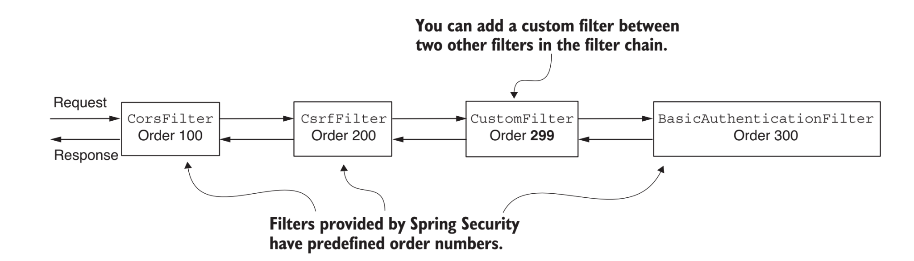{width="7.267716535433071in"
height="2.0833333333333335in"}

### AuthenticationManager

AuthenticationManager serves as the API specifying how authentication is
conducted by Spring Security's Filters. The resulting authentication is
subsequently established on SecurityContextHolder by the invoking
controller (i.e., Spring Security's Filters instances).

[[https://github.com/spring-projects/spring-security/blob/main/core/src/main/java/org/springframework/security/authentication/AuthenticationManager.java]{.underline}](https://github.com/spring-projects/spring-security/blob/main/core/src/main/java/org/springframework/security/authentication/AuthenticationManager.java)

  -----------------------------------------------------------------------
  **public** **interface** **AuthenticationManager** {\
  \
  Authentication **authenticate**(Authentication authentication)
  **throws** AuthenticationException;\
  }
  -----------------------------------------------------------------------

  -----------------------------------------------------------------------

### ProviderManager

ProviderManager stands out as the frequently employed realization of
AuthenticationManager.

It delegates responsibilities to a list of AuthenticationProvider
instances. Each

AuthenticationProvider possesses the capability to express whether
authentication should

succeed, fail, or delegate the decision-making to a subsequent
AuthenticationProvider

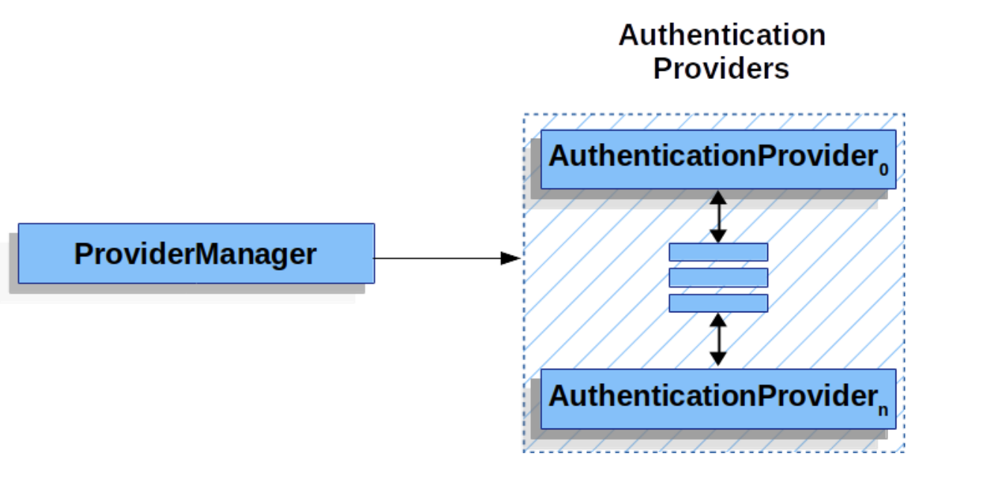{width="7.267716535433071in"
height="3.486111111111111in"}In the event that none of the configured
AuthenticationProvider instances can authenticate,

the authentication process results in a ProviderNotFoundException. This
particular

AuthenticationException signifies that the ProviderManager lacked
configuration to

support the specific authentication type provided to it.

Additionally, ProviderManager enables the configuration of an optional
parent

AuthenticationManager. This parent AuthenticationManager is consulted
when no

AuthenticationProvider is able to execute authentication. The parent can
take on any form

of AuthenticationManager, with ProviderManager frequently being the
chosen type.

By default, ProviderManager attempts to remove any sensitive credential
information from the

Authentication object returned upon a successful authentication request.
This precautionary

measure ensures that sensitive details, such as passwords, are not
stored in the HttpSession for

longer than necessary.

[[https://github.com/spring-projects/spring-security/blob/main/core/src/main/java/org/springframework/security/authentication/ProviderManager.java]{.underline}](https://github.com/spring-projects/spring-security/blob/main/core/src/main/java/org/springframework/security/authentication/ProviderManager.java)

  -----------------------------------------------------------------------------------------------
  **public** **class** **ProviderManager** **implements** **AuthenticationManager**,
  **MessageSourceAware**, **InitializingBean** {\
  **private** List\<AuthenticationProvider\> providers = Collections.emptyList();\
  \
  \
  **private** AuthenticationManager parent;\
  **\@Override**\
  **public** Authentication **authenticate**(Authentication authentication) **throws**
  AuthenticationException {\
  Class\<? extends Authentication\> toTest = authentication.getClass();\
  AuthenticationException lastException = **null**;\
  AuthenticationException parentException = **null**;\
  Authentication result = **null**;\
  Authentication parentResult = **null**;\
  **int** currentPosition = 0;\
  **int** size = **this**.providers.size();\
  **for** (AuthenticationProvider provider : getProviders()) {\
  **if** (!provider.supports(toTest)) {\
  **continue**;\
  }\
  **if** (logger.isTraceEnabled()) {\
  logger.trace(LogMessage.format(\"Authenticating request with %s (%d/%d)\",\
  provider.getClass().getSimpleName(), ++currentPosition, size));\
  }\
  **try** {\
  result = provider.authenticate(authentication);\
  **if** (result != **null**) {\
  copyDetails(authentication, result);\
  **break**;\
  }\
  }\
  **catch** (AccountStatusException \| InternalAuthenticationServiceException ex) {\
  prepareException(ex, authentication);\
  *// SEC-546: Avoid polling additional providers if auth failure is due to*\
  *// invalid account status*\
  **throw** ex;\
  }\
  **catch** (AuthenticationException ex) {\
  lastException = ex;\
  }\
  }\
  **if** (result == **null** && **this**.parent != **null**) {\
  *// Allow the parent to try.*\
  **try** {\
  parentResult = **this**.parent.authenticate(authentication);\
  result = parentResult;\
  }\
  **catch** (ProviderNotFoundException ex) {\
  *// ignore as we will throw below if no other exception occurred prior to*\
  *// calling parent and the parent*\
  *// may throw ProviderNotFound even though a provider in the child already*\
  *// handled the request*\
  }\
  **catch** (AuthenticationException ex) {\
  parentException = ex;\
  lastException = ex;\
  }\
  }\
  **if** (result != **null**) {\
  **if** (**this**.eraseCredentialsAfterAuthentication && (result **instanceof**
  CredentialsContainer)) {\
  *// Authentication is complete. Remove credentials and other secret data*\
  *// from authentication*\
  ((CredentialsContainer) result).eraseCredentials();\
  }\
  *// If the parent AuthenticationManager was attempted and successful then it*\
  *// will publish an AuthenticationSuccessEvent*\
  *// This check prevents a duplicate AuthenticationSuccessEvent if the parent*\
  *// AuthenticationManager already published it*\
  **if** (parentResult == **null**) {\
  **this**.eventPublisher.publishAuthenticationSuccess(result);\
  }\
  \
  **return** result;\
  }\
  \
  *// Parent was null, or didn\'t authenticate (or throw an exception).*\
  **if** (lastException == **null**) {\
  lastException = **new**
  ProviderNotFoundException(**this**.messages.getMessage(\"ProviderManager.providerNotFound\",\
  **new** Object\[\] { toTest.getName() }, \"No AuthenticationProvider found for {0}\"));\
  }\
  *// If the parent AuthenticationManager was attempted and failed then it will*\
  *// publish an AbstractAuthenticationFailureEvent*\
  *// This check prevents a duplicate AbstractAuthenticationFailureEvent if the*\
  *// parent AuthenticationManager already published it*\
  **if** (parentException == **null**) {\
  prepareException(lastException, authentication);\
  }\
  **throw** lastException;\
  }
  -----------------------------------------------------------------------------------------------

  -----------------------------------------------------------------------------------------------

### AuthenticationProvider 

In practical terms, every AuthenticationProvider is equipped to carry
out a distinct authentication method. For instance, one
AuthenticationProvider may validate a username/password, while another
is capable of authenticating a SAML Assertion.

Before Spring Security can invoke the authenticate method, the supports
method must return true for the Authentication class that will be passed
in.

  -----------------------------------------------------------------------
  **for** (AuthenticationProvider provider : getProviders()) {\
  **if** (!provider.supports(toTest)) {\
  **continue**;\
  }\
  }
  -----------------------------------------------------------------------

  -----------------------------------------------------------------------

  --------------------------------------------------------------------------------
  **\@Override**\
  **public** **boolean** **supports**(Class\<?\> authentication) {\
  **return**
  (UsernamePasswordAuthenticationToken.class.isAssignableFrom(authentication));\
  }
  --------------------------------------------------------------------------------

  --------------------------------------------------------------------------------

When a user authenticates, Spring Security submits an Authentication
object to AuthenticationProvider with the information provided by the
user. The current UsernamePasswordAuthentication object only contains a
username and password field.

The authenticate method accepts an Authentication object as an argument
that represents an

authentication request. In practical terms, it is the input from the
user that we need to attempt to validate. If authentication fails, the
method should throw an o.s.s.core.AuthenticationException exception. If
authentication succeeds, it should return an Authentication object that
contains the proper GrantedAuthority objects for the user. The returned
Authentication object will be set on SecurityContextHolder. If
authentication cannot be determined, the method

should return null.

It is possible to inject multiple instances of AuthenticationProviders
into ProviderManager.

Each AuthenticationProvider is responsible for a specific form of
authentication. For instance,

DaoAuthenticationProvider is designed for username/password-based
authentication, while

JwtAuthenticationProvider specializes in authenticating JSON Web Tokens.

  -----------------------------------------------------------------------
  **\@Bean**\
  **public** SecurityFilterChain **securityFilterChain**(HttpSecurity
  http,\
  DaoAuthenticationProvider jpaDaoAuthenticationProvider,\
  DaoAuthenticationProvider inMemoryDaoAuthenticationProvider,\
  LdapAuthenticationProvider ldapAuthenticationProvider) **throws**
  Exception {\
  http.authorizeHttpRequests(authorize -\> authorize\
  .requestMatchers(\"/h2-console\")\
  .permitAll()\
  .anyRequest()\
  .authenticated())\
  .csrf(AbstractHttpConfigurer::disable)\
  .httpBasic(withDefaults())\
  .authenticationManager(**new** ProviderManager(\
  List.of(jpaDaoAuthenticationProvider,
  inMemoryDaoAuthenticationProvider,\
  ldapAuthenticationProvider)));\
  \
  **return** http.build();\
  }
  -----------------------------------------------------------------------

  -----------------------------------------------------------------------

[[https://github.com/spring-projects/spring-security/blob/main/core/src/main/java/org/springframework/security/authentication/AuthenticationProvider.java]{.underline}](https://github.com/spring-projects/spring-security/blob/main/core/src/main/java/org/springframework/security/authentication/AuthenticationProvider.java)

  -----------------------------------------------------------------------
  **public** **interface** **AuthenticationProvider** {\
  Authentication **authenticate**(Authentication authentication)
  **throws** AuthenticationException;\
  \
  **boolean** **supports**(Class\<?\> authentication);\
  }
  -----------------------------------------------------------------------

  -----------------------------------------------------------------------

####  Username/Password Authentication
The AuthenticationProvider is the element responsible for executing the
authentication process and utilizes the UserDetailsService to gather
user details. It invokes the loadUserByUsername(String username) method
to locate the user based on their username.

[[https://github.com/spring-projects/spring-security/blob/main/core/src/main/java/org/springframework/security/authentication/dao/AbstractUserDetailsAuthenticationProvider.java]{.underline}](https://github.com/spring-projects/spring-security/blob/main/core/src/main/java/org/springframework/security/authentication/dao/AbstractUserDetailsAuthenticationProvider.java)

  -------------------------------------------------------------------------------------------
  **public** **abstract** **class** **AbstractUserDetailsAuthenticationProvider**\
  **implements** **AuthenticationProvider**, **InitializingBean**, **MessageSourceAware** {\
  \
  \
  **\@Override**\
  **public** Authentication **authenticate**(Authentication authentication) **throws**
  AuthenticationException {\
  Assert.isInstanceOf(UsernamePasswordAuthenticationToken.class, authentication,\
  () -\>
  **this**.messages.getMessage(\"AbstractUserDetailsAuthenticationProvider.onlySupports\",\
  \"Only UsernamePasswordAuthenticationToken is supported\"));\
  String username = determineUsername(authentication);\
  **boolean** cacheWasUsed = **true**;\
  UserDetails user = **this**.userCache.getUserFromCache(username);\
  **if** (user == **null**) {\
  cacheWasUsed = **false**;\
  **try** {\
  user = retrieveUser(username, (UsernamePasswordAuthenticationToken) authentication);\
  }\
  **catch** (UsernameNotFoundException ex) {\
  **this**.logger.debug(\"Failed to find user \'\" + username + \"\'\");\
  **if** (!**this**.hideUserNotFoundExceptions) {\
  **throw** ex;\
  }\
  **throw** **new** BadCredentialsException(**this**.messages\
  .getMessage(\"AbstractUserDetailsAuthenticationProvider.badCredentials\", \"Bad
  credentials\"));\
  }\
  Assert.notNull(user, \"retrieveUser returned null - a violation of the interface
  contract\");\
  }\
  **try** {\
  **this**.preAuthenticationChecks.check(user);\
  additionalAuthenticationChecks(user, (UsernamePasswordAuthenticationToken)
  authentication);\
  }\
  **catch** (AuthenticationException ex) {\
  **if** (!cacheWasUsed) {\
  **throw** ex;\
  }\
  *// There was a problem, so try again after checking*\
  *// we\'re using latest data (i.e. not from the cache)*\
  cacheWasUsed = **false**;\
  user = retrieveUser(username, (UsernamePasswordAuthenticationToken) authentication);\
  **this**.preAuthenticationChecks.check(user);\
  additionalAuthenticationChecks(user, (UsernamePasswordAuthenticationToken)
  authentication);\
  }\
  **this**.postAuthenticationChecks.check(user);\
  **if** (!cacheWasUsed) {\
  **this**.userCache.putUserInCache(user);\
  }\
  Object principalToReturn = user;\
  **if** (**this**.forcePrincipalAsString) {\
  principalToReturn = user.getUsername();\
  }\
  **return** createSuccessAuthentication(principalToReturn, authentication, user);\
  }\
  \
  **private** String **determineUsername**(Authentication authentication) {\
  **return** (authentication.getPrincipal() == **null**) ? \"NONE_PROVIDED\" :
  authentication.getName();\
  }\
  \
  **protected** Authentication **createSuccessAuthentication**(Object principal,
  Authentication authentication,\
  UserDetails user) {\
  *// Ensure we return the original credentials the user supplied,*\
  *// so subsequent attempts are successful even with encoded passwords.*\
  *// Also ensure we return the original getDetails(), so that future*\
  *// authentication events after cache expiry contain the details*\
  UsernamePasswordAuthenticationToken result =
  UsernamePasswordAuthenticationToken.authenticated(principal,\
  authentication.getCredentials(),
  **this**.authoritiesMapper.mapAuthorities(user.getAuthorities()));\
  result.setDetails(authentication.getDetails());\
  **this**.logger.debug(\"Authenticated user\");\
  **return** result;\
  }\
  \
  **protected** **void** **doAfterPropertiesSet**() **throws** Exception {\
  }\
  \
  **public** UserCache **getUserCache**() {\
  **return** **this**.userCache;\
  }\
  \
  **public** **boolean** **isForcePrincipalAsString**() {\
  **return** **this**.forcePrincipalAsString;\
  }\
  \
  **public** **boolean** **isHideUserNotFoundExceptions**() {\
  **return** **this**.hideUserNotFoundExceptions;\
  }\
  \
  **protected** **abstract** UserDetails **retrieveUser**(String username,
  UsernamePasswordAuthenticationToken authentication)\
  **throws** AuthenticationException;\
  \
  **public** **void** **setForcePrincipalAsString**(**boolean** forcePrincipalAsString) {\
  **this**.forcePrincipalAsString = forcePrincipalAsString;\
  }\
  \
  **public** **void** **setHideUserNotFoundExceptions**(**boolean**
  hideUserNotFoundExceptions) {\
  **this**.hideUserNotFoundExceptions = hideUserNotFoundExceptions;\
  }\
  \
  **\@Override**\
  **public** **void** **setMessageSource**(MessageSource messageSource) {\
  **this**.messages = **new** MessageSourceAccessor(messageSource);\
  }\
  \
  **public** **void** **setUserCache**(UserCache userCache) {\
  **this**.userCache = userCache;\
  }\
  \
  **\@Override**\
  **public** **boolean** **supports**(Class\<?\> authentication) {\
  **return** (UsernamePasswordAuthenticationToken.class.isAssignableFrom(authentication));\
  }\
  \
  **protected** UserDetailsChecker **getPreAuthenticationChecks**() {\
  **return** **this**.preAuthenticationChecks;\
  }\
  \
  */\*\*\
  \* Sets the policy will be used to verify the status of the loaded\
  \* \<tt\>UserDetails\</tt\> \<em\>before\</em\> validation of the credentials takes place.\
  \* \@param preAuthenticationChecks strategy to be invoked prior to authentication.\
  \*/*\
  **public** **void** **setPreAuthenticationChecks**(UserDetailsChecker
  preAuthenticationChecks) {\
  **this**.preAuthenticationChecks = preAuthenticationChecks;\
  }\
  \
  **protected** UserDetailsChecker **getPostAuthenticationChecks**() {\
  **return** **this**.postAuthenticationChecks;\
  }\
  \
  **public** **void** **setPostAuthenticationChecks**(UserDetailsChecker
  postAuthenticationChecks) {\
  **this**.postAuthenticationChecks = postAuthenticationChecks;\
  }\
  \
  **public** **void** **setAuthoritiesMapper**(GrantedAuthoritiesMapper authoritiesMapper) {\
  **this**.authoritiesMapper = authoritiesMapper;\
  }\
  \
  **private** **class** **DefaultPreAuthenticationChecks** **implements**
  **UserDetailsChecker** {\
  \
  **\@Override**\
  **public** **void** **check**(UserDetails user) {\
  **if** (!user.isAccountNonLocked()) {\
  AbstractUserDetailsAuthenticationProvider.**this**.logger\
  .debug(\"Failed to authenticate since user account is locked\");\
  **throw** **new**
  LockedException(AbstractUserDetailsAuthenticationProvider.**this**.messages\
  .getMessage(\"AbstractUserDetailsAuthenticationProvider.locked\", \"User account is
  locked\"));\
  }\
  **if** (!user.isEnabled()) {\
  AbstractUserDetailsAuthenticationProvider.**this**.logger\
  .debug(\"Failed to authenticate since user account is disabled\");\
  **throw** **new**
  DisabledException(AbstractUserDetailsAuthenticationProvider.**this**.messages\
  .getMessage(\"AbstractUserDetailsAuthenticationProvider.disabled\", \"User is
  disabled\"));\
  }\
  **if** (!user.isAccountNonExpired()) {\
  AbstractUserDetailsAuthenticationProvider.**this**.logger\
  .debug(\"Failed to authenticate since user account has expired\");\
  **throw** **new**
  AccountExpiredException(AbstractUserDetailsAuthenticationProvider.**this**.messages\
  .getMessage(\"AbstractUserDetailsAuthenticationProvider.expired\", \"User account has
  expired\"));\
  }\
  }\
  \
  }\
  \
  **private** **class** **DefaultPostAuthenticationChecks** **implements**
  **UserDetailsChecker** {\
  \
  **\@Override**\
  **public** **void** **check**(UserDetails user) {\
  **if** (!user.isCredentialsNonExpired()) {\
  AbstractUserDetailsAuthenticationProvider.**this**.logger\
  .debug(\"Failed to authenticate since user account credentials have expired\");\
  **throw** **new**
  CredentialsExpiredException(AbstractUserDetailsAuthenticationProvider.**this**.messages\
  .getMessage(\"AbstractUserDetailsAuthenticationProvider.credentialsExpired\",\
  \"User credentials have expired\"));\
  }\
  }\
  \
  }\
  \
  }
  -------------------------------------------------------------------------------------------

  -------------------------------------------------------------------------------------------

##### DaoAuthenticationProvider

  --------------------------------------------------------------------------------
  **public** **class** **DaoAuthenticationProvider** **extends**
  **AbstractUserDetailsAuthenticationProvider** {\
  \
  */\*\*\
  \* The plaintext password used to perform\
  \* {@link PasswordEncoder#matches(CharSequence, String)} on when the user is not
  found\
  \* to avoid SEC-2056.\
  \*/*\
  **private** **static** **final** String USER_NOT_FOUND_PASSWORD =
  \"userNotFoundPassword\";\
  \
  **private** PasswordEncoder passwordEncoder;\
  \
  */\*\*\
  \* The password used to perform {@link PasswordEncoder#matches(CharSequence,
  String)}\
  \* on when the user is not found to avoid SEC-2056. This is necessary, because
  some\
  \* {@link PasswordEncoder} implementations will short circuit if the password is
  not\
  \* in a valid format.\
  \*/*\
  **private** **volatile** String userNotFoundEncodedPassword;\
  \
  **private** UserDetailsService userDetailsService;\
  \
  **private** UserDetailsPasswordService userDetailsPasswordService;\
  \
  **private** CompromisedPasswordChecker compromisedPasswordChecker;\
  \
  **public** **DaoAuthenticationProvider**() {\
  **this**(PasswordEncoderFactories.createDelegatingPasswordEncoder());\
  }\
  \
  */\*\*\
  \* Creates a new instance using the provided {@link PasswordEncoder}\
  \* \@param passwordEncoder the {@link PasswordEncoder} to use. Cannot be null.\
  \* \@since 6.0.3\
  \*/*\
  **public** **DaoAuthenticationProvider**(PasswordEncoder passwordEncoder) {\
  setPasswordEncoder(passwordEncoder);\
  }\
  \
  **\@Override**\
  **\@SuppressWarnings**(\"deprecation\")\
  **protected** **void** **additionalAuthenticationChecks**(UserDetails
  userDetails,\
  UsernamePasswordAuthenticationToken authentication) **throws**
  AuthenticationException {\
  **if** (authentication.getCredentials() == **null**) {\
  **this**.logger.debug(\"Failed to authenticate since no credentials
  provided\");\
  **throw** **new** BadCredentialsException(**this**.messages\
  .getMessage(\"AbstractUserDetailsAuthenticationProvider.badCredentials\", \"Bad
  credentials\"));\
  }\
  String presentedPassword = authentication.getCredentials().toString();\
  **if** (!**this**.passwordEncoder.matches(presentedPassword,
  userDetails.getPassword())) {\
  **this**.logger.debug(\"Failed to authenticate since password does not match
  stored value\");\
  **throw** **new** BadCredentialsException(**this**.messages\
  .getMessage(\"AbstractUserDetailsAuthenticationProvider.badCredentials\", \"Bad
  credentials\"));\
  }\
  }\
  \
  **\@Override**\
  **protected** **void** **doAfterPropertiesSet**() {\
  Assert.notNull(**this**.userDetailsService, \"A UserDetailsService must be
  set\");\
  }\
  \
  **\@Override**\
  **protected** **final** UserDetails **retrieveUser**(String username,
  UsernamePasswordAuthenticationToken authentication)\
  **throws** AuthenticationException {\
  prepareTimingAttackProtection();\
  **try** {\
  UserDetails loadedUser =
  **this**.getUserDetailsService().loadUserByUsername(username);\
  **if** (loadedUser == **null**) {\
  **throw** **new** InternalAuthenticationServiceException(\
  \"UserDetailsService returned null, which is an interface contract
  violation\");\
  }\
  **return** loadedUser;\
  }\
  **catch** (UsernameNotFoundException ex) {\
  mitigateAgainstTimingAttack(authentication);\
  **throw** ex;\
  }\
  **catch** (InternalAuthenticationServiceException ex) {\
  **throw** ex;\
  }\
  **catch** (Exception ex) {\
  **throw** **new** InternalAuthenticationServiceException(ex.getMessage(), ex);\
  }\
  }\
  \
  **\@Override**\
  **protected** Authentication **createSuccessAuthentication**(Object principal,
  Authentication authentication,\
  UserDetails user) {\
  String presentedPassword = authentication.getCredentials().toString();\
  **boolean** isPasswordCompromised = **this**.compromisedPasswordChecker !=
  **null**\
  &&
  **this**.compromisedPasswordChecker.check(presentedPassword).isCompromised();\
  **if** (isPasswordCompromised) {\
  **throw** **new** CompromisedPasswordException(\"The provided password is
  compromised, please change your password\");\
  }\
  **boolean** upgradeEncoding = **this**.userDetailsPasswordService != **null**\
  && **this**.passwordEncoder.upgradeEncoding(user.getPassword());\
  **if** (upgradeEncoding) {\
  String newPassword = **this**.passwordEncoder.encode(presentedPassword);\
  user = **this**.userDetailsPasswordService.updatePassword(user, newPassword);\
  }\
  **return** **super**.createSuccessAuthentication(principal, authentication,
  user);\
  }\
  \
  **private** **void** **prepareTimingAttackProtection**() {\
  **if** (**this**.userNotFoundEncodedPassword == **null**) {\
  **this**.userNotFoundEncodedPassword =
  **this**.passwordEncoder.encode(USER_NOT_FOUND_PASSWORD);\
  }\
  }\
  \
  **private** **void**
  **mitigateAgainstTimingAttack**(UsernamePasswordAuthenticationToken
  authentication) {\
  **if** (authentication.getCredentials() != **null**) {\
  String presentedPassword = authentication.getCredentials().toString();\
  **this**.passwordEncoder.matches(presentedPassword,
  **this**.userNotFoundEncodedPassword);\
  }\
  }\
  \
  */\*\*\
  \* Sets the PasswordEncoder instance to be used to encode and validate
  passwords. If\
  \* not set, the password will be compared using\
  \* {@link PasswordEncoderFactories#createDelegatingPasswordEncoder()}\
  \* \@param passwordEncoder must be an instance of one of the {@code
  PasswordEncoder}\
  \* types.\
  \*/*\
  **public** **void** **setPasswordEncoder**(PasswordEncoder passwordEncoder) {\
  Assert.notNull(passwordEncoder, \"passwordEncoder cannot be null\");\
  **this**.passwordEncoder = passwordEncoder;\
  **this**.userNotFoundEncodedPassword = **null**;\
  }\
  \
  **protected** PasswordEncoder **getPasswordEncoder**() {\
  **return** **this**.passwordEncoder;\
  }\
  \
  **public** **void** **setUserDetailsService**(UserDetailsService
  userDetailsService) {\
  **this**.userDetailsService = userDetailsService;\
  }\
  \
  **protected** UserDetailsService **getUserDetailsService**() {\
  **return** **this**.userDetailsService;\
  }\
  \
  **public** **void** **setUserDetailsPasswordService**(UserDetailsPasswordService
  userDetailsPasswordService) {\
  **this**.userDetailsPasswordService = userDetailsPasswordService;\
  }\
  \
  */\*\*\
  \* Sets the {@link CompromisedPasswordChecker} to be used before creating a
  successful\
  \* authentication. Defaults to {@code null}.\
  \* \@param compromisedPasswordChecker the {@link CompromisedPasswordChecker} to
  use\
  \* \@since 6.3\
  \*/*\
  **public** **void** **setCompromisedPasswordChecker**(CompromisedPasswordChecker
  compromisedPasswordChecker) {\
  **this**.compromisedPasswordChecker = compromisedPasswordChecker;\
  }\
  \
  }
  --------------------------------------------------------------------------------

  --------------------------------------------------------------------------------

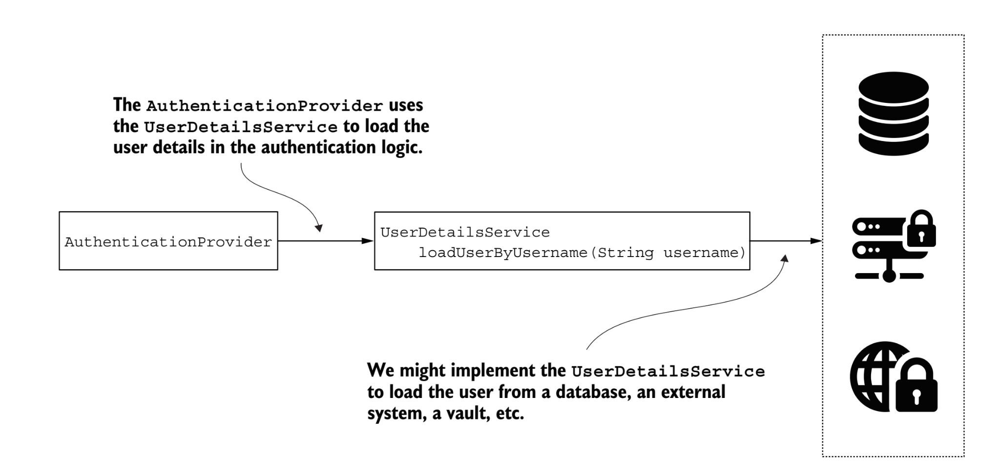{width="7.267716535433071in"
height="3.4583333333333335in"}

### UserDetailsService

#### JdbcUserDetailsManager

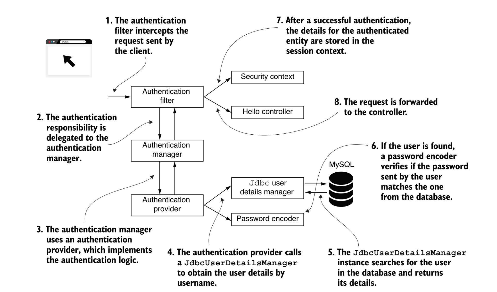{width="7.267716535433071in"
height="4.277777777777778in"}

**Dependencies between the components involved in user management**.

The UserDetailsService retrieves a user's details by searching for the
user by name. The user is characterized by the UserDetails contract.
Each user possesses one or more authorities, which are depicted by the
GrantedAuthority interface. For incorporating operations such as create,
delete, or modify password for a user, the UserDetailsManager contract,
which expands on the UserDetailsService, is used to include these
functionalities.

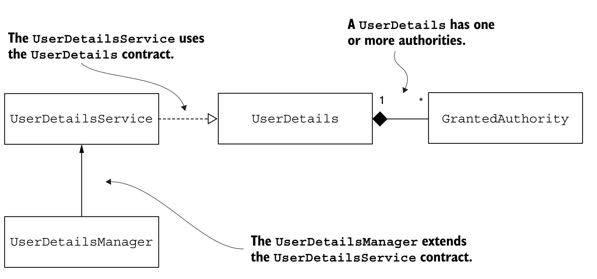{width="7.267716535433071in"
height="3.388888888888889in"}

### Practice:CustomAuthenticationProvider

```java
@Component
public class CustomAuthenticationProvider implements AuthenticationProvider {
    private final UserDetailsService userDetailsService;
    private final PasswordEncoder passwordEncoder;

    public CustomAuthenticationProvider(UserDetailsService userDetailsService, PasswordEncoder passwordEncoder) {
        this.userDetailsService = userDetailsService;
        this.passwordEncoder = passwordEncoder;
    }

    @Override
    public Authentication authenticate(Authentication authentication) throws AuthenticationException {
        String username = authentication.getName();
        String password = authentication.getCredentials().toString();
        UserDetails userDetails = userDetailsService.loadUserByUsername(username);
        if (passwordEncoder.matches(password, userDetails.getPassword())) {
            return new UsernamePasswordAuthenticationToken(username, password, userDetails.getAuthorities());
        } else
            throw new BadCredentialsException("Something went wrong");

    }

    @Override
    public boolean supports(Class<?> authentication) {
        return authentication.equals(UsernamePasswordAuthenticationToken.class);
    }

}
```
```java
 @Configuration
public class SecurityConfig {

    private final AuthenticationProvider authenticationProvider;

    public SecurityConfig(
            AuthenticationProvider authenticationProvider) {
        this.authenticationProvider = authenticationProvider;
    }

    @Bean
    public SecurityFilterChain securityFilterChain(HttpSecurity http)
            throws Exception {
        http.httpBasic(Customizer.withDefaults())
                .authenticationProvider(authenticationProvider)
                .authorizeHttpRequests(authorize -> authorize
                        .anyRequest()
                        .authenticated());
        // .authorizeRequests(c -> c.anyRequest().permitAll());
        return http.build();
    }
```

}


```java
@Configuration
public class UserManagementConfig {

  @Bean
  public UserDetailsService userDetailsService() {
    UserDetails user =
        User.withUsername("user")
            .password("password")
            .authorities("read")
            .build();

    return new InMemoryUserDetailsManager(user);
  }

  @Bean
  public PasswordEncoder passwordEncoder() {
    return NoOpPasswordEncoder.getInstance();
  }
}
```

**Another example**

```java
@Component
public class CalendarUserAuthenticationProvider implements AuthenticationProvider {
    /**
     * The Calendar service.
     */
    private final CalendarService calendarService;


    /**
     * Instantiates a new Calendar user authentication provider.
     *
     * @param calendarService the calendar service
     */
    public CalendarUserAuthenticationProvider(final CalendarService calendarService) {
        if (calendarService == null) {
            throw new IllegalArgumentException("calendarService cannot be null");
        }
        this.calendarService = calendarService;
    }

    @Override
    public Authentication authenticate(final Authentication authentication) throws AuthenticationException {
        UsernamePasswordAuthenticationToken token = (UsernamePasswordAuthenticationToken) authentication;
        String email = token.getName();
        CalendarUser user = email == null ? null : calendarService.findUserByEmail(email);
        if (user == null) {
            throw new UsernameNotFoundException("Invalid username/password");
        }
        String password = user.getPassword();
        if (!password.equals(token.getCredentials())) {
            throw new BadCredentialsException("Invalid username/password");
        }
        Collection<? extends GrantedAuthority> authorities = CalendarUserAuthorityUtils.createAuthorities(user);
        return new UsernamePasswordAuthenticationToken(user, password, authorities);
    }

    @Override
    public boolean supports(final Class<?> authentication) {
        return UsernamePasswordAuthenticationToken.class.equals(authentication);
    }
}

```
```java
@Configuration
@EnableWebSecurity
public class SecurityConfig {

    /**
     * The Cuap.
     */
    private final CalendarUserAuthenticationProvider cuap;

    /**
     * Instantiates a new Security config.
     *
     * @param cuap the cuap
     */
    public SecurityConfig(CalendarUserAuthenticationProvider cuap) {
        this.cuap = cuap;
    }


    /**
     * Auth manager authentication manager.
     *
     * @param http the http
     * @return the authentication manager
     * @throws Exception the exception
     */
    @Bean
    public AuthenticationManager authManager(HttpSecurity http) throws Exception {
        AuthenticationManagerBuilder authenticationManagerBuilder =
                http.getSharedObject(AuthenticationManagerBuilder.class);
        authenticationManagerBuilder.authenticationProvider(cuap);
        return authenticationManagerBuilder.build();
    }

    /**
     * Filter chain security filter chain.
     *
     * @param http the http
     * @return the security filter chain
     * @throws Exception the exception
     */
    @Bean
    public SecurityFilterChain filterChain(HttpSecurity http) throws Exception {
                return http.build();
    }

}
```
### Practice:CustomAuthenticationProvider

### PasswordEncoder
The PasswordEncoder does two things:
1. Encodes a password (usually using an encryption or a hashing algorithm)
1. Verifies if the password matches an existing encoding

 
[[https://github.com/spring-projects/spring-security/blob/main/crypto/src/main/java/org/springframework/security/crypto/password/PasswordEncoder.java]{.underline}](https://github.com/spring-projects/spring-security/blob/main/crypto/src/main/java/org/springframework/security/crypto/password/PasswordEncoder.java)

  -----------------------------------------------------------------------
  **package** org.springframework.security.crypto.password;\
  \
  **public** **interface** **PasswordEncoder** {\
  \
  */\*\*\
  \* Encode the raw password. Generally, a good encoding algorithm
  applies a SHA-1 or\
  \* greater hash combined with an 8-byte or greater randomly generated
  salt.\
  \*/*\
  String **encode**(CharSequence rawPassword);\
  \
  */\*\*\
  \* Verify the encoded password obtained from storage matches the
  submitted raw\
  \* password after it too is encoded. Returns true if the passwords
  match, false if\
  \* they do not. The stored password itself is never decoded.\
  \* \@param rawPassword the raw password to encode and match\
  \* \@param encodedPassword the encoded password from storage to compare
  with\
  \* \@return true if the raw password, after encoding, matches the
  encoded password from\
  \* storage\
  \*/*\
  **boolean** **matches**(CharSequence rawPassword, String
  encodedPassword);\
  \
  */\*\*\
  \* Returns true if the encoded password should be encoded again for
  better security,\
  \* else false. The default implementation always returns false.\
  \* \@param encodedPassword the encoded password to check\
  \* \@return true if the encoded password should be encoded again for
  better security,\
  \* else false.\
  \*/*\
  **default** **boolean** **upgradeEncoding**(String encodedPassword) {\
  **return** **false**;\
  }\
  \
  }
  -----------------------------------------------------------------------

  -----------------------------------------------------------------------

#### NoOpPasswordEncoder 

Managing passwords in cleartext is what the instance of NoOpPasswordEncoder is precisely

[[https://github.com/spring-projects/spring-security/blob/main/crypto/src/main/java/org/springframework/security/crypto/password/NoOpPasswordEncoder.java]{.underline}](https://github.com/spring-projects/spring-security/blob/main/crypto/src/main/java/org/springframework/security/crypto/password/NoOpPasswordEncoder.java)

  -----------------------------------------------------------------------
  **package** org.springframework.security.crypto.password;\
  \
  */\*\*\
  \* A password encoder that does nothing. Useful for testing where
  working with plain text\
  \* passwords may be preferred.\
  \*/*\
  **\@Deprecated**\
  **public** **final** **class** **NoOpPasswordEncoder** **implements**
  **PasswordEncoder** {\
  \
  **private** **static** **final** PasswordEncoder INSTANCE = **new**
  NoOpPasswordEncoder();\
  \
  **private** **NoOpPasswordEncoder**() {\
  }\
  \
  **\@Override**\
  **public** String **encode**(CharSequence rawPassword) {\
  **return** rawPassword.toString();\
  }\
  \
  **\@Override**\
  **public** **boolean** **matches**(CharSequence rawPassword, String
  encodedPassword) {\
  **return** rawPassword.toString().equals(encodedPassword);\
  }\
  \
  */\*\*\
  \* Get the singleton {@link NoOpPasswordEncoder}.\
  \*/*\
  **public** **static** PasswordEncoder **getInstance**() {\
  **return** INSTANCE;\
  }\
  \
  }
  -----------------------------------------------------------------------

  -----------------------------------------------------------------------

#### StandardPasswordEncoder

Uses SHA-256 to hash the password

https://github.com/spring-projects/spring-security/blob/main/crypto/src/main/java/org/springframework/security/crypto/password/StandardPasswordEncoder.java

  -----------------------------------------------------------------------
  */\*\*\
  \* A standard {@code PasswordEncoder} implementation that uses SHA-256
  hashing with 1024\
  \* iterations and a random 8-byte random salt value. It uses an
  additional system-wide\
  \* secret value to provide additional protection.\
  \* \<p\>\
  \* The digest algorithm is invoked on the concatenated bytes of the
  salt, secret and\
  \* password.\
  \*/*\
  **\@Deprecated**\
  **public** **final** **class** **StandardPasswordEncoder**
  **implements** **PasswordEncoder** {\
  \
  **private** **static** **final** **int** DEFAULT_ITERATIONS = 1024;\
  \
  **private** **final** Digester digester;\
  \
  **private** **final** **byte**\[\] secret;\
  \
  **private** **final** BytesKeyGenerator saltGenerator;\
  \
  */\*\*\
  \* Constructs a standard password encoder with no additional secret
  value.\
  \*/*\
  **public** **StandardPasswordEncoder**() {\
  **this**(\"\");\
  }\
  \
  */\*\*\
  \* Constructs a standard password encoder with a secret value which is
  also included\
  \* in the password hash.\
  \* \@param secret the secret key used in the encoding process (should
  not be shared)\
  \*/*\
  **public** **StandardPasswordEncoder**(CharSequence secret) {\
  **this**(\"SHA-256\", secret);\
  }\
  \
  **\@Override**\
  **public** String **encode**(CharSequence rawPassword) {\
  **return** encode(rawPassword, **this**.saltGenerator.generateKey());\
  }\
  \
  **\@Override**\
  **public** **boolean** **matches**(CharSequence rawPassword, String
  encodedPassword) {\
  **byte**\[\] digested = decode(encodedPassword);\
  **byte**\[\] salt = EncodingUtils.subArray(digested, 0,
  **this**.saltGenerator.getKeyLength());\
  **return** MessageDigest.isEqual(digested, digest(rawPassword, salt));\
  }\
  \
  **private** **StandardPasswordEncoder**(String algorithm, CharSequence
  secret) {\
  **this**.digester = **new** Digester(algorithm, DEFAULT_ITERATIONS);\
  **this**.secret = Utf8.encode(secret);\
  **this**.saltGenerator = KeyGenerators.secureRandom();\
  }\
  \
  **private** String **encode**(CharSequence rawPassword, **byte**\[\]
  salt) {\
  **byte**\[\] digest = digest(rawPassword, salt);\
  **return** **new** String(Hex.encode(digest));\
  }\
  \
  **private** **byte**\[\] digest(CharSequence rawPassword, **byte**\[\]
  salt) {\
  **byte**\[\] digest =
  **this**.digester.digest(EncodingUtils.concatenate(salt,
  **this**.secret, Utf8.encode(rawPassword)));\
  **return** EncodingUtils.concatenate(salt, digest);\
  }\
  \
  **private** **byte**\[\] decode(CharSequence encodedPassword) {\
  **return** Hex.decode(encodedPassword);\
  }\
  \
  }
  -----------------------------------------------------------------------

  -----------------------------------------------------------------------

#### DelegatingPasswordEncoder

return new DelegatingPasswordEncoder(\"bcrypt\", encoders);

[[https://github.com/spring-projects/spring-security/blob/main/crypto/src/main/java/org/springframework/security/crypto/password/DelegatingPasswordEncoder.java]{.underline}](https://github.com/spring-projects/spring-security/blob/main/crypto/src/main/java/org/springframework/security/crypto/password/DelegatingPasswordEncoder.java)

[[https://github.com/spring-projects/spring-security/blob/main/crypto/src/main/java/org/springframework/security/crypto/factory/PasswordEncoderFactories.java]{.underline}](https://github.com/spring-projects/spring-security/blob/main/crypto/src/main/java/org/springframework/security/crypto/factory/PasswordEncoderFactories.java)

  -----------------------------------------------------------------------
  **\@Bean**\
  **public** PasswordEncoder **passwordEncoder**() {\
  Map\<String, PasswordEncoder\> encoders = **new** HashMap\<\>();\
  encoders.put(\"noop\", NoOpPasswordEncoder.getInstance());\
  encoders.put(\"bcrypt\", **new** BCryptPasswordEncoder());\
  encoders.put(\"scrypt\", **new** SCryptPasswordEncoder());\
  **return** **new** DelegatingPasswordEncoder(\"bcrypt\", encoders);\
  }
  -----------------------------------------------------------------------

  -----------------------------------------------------------------------

  -----------------------------------------------------------------------
  PasswordEncoder passwordEncoder =
  PasswordEncoderFactories.createDelegatingPasswordEncoder();
  -----------------------------------------------------------------------

  -----------------------------------------------------------------------

### SecurityContext

Once the AuthenticationManager completes the authentication process
successfully, it stores the Authentication instance for the rest of the
request.The instance storing the Authentication object is called the
security context.

Spring Security provides quite a few different methods for
authenticating a user. However, the net result is that Spring Security
will populate o.s.s.core.context.SecurityContext with
o.s.s.core.Authentication. The Authentication object represents all the
information we gathered at the time of authentication (username,
password, roles, and so on). The SecurityContext interface is then set
on the o.s.s.core.context.SecurityContextHolder interface.

This means that Spring Security and developers can use
SecurityContextHolder to obtain information about the currently
logged-in user. An example of obtaining the current username is
illustrated as follows:

  -----------------------------------------------------------------------
  String username = SecurityContextHolder.getContext()\
  .getAuthentication()\
  .getName();
  -----------------------------------------------------------------------

  -----------------------------------------------------------------------

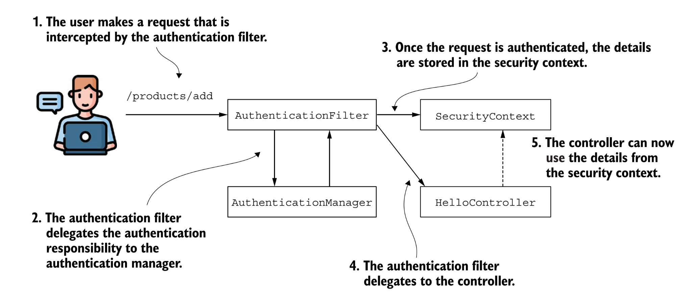{width="7.267716535433071in"
height="3.111111111111111in"}

[[https://github.com/spring-projects/spring-security/blob/3b9a2c3def8592f176194d77587d8d4bb9504db2/web/src/main/java/org/springframework/security/web/authentication/AuthenticationFilter.java]{.underline}](https://github.com/spring-projects/spring-security/blob/3b9a2c3def8592f176194d77587d8d4bb9504db2/web/src/main/java/org/springframework/security/web/authentication/AuthenticationFilter.java)

+-----------------------------------------------------------------------+
| **private SecurityContextHolderStrategy securityContextHolderStrategy |
| = SecurityContextHolder**                                             |
|                                                                       |
| **.getContextHolderStrategy();**                                      |
|                                                                       |
| **private SecurityContextRepository securityContextRepository = new   |
| RequestAttributeSecurityContextRepository();**                        |
|                                                                       |
| **private** **void** **successfulAuthentication**(HttpServletRequest  |
| request, HttpServletResponse response, FilterChain chain,\            |
| Authentication authentication) **throws** IOException,                |
| ServletException {\                                                   |
| SecurityContext context =                                             |
| **this**.securityContextHolderStrategy.createEmptyContext();\         |
| context.setAuthentication(authentication);\                           |
| **this**.securityContextHolderStrategy.setContext(context);\          |
| **this**.securityContextRepository.saveContext(context, request,      |
| response);\                                                           |
| **this**.successHandler.onAuthenticationSuccess(request, response,    |
| chain, authentication);\                                              |
| }                                                                     |
+=======================================================================+
+-----------------------------------------------------------------------+

### 

+-----------------------------------------------------------------------+
| **public** **interface** **SecurityContext** **extends**              |
| **Serializable** {                                                    |
|                                                                       |
| > Authentication **getAuthentication**();                             |
| >                                                                     |
| > **void** **setAuthentication**(Authentication authentication);      |
|                                                                       |
| }                                                                     |
+=======================================================================+
+-----------------------------------------------------------------------+

[[https://github.com/spring-projects/spring-security/blob/main/core/src/main/java/org/springframework/security/core/context/SecurityContextImpl.java]{.underline}](https://github.com/spring-projects/spring-security/blob/main/core/src/main/java/org/springframework/security/core/context/SecurityContextImpl.java)

  -----------------------------------------------------------------------
  **public** **class** **SecurityContextImpl** **implements**
  **SecurityContext** {\
  \
  **private** **static** **final** **long** serialVersionUID =
  SpringSecurityCoreVersion.SERIAL_VERSION_UID;\
  \
  **private** Authentication authentication;\
  \
  **public** **SecurityContextImpl**() {\
  }\
  \
  **public** **SecurityContextImpl**(Authentication authentication) {\
  **this**.authentication = authentication;\
  }\
  \
  **\@Override**\
  **public** **boolean** **equals**(Object obj) {\
  **if** (obj **instanceof** SecurityContextImpl other) {\
  **if** ((**this**.getAuthentication() == **null**) &&
  (other.getAuthentication() == **null**)) {\
  **return** **true**;\
  }\
  **if** ((**this**.getAuthentication() != **null**) &&
  (other.getAuthentication() != **null**)\
  && **this**.getAuthentication().equals(other.getAuthentication())) {\
  **return** **true**;\
  }\
  }\
  **return** **false**;\
  }\
  \
  **\@Override**\
  **public** Authentication **getAuthentication**() {\
  **return** **this**.authentication;\
  }\
  \
  **\@Override**\
  **public** **int** **hashCode**() {\
  **return** ObjectUtils.nullSafeHashCode(**this**.authentication);\
  }\
  \
  **\@Override**\
  **public** **void** **setAuthentication**(Authentication
  authentication) {\
  **this**.authentication = authentication;\
  }\
  \
  **\@Override**\
  **public** String **toString**() {\
  StringBuilder sb = **new** StringBuilder();\
  sb.append(getClass().getSimpleName()).append(\" \[\");\
  **if** (**this**.authentication == **null**) {\
  sb.append(\"Null authentication\");\
  }\
  **else** {\
  sb.append(\"Authentication=\").append(**this**.authentication);\
  }\
  sb.append(\"\]\");\
  **return** sb.toString();\
  }\
  \
  }
  -----------------------------------------------------------------------

  -----------------------------------------------------------------------

The Authentication interface in Spring Security serves dual purposes:

-   It acts as input for AuthenticationManager, supplying the user's
    > provided credentials for authentication. In this context, the
    > method isAuthenticated() returns false.

-   It serves as a representation of the presently authenticated user,
    > retrievable from the SecurityContext.

Key components within the Authentication interface include the
following:

-   Principal: This identifies the user, often represented as an
    > instance of UserDetails, especially in username/password
    > authentication.

-   Credentials: This typically encompasses a password. In many
    > instances, this information is

> cleared post-authentication to prevent inadvertent leakage.

-   Authorities: This comprises GrantedAuthority instances denoting
    > high-level permissions

> granted to the user. Examples include roles and scopes.

  -----------------------------------------------------------------------
  **public** **interface** **Principal** {\
  \
  */\*\*\
  \* Compares this principal to the specified object. Returns true\
  \* if the object passed in matches the principal represented by\
  \* the implementation of this interface.\
  \*\
  \* \@param another principal to compare with.\
  \*\
  \* \@return true if the principal passed in is the same as that\
  \* encapsulated by this principal, and false otherwise.\
  \
  \*/*\
  **public** **boolean** **equals**(Object another);\
  \
  */\*\*\
  \* Returns a string representation of this principal.\
  \*\
  \* \@return a string representation of this principal.\
  \*/*\
  **public** String **toString**();\
  \
  */\*\*\
  \* Returns a hashcode for this principal.\
  \*\
  \* \@return a hashcode for this principal.\
  \*/*\
  **public** **int** **hashCode**();\
  \
  */\*\*\
  \* Returns the name of this principal.\
  \*\
  \* \@return the name of this principal.\
  \*/*\
  **public** String **getName**();\
  }
  -----------------------------------------------------------------------

  -----------------------------------------------------------------------

[[https://github.com/spring-projects/spring-security/blob/main/core/src/main/java/org/springframework/security/core/Authentication.java]{.underline}](https://github.com/spring-projects/spring-security/blob/main/core/src/main/java/org/springframework/security/core/Authentication.java)

  -----------------------------------------------------------------------
  **public** **interface** **Authentication** **extends** **Principal**,
  **Serializable** {\
  Collection\<? extends GrantedAuthority\> getAuthorities();\
  Object **getCredentials**();\
  Object **getDetails**();\
  Object **getPrincipal**();\
  **boolean** **isAuthenticated**();\
  **void** **setAuthenticated**(**boolean** isAuthenticated) **throws**
  IllegalArgumentException;\
  }
  -----------------------------------------------------------------------

  -----------------------------------------------------------------------

### SecurityContextHolder

SecurityContextHolder is where Spring Security stores the details of who
is authenticated. It contains the SecurityContext.

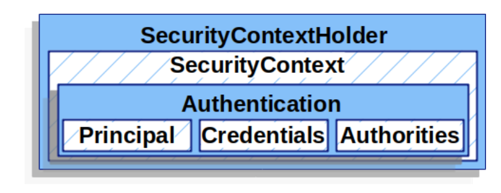{width="7.267716535433071in"
height="2.8055555555555554in"}

[[https://github.com/spring-projects/spring-security/blob/main/core/src/main/java/org/springframework/security/core/context/SecurityContextHolder.java]{.underline}](https://github.com/spring-projects/spring-security/blob/main/core/src/main/java/org/springframework/security/core/context/SecurityContextHolder.java)

Spring Security offers three strategies to manage the SecurityContext
with an object in the role of a manager. It's named the
SecurityContextHolder

[[https://github.com/spring-projects/spring-security/blob/3b9a2c3def8592f176194d77587d8d4bb9504db2/core/src/main/java/org/springframework/security/core/context/SecurityContextHolder.java#L219]{.underline}](https://github.com/spring-projects/spring-security/blob/3b9a2c3def8592f176194d77587d8d4bb9504db2/core/src/main/java/org/springframework/security/core/context/SecurityContextHolder.java#L219)

  -----------------------------------------------------------------------
  **public** **static** SecurityContextHolderStrategy
  **getContextHolderStrategy**() {\
  **return** strategy;\
  }
  -----------------------------------------------------------------------

  -----------------------------------------------------------------------

[[https://github.com/spring-projects/spring-security/blob/3b9a2c3def8592f176194d77587d8d4bb9504db2/core/src/main/java/org/springframework/security/core/context/SecurityContextHolder.java#L80]{.underline}](https://github.com/spring-projects/spring-security/blob/3b9a2c3def8592f176194d77587d8d4bb9504db2/core/src/main/java/org/springframework/security/core/context/SecurityContextHolder.java#L80)

+-----------------------------------------------------------------------+
| **private** **static** **void** **initializeStrategy**() {\           |
| **if** (MODE_PRE_INITIALIZED.equals(strategyName)) {\                 |
| Assert.state(strategy != **null**, \"When using \" +                  |
| MODE_PRE_INITIALIZED\                                                 |
| + \", setContextHolderStrategy must be called with the fully          |
| constructed strategy\");\                                             |
| **return**;\                                                          |
| }\                                                                    |
| **if** (!StringUtils.hasText(strategyName)) {\                        |
| *// Set default*\                                                     |
| strategyName = MODE_THREADLOCAL;\                                     |
| }\                                                                    |
| **if** (strategyName.equals(MODE_THREADLOCAL)) {\                     |
| strategy = **new** ThreadLocalSecurityContextHolderStrategy();\       |
| **return**;\                                                          |
| }\                                                                    |
| **if** (strategyName.equals(MODE_INHERITABLETHREADLOCAL)) {\          |
| strategy = **new**                                                    |
| InheritableThreadLocalSecurityContextHolderStrategy();\               |
| **return**;\                                                          |
| }\                                                                    |
| **if** (strategyName.equals(MODE_GLOBAL)) {\                          |
| strategy = **new** GlobalSecurityContextHolderStrategy();\            |
| **return**;\                                                          |
| }\                                                                    |
| *// Try to load a custom strategy*\                                   |
| **try** {\                                                            |
| Class\<?\> clazz = Class.forName(strategyName);\                      |
| Constructor\<?\> customStrategy = clazz.getConstructor();\            |
| strategy = (SecurityContextHolderStrategy)                            |
| customStrategy.newInstance();                                         |
|                                                                       |
| }\                                                                    |
| **catch** (Exception ex) {\                                           |
| ReflectionUtils.handleReflectionException(ex);\                       |
| }\                                                                    |
| }                                                                     |
+=======================================================================+
+-----------------------------------------------------------------------+

1.  **MODE_THREADLOCAL**---Allows each thread to store its own details
    > in the security

> context. In a thread-per-request web application, this is a common
> approach, as each request has an individual thread.\
> it is also the default for managing the security context used by
> Spring Security. With this strategy, Spring Security uses ThreadLocal
> to manage the context. ThreadLocal is an implementation provided by
> the JDK. This implementation works as a collection of data but ensures
> that each thread of the application can only see the data stored in
> its dedicated part of the collection. This way, each request has
> access to its security context. No thread will have access to
> another's ThreadLocal. That means that in a web application, each
> request can see only its own security context. We could say that this
> is also what you generally want to have for a backend web application
>
> From Figure, Each request (A, B, and C) has its own allocated thread
> (T1, T2, and T3), so each request only sees the details stored in its
> own security context. However, this also means that if a new thread is
> created (for example, when an asynchronous method is called), the new
> thread will have its own security context as well. The details from
> the parent thread (the original thread of the request) are not copied
> to the security context of the new thread.
>
> 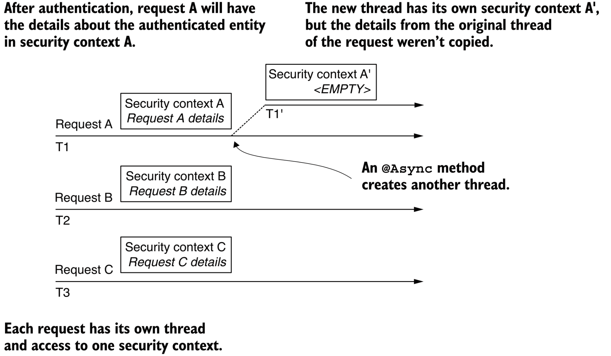{width="7.267716535433071in"
> height="4.236111111111111in"}
>
> [[https://github.com/spring-projects/spring-security/blob/main/core/src/main/java/org/springframework/security/core/context/ThreadLocalSecurityContextHolderStrategy.java]{.underline}](https://github.com/spring-projects/spring-security/blob/main/core/src/main/java/org/springframework/security/core/context/ThreadLocalSecurityContextHolderStrategy.java)

  -----------------------------------------------------------------------
  **final** **class** **ThreadLocalSecurityContextHolderStrategy**
  **implements** **SecurityContextHolderStrategy** {\
  \
  **private** **static** **final**
  ThreadLocal\<Supplier\<SecurityContext\>\> contextHolder = **new**
  ThreadLocal\<\>();\
  \
  **\@Override**\
  **public** **void** **clearContext**() {\
  contextHolder.remove();\
  }\
  \
  **\@Override**\
  **public** SecurityContext **getContext**() {\
  **return** getDeferredContext().get();\
  }\
  \
  **\@Override**\
  **public** Supplier\<SecurityContext\> **getDeferredContext**() {\
  Supplier\<SecurityContext\> result = contextHolder.get();\
  **if** (result == **null**) {\
  SecurityContext context = createEmptyContext();\
  result = () -\> context;\
  contextHolder.set(result);\
  }\
  **return** result;\
  }\
  \
  **\@Override**\
  **public** **void** **setContext**(SecurityContext context) {\
  Assert.notNull(context, \"Only non-null SecurityContext instances are
  permitted\");\
  contextHolder.set(() -\> context);\
  }\
  \
  **\@Override**\
  **public** **void** **setDeferredContext**(Supplier\<SecurityContext\>
  deferredContext) {\
  Assert.notNull(deferredContext, \"Only non-null Supplier instances are
  permitted\");\
  Supplier\<SecurityContext\> notNullDeferredContext = () -\> {\
  SecurityContext result = deferredContext.get();\
  Assert.notNull(result, \"A Supplier\<SecurityContext\> returned null
  and is not allowed.\");\
  **return** result;\
  };\
  contextHolder.set(notNullDeferredContext);\
  }\
  \
  **\@Override**\
  **public** SecurityContext **createEmptyContext**() {\
  **return** **new** SecurityContextImpl();\
  }
  -----------------------------------------------------------------------

  -----------------------------------------------------------------------

> }

2.  **MODE_INHERITABLETHREADLOCAL**---Similar to MODE_THREADLOCAL, but
    > it also

> instructs Spring Security to copy the security context to the next
> thread in case of
>
> an asynchronous method. This way, we can say that the new thread
> running the
>
> \@Async method inherits the security context. The \@Async annotation
> is used with
>
> methods to instruct Spring to call the annotated method on a separate
> thread.

3.  **MODE_GLOBAL**---Makes all the threads of the application see the
    > same security

> context instance

SecurityContextRepository

[[https://github.com/spring-projects/spring-security/blob/main/core/src/main/java/org/springframework/security/core/context/ListeningSecurityContextHolderStrategy.java]{.underline}](https://github.com/spring-projects/spring-security/blob/main/core/src/main/java/org/springframework/security/core/context/ListeningSecurityContextHolderStrategy.java)

  -----------------------------------------------------------------------
  **public** **final** **class**
  **RequestAttributeSecurityContextRepository** **implements**
  **SecurityContextRepository** {\
  \
  */\*\*\
  \* The default request attribute name to use.\
  \*/*\
  **public** **static** **final** String DEFAULT_REQUEST_ATTR_NAME =
  RequestAttributeSecurityContextRepository.class.getName()\
  .concat(\".SPRING_SECURITY_CONTEXT\");\
  \
  **private** **final** String requestAttributeName;\
  \
  **private** SecurityContextHolderStrategy securityContextHolderStrategy
  = SecurityContextHolder\
  .getContextHolderStrategy();\
  \
  */\*\*\
  \* Creates a new instance using {@link #DEFAULT_REQUEST_ATTR_NAME}.\
  \*/*\
  **public** **RequestAttributeSecurityContextRepository**() {\
  **this**(DEFAULT_REQUEST_ATTR_NAME);\
  }\
  \
  */\*\*\
  \* Creates a new instance with the specified request attribute name.\
  \* \@param requestAttributeName the request attribute name to set to
  the\
  \* {@link SecurityContext}.\
  \*/*\
  **public** **RequestAttributeSecurityContextRepository**(String
  requestAttributeName) {\
  **this**.requestAttributeName = requestAttributeName;\
  }\
  \
  **\@Override**\
  **public** **boolean** **containsContext**(HttpServletRequest request)
  {\
  **return** getContext(request) != **null**;\
  }\
  \
  **\@Override**\
  **public** SecurityContext **loadContext**(HttpRequestResponseHolder
  requestResponseHolder) {\
  **return**
  loadDeferredContext(requestResponseHolder.getRequest()).get();\
  }\
  \
  **\@Override**\
  **public** DeferredSecurityContext
  **loadDeferredContext**(HttpServletRequest request) {\
  Supplier\<SecurityContext\> supplier = () -\> getContext(request);\
  **return** **new** SupplierDeferredSecurityContext(supplier,
  **this**.securityContextHolderStrategy);\
  }\
  \
  **private** SecurityContext **getContext**(HttpServletRequest request)
  {\
  **return** (SecurityContext)
  request.getAttribute(**this**.requestAttributeName);\
  }\
  \
  **\@Override**\
  **public** **void** **saveContext**(SecurityContext context,
  HttpServletRequest request, HttpServletResponse response) {\
  request.setAttribute(**this**.requestAttributeName, context);\
  }\
  \
  */\*\*\
  \* Sets the {@link SecurityContextHolderStrategy} to use. The default
  action is to use\
  \* the {@link SecurityContextHolderStrategy} stored in {@link
  SecurityContextHolder}.\
  \* \@since 5.8\
  \*/*\
  **public** **void**
  **setSecurityContextHolderStrategy**(SecurityContextHolderStrategy
  securityContextHolderStrategy) {\
  Assert.notNull(securityContextHolderStrategy,
  \"securityContextHolderStrategy cannot be null\");\
  **this**.securityContextHolderStrategy =
  securityContextHolderStrategy;\
  }\
  }
  -----------------------------------------------------------------------

  -----------------------------------------------------------------------

### Basic Authentication

### Form Based Authentication
the formLogin() method instructed Spring Security to use o.s.s.web.authentication.UsernamePasswordAuthenticationFilter to act as a login controller. The filter’s job is to perform the following tasks:
* Obtain a username and password from the HTTP request.
* Create a UsernamePasswordAuthenticationToken object with the information 
obtained from the HTTP request.
* Request that Spring Security validates UsernamePasswordAuthenticationToken.
* If the token is validated, it will set the authentication returned to it on SecurityContext
Holder

https://github.com/spring-projects/spring-security/blob/main/web/src/main/java/org/springframework/security/web/authentication/UsernamePasswordAuthenticationFilter.java
```java
@Override
	public Authentication attemptAuthentication(HttpServletRequest request, HttpServletResponse response)
			throws AuthenticationException {
		if (this.postOnly && !request.getMethod().equals("POST")) {
			throw new AuthenticationServiceException("Authentication method not supported: " + request.getMethod());
		}
		String username = obtainUsername(request);
		username = (username != null) ? username.trim() : "";
		String password = obtainPassword(request);
		password = (password != null) ? password : "";
		UsernamePasswordAuthenticationToken authRequest = UsernamePasswordAuthenticationToken.unauthenticated(username,
				password);
		// Allow subclasses to set the "details" property
		setDetails(request, authRequest);
		return this.getAuthenticationManager().authenticate(authRequest);
	}
```
### Practice: Create multitenant security Authentication
maybe your application uses a random identifier for authentication, or perhaps 
it is a multitenant application and requires a username, password, and domain. In the following section, 
we will update CalendarUserAuthenticationProvider to support multiple domains.

When a user authenticates, Spring Security submits an Authentication object to 
AuthenticationProvider with the information provided by the user. The current 
UsernamePasswordAuthentication object only contains a username and password field. 
Create a DomainUsernamePasswordAuthenticationToken object that contains a domain
field
```java
public final class DomainUsernamePasswordAuthenticationToken extends
		UsernamePasswordAuthenticationToken {
	/**
	 * The Domain.
	 */
	private final String domain;

	/**
	 * Instantiates a new Domain username password authentication token.
	 *
	 * @param principal   the principal
	 * @param credentials the credentials
	 * @param domain      the domain
	 */
// used for attempting authentication
	public DomainUsernamePasswordAuthenticationToken(String
			principal, String credentials, String domain) {
		super(principal, credentials);
		this.domain = domain;
	}

	/**
	 * Instantiates a new Domain username password authentication token.
	 *
	 * @param principal   the principal
	 * @param credentials the credentials
	 * @param domain      the domain
	 * @param authorities the authorities
	 */
	// used for returning to Spring Security after being authenticated
	public DomainUsernamePasswordAuthenticationToken(CalendarUser
			principal, String credentials, String domain,
			Collection<? extends GrantedAuthority> authorities) {
		super(principal, credentials, authorities);
		this.domain = domain;
	}

	/**
	 * Gets domain.
	 *
	 * @return the domain
	 */
	public String getDomain() {
		return domain;
	}
}

```
```java
@Component
public class CustomUserAuthenticationProvider implements AuthenticationProvider {

	/**
	 * The constant logger.
	 */
	private static final Logger logger = LoggerFactory
			.getLogger(CustomUserAuthenticationProvider.class);

	private final UserService userService;

	@Autowired
	public CustomUserAuthenticationProvider(UserService userService) {
		if (userService == null) {
			throw new IllegalArgumentException("userService cannot be null");
		}
		this.userService = userService;
	}

	@Override
	public Authentication authenticate(Authentication authentication) throws AuthenticationException {
		DomainUsernamePasswordAuthenticationToken token = (DomainUsernamePasswordAuthenticationToken) authentication;
		String userName = token.getName();
		String domain = token.getDomain();
		String email = userName + "@" + domain;

		CustomUser = userService.findUserByEmail(email);
		logger.info("Custom: {}", user);

		if (user == null) {
			throw new UsernameNotFoundException("Invalid username/password");
		}
		String password = user.getPassword();
		if (!password.equals(token.getCredentials())) {
			throw new BadCredentialsException("Invalid username/password");
		}
		Collection<? extends GrantedAuthority> authorities = SecurityUtils.createAuthorities(user);
		logger.info("authorities: {}", authorities);
		return new DomainUsernamePasswordAuthenticationToken(user, password, domain, authorities);
	}

	@Override
	public boolean supports(Class<?> authentication) {
		return DomainUsernamePasswordAuthenticationToken.class.equals(authentication);
	}
}
```
Adding domain to the login page
```html
 <form class="form-horizontal" method="POST" th:action="@{/login}">
        <div class="alert alert-danger" th:if="${param.error != null}">
            <strong>Failed to login.</strong>
            <span th:if="${session[SPRING_SECURITY_LAST_EXCEPTION] != null}"
                  th:text="${session[SPRING_SECURITY_LAST_EXCEPTION].message}">Invalid credentials</span>
        </div>
        <div class="alert alert-success" th:if="${param.logout != null}">
            You have been logged out.
        </div>
        <fieldset>
            <legend>Login Form</legend>
            <div class="mb-3">
                <label class="form-label" for="username">Username</label>
                <input autofocus="autofocus" class="form-control" id="username"
                       name="username"
                       type="text"/>
            </div>
            <div class="mb-3">
                <label class="form-label" for="password">Password</label>
                <input class="form-control" id="password" name="password"
                       type="password"/>
            </div>

            <div class="mb-3">
                <label class="form-label" for="domain">Domain</label>
                <input class="form-control" id="domain" name="domain" type="text"/>
            </div>

            <div class="mb-3">
                <input class="btn btn-primary" id="submit" name="submit" type="submit"
                       value="Login"/>
            </div>
        </fieldset>
    </form>
```

We will need to extend UsernamePasswordAuthenticationFilter to leverage our newly created 
DoainUsernamePasswordAuthenticationToken object
```java
public final class DomainUsernamePasswordAuthenticationFilter extends UsernamePasswordAuthenticationFilter {

	/**
	 * Instantiates a new Domain username password authentication filter.
	 *
	 * @param authenticationManager the authentication manager
	 */
	public DomainUsernamePasswordAuthenticationFilter(final AuthenticationManager authenticationManager) {
		super.setAuthenticationManager(authenticationManager);
	}

	public Authentication attemptAuthentication
			(HttpServletRequest request, HttpServletResponse response) throws
			AuthenticationException {
		if (!request.getMethod().equals("POST")) {
			throw new AuthenticationServiceException
					("Authentication method not supported: "
							+ request.getMethod());
		}
		String username = obtainUsername(request);
		String password = obtainPassword(request);
		String domain = request.getParameter("domain");
		// authRequest.isAuthenticated() = false since no
		//authorities are specified
		DomainUsernamePasswordAuthenticationToken authRequest
				= new DomainUsernamePasswordAuthenticationToken(username,
				password, domain);
		setDetails(request, authRequest);
		return this.getAuthenticationManager()
				.authenticate(authRequest);
	}
}
```
Updating our configuration
```java
@Bean
	public SecurityFilterChain filterChain(HttpSecurity http, AuthenticationManager authManager) throws Exception {
		http.authorizeHttpRequests( authz -> authz
						.requestMatchers("/login/*").permitAll()
						.requestMatchers("/logout").permitAll()
						.requestMatchers("/signup/*").permitAll()
						.requestMatchers("/errors/**").permitAll())

				.exceptionHandling(exceptions -> exceptions
						.accessDeniedPage("/errors/403")
						.authenticationEntryPoint(new LoginUrlAuthenticationEntryPoint("/login/form")))
				.logout(form -> form
						.logoutUrl("/logout")
						.logoutSuccessUrl("/login/form?logout")
						.permitAll())
				// Add custom DomainUsernamePasswordAuthenticationFilter
				.addFilterAt(domainUsernamePasswordAuthenticationFilter(authManager), UsernamePasswordAuthenticationFilter.class);

		http.securityContext(securityContext -> securityContext.requireExplicitSave(false));
		http.headers(headers -> headers.frameOptions(FrameOptionsConfig::disable));
		return http.build();
	}

	@Bean
	public DomainUsernamePasswordAuthenticationFilter domainUsernamePasswordAuthenticationFilter(AuthenticationManager authManager) {
		DomainUsernamePasswordAuthenticationFilter dupaf = new
				DomainUsernamePasswordAuthenticationFilter(authManager);
		dupaf.setFilterProcessesUrl("/login");
		dupaf.setUsernameParameter("username");
		dupaf.setPasswordParameter("password");
		dupaf.setAuthenticationSuccessHandler(new SavedRequestAwareAuthenticationSuccessHandler() {
			setDefaultTargetUrl("/default");
		});
		dupaf.setAuthenticationFailureHandler(new SimpleUrlAuthenticationFailureHandler() {
			setDefaultFailureUrl("/login/form?error");
		});
		dupaf.afterPropertiesSet();
		return dupaf;
	}
```
### Practice: support both the HTTP Basic and the form-based login methods

+-----------------------------------------------------------------------+
| **\@Bean**                                                            |
|                                                                       |
| **public** SecurityFilterChain **securityFilterChain**(HttpSecurity   |
| http)                                                                 |
|                                                                       |
| > **throws** Exception {\                                             |
| > http.formLogin(c -\>                                                |
| >                                                                     |
| > c.successHandler(authenticationSuccessHandler)                      |
| > .failureHandler(authenticationFailureHandler)                       |
| >                                                                     |
| > );                                                                  |
| >                                                                     |
| > http.httpBasic(Customizer.withDefaults());\                         |
| > http.authorizeHttpRequests(c -\> c.anyRequest().authenticated());\  |
| > **return** http.build();                                            |
|                                                                       |
| }                                                                     |
+=======================================================================+
+-----------------------------------------------------------------------+

### ractice: Obtaining the SecurityContext from the SecurityContextHolder

+-----------------------------------------------------------------------+
| **\@RestController**\                                                 |
| **public** **class** **HelloController** {                            |
|                                                                       |
| //Method 1                                                            |
|                                                                       |
| **\@GetMapping**(\"/hello\")\                                         |
| **public** String **hello**() {\                                      |
| SecurityContext context = SecurityContextHolder.getContext();\        |
| Authentication auth = context.getAuthentication();\                   |
| **return** \"Hello!\" + auth.getName();\                              |
| }                                                                     |
|                                                                       |
| // Method 2\                                                          |
| **\@GetMapping**(\"/hello1\")\                                        |
| **public** String **hello1**(Authentication a) {\                     |
| **return** \"Hello, \" + a.getName() + \"!\";\                        |
| }\                                                                    |
| }                                                                     |
+=======================================================================+
+-----------------------------------------------------------------------+

### Practice: Using a holding strategy for asynchronous calls

if you make the endpoint asynchronous. The thread that executes the
method is no longer the same thread that serves the request.This is
because the method now executes on another thread that does not inherit
the security context. For this reason, the Authorization object is null
and, in the context of the presented code, causing a
NullPointerException.

In this case, you could solve the problem by using the
MODE_INHERITABLETHREADLOCAL strategy. This can be set either by calling
the SecurityContextHolder.setStrategyName() method or by using the
system property spring.security.strategy. By setting this strategy, the
framework knows to copy the details of the original thread of the
request to the newly created thread of the asynchronous method

  --------------------------------------------------------------------------------------------
  **\@Configuration**\
  **\@EnableAsync**\
  **public** **class** **ProjectConfig** {\
  \
  **\@Bean**\
  **public** InitializingBean **initializingBean**() {\
  **return** () -\>
  SecurityContextHolder.setStrategyName(SecurityContextHolder.MODE_INHERITABLETHREADLOCAL);\
  }\
  }
  --------------------------------------------------------------------------------------------

  --------------------------------------------------------------------------------------------

  -----------------------------------------------------------------------
  **\@GetMapping**(\"/helloasync\")\
  **\@Async**\
  **public** CompletableFuture\<String\> **goodbye**() **throws**
  InterruptedException, ExecutionException {\
  SecurityContext context = SecurityContextHolder.getContext();\
  String username = context.getAuthentication().getName();\
  log.info(String.format(\"username from current thread:%s\",
  username));\
  **return** CompletableFuture.completedFuture(\"Hello, \" + username +
  \"!\");\
  }
  -----------------------------------------------------------------------

  -----------------------------------------------------------------------

### Practice: Obtaining the SecurityContext from Managed Thread

If your code starts new threads without the framework knowing about
them(self-managed),No specific strategy of the SecurityContextHolder
offers you a solution to self managed threads. In this case, you need to
take care of the security context propagation

**Sol1: use the DelegatingSecurityContextRunnable to decorate the tasks
you want to execute on a separate thread**

  -----------------------------------------------------------------------
  **\@GetMapping**(\"/ciao\")\
  **public** String **ciao**() **throws** Exception {\
  Callable\<String\> task = () -\> {\
  SecurityContext context = SecurityContextHolder.getContext();\
  **return** context.getAuthentication().getName();\
  };\
  \
  ExecutorService e = Executors.newCachedThreadPool();\
  **try** {\
  var contextTask = **new** DelegatingSecurityContextCallable\<\>(task);\
  **return** \"Ciao, \" + e.submit(contextTask).get() + \"!\";\
  } **finally** {\
  e.shutdown();\
  }\
  }
  -----------------------------------------------------------------------

  -----------------------------------------------------------------------

**Sol2: Forwarding the security context with
DelegatingSecurityContextExecutorService**

  -----------------------------------------------------------------------
  **\@GetMapping(\"/hola\")\
  public String hola() throws Exception {\
  Callable\<String\> task = () -\> {\
  SecurityContext context = SecurityContextHolder.getContext();\
  return context.getAuthentication().getName();\
  };\
  \
  ExecutorService e = Executors.newCachedThreadPool();\
  e = new DelegatingSecurityContextExecutorService(e);\
  try {\
  return \"Hola, \" + e.submit(task).get() + \"!\";\
  } finally {\
  e.shutdown();\
  }\
  }**
  -----------------------------------------------------------------------

  -----------------------------------------------------------------------

##  

## AuthorizationFilter

once the application ends the authentication flow, it delegates the
request to an authorization filter. The filter allows or rejects the
request based on the configured authorization rules

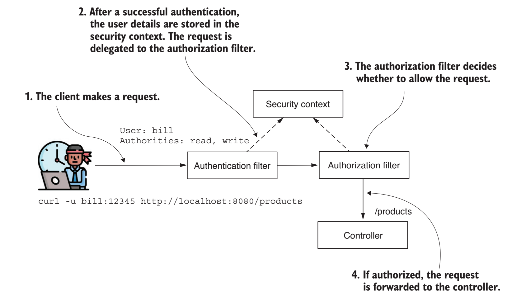{width="7.267716535433071in"
height="4.236111111111111in"}

  --------------------------------------------------------------------------------
  **\@Override**\
  **public** **void** **doFilter**(ServletRequest servletRequest, ServletResponse
  servletResponse, FilterChain chain)\
  **throws** ServletException, IOException {\
  \
  HttpServletRequest request = (HttpServletRequest) servletRequest;\
  HttpServletResponse response = (HttpServletResponse) servletResponse;\
  \
  **if** (**this**.observeOncePerRequest && isApplied(request)) {\
  chain.doFilter(request, response);\
  **return**;\
  }\
  \
  **if** (skipDispatch(request)) {\
  chain.doFilter(request, response);\
  **return**;\
  }\
  \
  String alreadyFilteredAttributeName = getAlreadyFilteredAttributeName();\
  request.setAttribute(alreadyFilteredAttributeName, Boolean.TRUE);\
  **try** {\
  AuthorizationDecision decision =
  **this**.authorizationManager.check(**this**::getAuthentication, request);\
  **this**.eventPublisher.publishAuthorizationEvent(**this**::getAuthentication,
  request, decision);\
  **if** (decision != **null** && !decision.isGranted()) {\
  **throw** **new** AccessDeniedException(\"Access Denied\");\
  }\
  chain.doFilter(request, response);\
  }\
  **finally** {\
  request.removeAttribute(alreadyFilteredAttributeName);\
  }\
  }
  --------------------------------------------------------------------------------

  --------------------------------------------------------------------------------

### GrantedAuthority

A user possesses one or more authorities (permissible actions).
Throughout the authentication phase, the UserDetailsService retrieves
comprehensive details about the user, encompassing their authorities.
Following a successful authentication, the application employs these
authorities, as depicted by the GrantedAuthority interface, to carry out
authorization

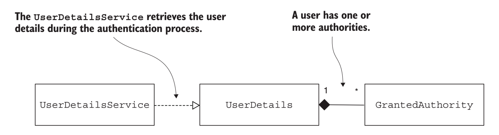{width="7.267716535433071in"
height="1.9861111111111112in"}

when using the authorities() method, include the ROLE\_ prefix. When
using the roles() method, do not include the ROLE\_ prefix.

  -----------------------------------------------------------------------
  var user1 = User.withUsername(\"john\")\
  .password(\"12345\")\
  .authorities(\"ROLE_ADMIN\")\
  .build();
  -----------------------------------------------------------------------

  -----------------------------------------------------------------------

  -----------------------------------------------------------------------
  var user1 = User.withUsername(\"john\")\
  .password(\"12345\")\
  .roles(\"ADMIN\")\
  .build();
  -----------------------------------------------------------------------

  -----------------------------------------------------------------------

### Practice: Restricting access for all endpoints based on user authorities

  -----------------------------------------------------------------------
  **\@Bean**\
  **public** SecurityFilterChain **securityFilterChain**(HttpSecurity
  http)\
  **throws** Exception {\
  http.httpBasic(Customizer.withDefaults())\
  .authorizeHttpRequests(authorize -\> authorize\
  .anyRequest()\
  .[hasAuthority(\"WRITE\")]{.underline});\
  *// .authorizeRequests(c -\> c.anyRequest().permitAll());*\
  **return** http.build();\
  }\
  \
  **\@Bean**\
  **public** UserDetailsService **userDetailsService**() {\
  var manager = **new** InMemoryUserDetailsManager();\
  var user1 = User.withUsername(\"john\")\
  .password(\"12345\")\
  .[authorities(\"READ\")]{.underline}\
  .build();\
  var user2 = User.withUsername(\"jane\")\
  .password(\"12345\")\
  .[authorities(\"WRITE\")\
  ]{.underline} .build();\
  manager.createUser(user1);\
  manager.createUser(user2);\
  **return** manager;\
  }
  -----------------------------------------------------------------------

  -----------------------------------------------------------------------

Or

  -----------------------------------------------------------------------
  **\@Bean**\
  **public** SecurityFilterChain **securityFilterChain**(HttpSecurity
  http)\
  **throws** Exception {\
  \
  http.httpBasic(Customizer.withDefaults());\
  http.authorizeHttpRequests(c -\> c.anyRequest()\
  .[hasAnyAuthority(\"WRITE\", \"READ\")]{.underline};\
  );\
  **return** http.build();\
  }
  -----------------------------------------------------------------------

  -----------------------------------------------------------------------

Or

  -----------------------------------------------------------------------
  **\@Bean**\
  **public** SecurityFilterChain **securityFilterChain**(HttpSecurity
  http)\
  **throws** Exception {\
  \
  http.httpBasic(Customizer.withDefaults());\
  http.authorizeHttpRequests(c -\> c.anyRequest()\
  [.access(\"hasAuthority(\'WRITE\')\"]{.underline})\
  );\
  **return** http.build();\
  }
  -----------------------------------------------------------------------

  -----------------------------------------------------------------------

OR

+-----------------------------------------------------------------------+
| String expression = \"\"\"hasAuthority(\'read\') and                  |
| !hasAuthority(\'delete\')\"\"\";                                      |
|                                                                       |
| http.authorizeHttpRequests(c -\> c.anyRequest()\                      |
| [.access(**new**                                                      |
| WebExpressionAuthorizationManager(expression))]{.underline}           |
|                                                                       |
| );                                                                    |
+=======================================================================+
+-----------------------------------------------------------------------+

### Practice: Restricting access for all endpoints based on user roles

  -----------------------------------------------------------------------
  **\@Bean**\
  **public** SecurityFilterChain **securityFilterChain**(HttpSecurity
  http)\
  **throws** Exception {\
  http.httpBasic(Customizer.withDefaults())\
  .authorizeHttpRequests(authorize -\> authorize\
  .anyRequest()\
  [.hasRole(\"ADMIN\"));\
  ]{.underline} *// .authorizeRequests(c -\>
  c.anyRequest().permitAll());*\
  **return** http.build();\
  }\
  \
  **\@Bean**\
  **public** UserDetailsService **userDetailsService**() {\
  var manager = **new** InMemoryUserDetailsManager();\
  var user1 = User.withUsername(\"john\")\
  .password(\"12345\")\
  [.authorities(\"ROLE_ADMIN\")\
  ]{.underline} .build();\
  var user2 = User.withUsername(\"jane\")\
  .password(\"12345\")\
  [.authorities(\"ROLE_MANAGER\")\
  ]{.underline} .build();\
  manager.createUser(user1);\
  manager.createUser(user2);\
  **return** manager;\
  }
  -----------------------------------------------------------------------

  -----------------------------------------------------------------------

## CSRF Filter

CSRF is enabled by default in Spring Security.

The starting point of CSRF protection is a filter in the filter chain
called Csrf-Filter. The CsrfFilter intercepts requests and allows all
those that use these HTTP methods: GET, HEAD, TRACE, and OPTIONS. For
all other requests, the filter expects to receive a header containing a
token. If this header does not exist or contains an incorrect token
value, the application rejects the request and sets the response status
to HTTP 403 Forbidden.

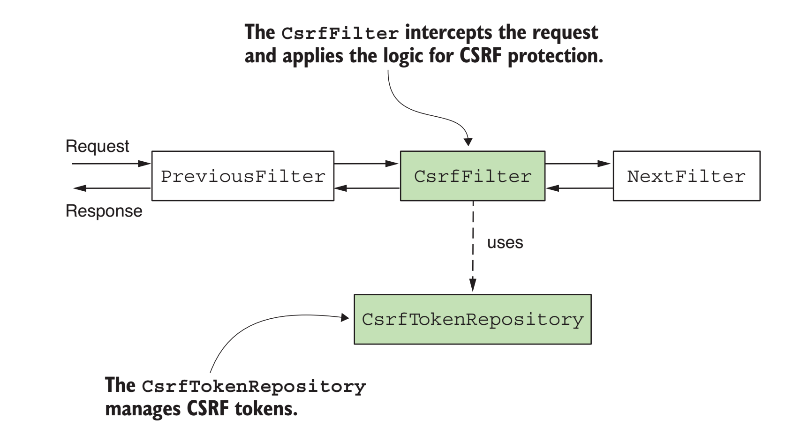{width="7.267716535433071in"
height="3.9166666666666665in"}

[[https://github.com/spring-projects/spring-security/blob/main/web/src/main/java/org/springframework/security/web/csrf/CsrfFilter.java]{.underline}](https://github.com/spring-projects/spring-security/blob/main/web/src/main/java/org/springframework/security/web/csrf/CsrfFilter.java)

  -----------------------------------------------------------------------
  **public** **final** **class** **CsrfFilter** **extends**
  **OncePerRequestFilter** {\
  \
  */\*\*\
  \* The default {@link RequestMatcher} that indicates if CSRF protection
  is required or\
  \* not. The default is to ignore GET, HEAD, TRACE, OPTIONS and process
  all other\
  \* requests.\
  \*/*\
  **public** **static** **final** RequestMatcher DEFAULT_CSRF_MATCHER =
  **new** DefaultRequiresCsrfMatcher();\
  \
  */\*\*\
  \* The attribute name to use when marking a given request as one that
  should not be\
  \* filtered.\
  \* \<p\>\
  \* To use, set the attribute on your {@link HttpServletRequest}:
  \<pre\>\
  \* CsrfFilter.skipRequest(request);\
  \* \</pre\>\
  \*/*\
  **private** **static** **final** String SHOULD_NOT_FILTER =
  \"SHOULD_NOT_FILTER\" + CsrfFilter.class.getName();\
  \
  **private** **final** Log logger = LogFactory.getLog(getClass());\
  \
  **private** **final** CsrfTokenRepository tokenRepository;\
  \
  **private** RequestMatcher requireCsrfProtectionMatcher =
  DEFAULT_CSRF_MATCHER;\
  \
  **private** AccessDeniedHandler accessDeniedHandler = **new**
  AccessDeniedHandlerImpl();\
  \
  **private** CsrfTokenRequestHandler requestHandler = **new**
  XorCsrfTokenRequestAttributeHandler();\
  \
  */\*\*\
  \* Creates a new instance.\
  \* \@param tokenRepository the {@link CsrfTokenRepository} to use\
  \*/*\
  **public** **CsrfFilter**(CsrfTokenRepository tokenRepository) {\
  Assert.notNull(tokenRepository, \"tokenRepository cannot be null\");\
  **this**.tokenRepository = tokenRepository;\
  }\
  \
  **\@Override**\
  **protected** **boolean** **shouldNotFilter**(HttpServletRequest
  request) **throws** ServletException {\
  **return**
  Boolean.TRUE.equals(request.getAttribute(SHOULD_NOT_FILTER));\
  }\
  \
  **\@Override**\
  **protected** **void** **doFilterInternal**(HttpServletRequest request,
  HttpServletResponse response, FilterChain filterChain)\
  **throws** ServletException, IOException {\
  DeferredCsrfToken deferredCsrfToken =
  **this**.tokenRepository.loadDeferredToken(request, response);\
  request.setAttribute(DeferredCsrfToken.class.getName(),
  deferredCsrfToken);\
  **this**.requestHandler.handle(request, response,
  deferredCsrfToken::get);\
  **if** (!**this**.requireCsrfProtectionMatcher.matches(request)) {\
  **if** (**this**.logger.isTraceEnabled()) {\
  **this**.logger.trace(\"Did not protect against CSRF since request did
  not match \"\
  + **this**.requireCsrfProtectionMatcher);\
  }\
  filterChain.doFilter(request, response);\
  **return**;\
  }\
  CsrfToken csrfToken = deferredCsrfToken.get();\
  String actualToken =
  **this**.requestHandler.resolveCsrfTokenValue(request, csrfToken);\
  **if** (!equalsConstantTime(csrfToken.getToken(), actualToken)) {\
  **boolean** missingToken = deferredCsrfToken.isGenerated();\
  **this**.logger\
  .debug(LogMessage.of(() -\> \"Invalid CSRF token found for \" +
  UrlUtils.buildFullRequestUrl(request)));\
  AccessDeniedException exception = (!missingToken) ? **new**
  InvalidCsrfTokenException(csrfToken, actualToken)\
  : **new** MissingCsrfTokenException(actualToken);\
  **this**.accessDeniedHandler.handle(request, response, exception);\
  **return**;\
  }\
  filterChain.doFilter(request, response);\
  }\
  \
  **public** **static** **void** **skipRequest**(HttpServletRequest
  request) {\
  request.setAttribute(SHOULD_NOT_FILTER, Boolean.TRUE);\
  }\
  \
  */\*\*\
  \* Specifies a {@link RequestMatcher} that is used to determine if CSRF
  protection\
  \* should be applied. If the {@link RequestMatcher} returns true for a
  given request,\
  \* then CSRF protection is applied.\
  \*\
  \* \<p\>\
  \* The default is to apply CSRF protection for any HTTP method other
  than GET, HEAD,\
  \* TRACE, OPTIONS.\
  \* \</p\>\
  \* \@param requireCsrfProtectionMatcher the {@link RequestMatcher} used
  to determine if\
  \* CSRF protection should be applied.\
  \*/*\
  **public** **void** **setRequireCsrfProtectionMatcher**(RequestMatcher
  requireCsrfProtectionMatcher) {\
  Assert.notNull(requireCsrfProtectionMatcher,
  \"requireCsrfProtectionMatcher cannot be null\");\
  **this**.requireCsrfProtectionMatcher = requireCsrfProtectionMatcher;\
  }\
  \
  */\*\*\
  \* Specifies a {@link AccessDeniedHandler} that should be used when
  CSRF protection\
  \* fails.\
  \*\
  \* \<p\>\
  \* The default is to use AccessDeniedHandlerImpl with no arguments.\
  \* \</p\>\
  \* \@param accessDeniedHandler the {@link AccessDeniedHandler} to use\
  \*/*\
  **public** **void** **setAccessDeniedHandler**(AccessDeniedHandler
  accessDeniedHandler) {\
  Assert.notNull(accessDeniedHandler, \"accessDeniedHandler cannot be
  null\");\
  **this**.accessDeniedHandler = accessDeniedHandler;\
  }\
  \
  */\*\*\
  \* Specifies a {@link CsrfTokenRequestHandler} that is used to make
  the\
  \* {@link CsrfToken} available as a request attribute.\
  \*\
  \* \<p\>\
  \* The default is {@link XorCsrfTokenRequestAttributeHandler}.\
  \* \</p\>\
  \* \@param requestHandler the {@link CsrfTokenRequestHandler} to use\
  \* \@since 5.8\
  \*/*\
  **public** **void** **setRequestHandler**(CsrfTokenRequestHandler
  requestHandler) {\
  Assert.notNull(requestHandler, \"requestHandler cannot be null\");\
  **this**.requestHandler = requestHandler;\
  }\
  \
  */\*\*\
  \* Constant time comparison to prevent against timing attacks.\
  \* \@param expected\
  \* \@param actual\
  \* \@return\
  \*/*\
  **private** **static** **boolean** **equalsConstantTime**(String
  expected, String actual) {\
  **if** (expected == actual) {\
  **return** **true**;\
  }\
  **if** (expected == **null** \|\| actual == **null**) {\
  **return** **false**;\
  }\
  *// Encode after ensure that the string is not null*\
  **byte**\[\] expectedBytes = Utf8.encode(expected);\
  **byte**\[\] actualBytes = Utf8.encode(actual);\
  **return** MessageDigest.isEqual(expectedBytes, actualBytes);\
  }\
  \
  **private** **static** **final** **class**
  **DefaultRequiresCsrfMatcher** **implements** **RequestMatcher** {\
  \
  **private** **final** HashSet\<String\> allowedMethods = **new**
  HashSet\<\>(Arrays.asList(\"GET\", \"HEAD\", \"TRACE\", \"OPTIONS\"));\
  \
  **\@Override**\
  **public** **boolean** **matches**(HttpServletRequest request) {\
  **return** !**this**.allowedMethods.contains(request.getMethod());\
  }\
  \
  **\@Override**\
  **public** String **toString**() {\
  **return** \"CsrfNotRequired \" + **this**.allowedMethods;\
  }\
  \
  }\
  \
  }
  -----------------------------------------------------------------------

  -----------------------------------------------------------------------

### CsrfTokenRepository

The CsrfFilter uses a component named CsrfTokenRepository to manage the
CSRF token values that generate new tokens, store tokens, and eventually
invalidate these. By default, the CsrfTokenRepository stores the token
on the HTTP session and generates the tokens as random string values.

  -----------------------------------------------------------------------
  */\*\*\
  \* An API to allow changing the method in which the expected {@link
  CsrfToken} is\
  \* associated to the {@link HttpServletRequest}. For example, it may be
  stored in\
  \* {@link HttpSession}.\
  \*\
  \* \@author Rob Winch\
  \* \@author Steve Riesenberg\
  \* \@since 3.2\
  \* \@see HttpSessionCsrfTokenRepository\
  \*/*\
  **public** **interface** **CsrfTokenRepository** {\
  \
  */\*\*\
  \* Generates a {@link CsrfToken}\
  \* \@param request the {@link HttpServletRequest} to use\
  \* \@return the {@link CsrfToken} that was generated. Cannot be null.\
  \*/*\
  CsrfToken **generateToken**(HttpServletRequest request);\
  \
  */\*\*\
  \* Saves the {@link CsrfToken} using the {@link HttpServletRequest}
  and\
  \* {@link HttpServletResponse}. If the {@link CsrfToken} is null, it is
  the same as\
  \* deleting it.\
  \* \@param token the {@link CsrfToken} to save or null to delete\
  \* \@param request the {@link HttpServletRequest} to use\
  \* \@param response the {@link HttpServletResponse} to use\
  \*/*\
  **void** **saveToken**(CsrfToken token, HttpServletRequest request,
  HttpServletResponse response);\
  \
  */\*\*\
  \* Loads the expected {@link CsrfToken} from the {@link
  HttpServletRequest}\
  \* \@param request the {@link HttpServletRequest} to use\
  \* \@return the {@link CsrfToken} or null if none exists\
  \*/*\
  CsrfToken **loadToken**(HttpServletRequest request);\
  \
  */\*\*\
  \* Defers loading the {@link CsrfToken} using the {@link
  HttpServletRequest} and\
  \* {@link HttpServletResponse} until it is needed by the application.\
  \* \<p\>\
  \* The returned {@link DeferredCsrfToken} is cached to allow subsequent
  calls to\
  \* {@link DeferredCsrfToken#get()} to return the same {@link CsrfToken}
  without the\
  \* cost of loading or generating the token again.\
  \* \@param request the {@link HttpServletRequest} to use\
  \* \@param response the {@link HttpServletResponse} to use\
  \* \@return a {@link DeferredCsrfToken} that will load the {@link
  CsrfToken}\
  \* \@since 5.8\
  \*/*\
  **default** DeferredCsrfToken **loadDeferredToken**(HttpServletRequest
  request, HttpServletResponse response) {\
  **return** **new** RepositoryDeferredCsrfToken(**this**, request,
  response);\
  }\
  \
  }
  -----------------------------------------------------------------------

  -----------------------------------------------------------------------

### HttpSessionCsrfTokenRepository

the CsrfFilter adds the generated CSRF token to the attribute of the
HTTP request named \_csrf

  -----------------------------------------------------------------------
  **public** **final** **class** **HttpSessionCsrfTokenRepository**
  **implements** **CsrfTokenRepository** {\
  \
  **private** **static** **final** String DEFAULT_CSRF_PARAMETER_NAME =
  \"\_csrf\";\
  \
  **private** **static** **final** String DEFAULT_CSRF_HEADER_NAME =
  \"X-CSRF-TOKEN\";[\
  ]{.mark}\
  **private** **static** **final** String DEFAULT_CSRF_TOKEN_ATTR_NAME =
  HttpSessionCsrfTokenRepository.class.getName()\
  .concat(\".CSRF_TOKEN\");\
  \
  **private** String parameterName = DEFAULT_CSRF_PARAMETER_NAME;\
  \
  **private** String headerName = DEFAULT_CSRF_HEADER_NAME;\
  \
  **private** String sessionAttributeName =
  DEFAULT_CSRF_TOKEN_ATTR_NAME;\
  \
  **\@Override**\
  **public** **void** **saveToken**(CsrfToken token, HttpServletRequest
  request, HttpServletResponse response) {\
  **if** (token == **null**) {\
  HttpSession session = request.getSession(**false**);\
  **if** (session != **null**) {\
  session.removeAttribute(**this**.sessionAttributeName);\
  }\
  }\
  **else** {\
  HttpSession session = request.getSession();\
  session.setAttribute(**this**.sessionAttributeName, token);\
  }\
  }\
  \
  **\@Override**\
  **public** CsrfToken **loadToken**(HttpServletRequest request) {\
  HttpSession session = request.getSession(**false**);\
  **if** (session == **null**) {\
  **return** **null**;\
  }\
  **return** (CsrfToken)
  session.getAttribute(**this**.sessionAttributeName);\
  }\
  \
  **\@Override**\
  **public** CsrfToken **generateToken**(HttpServletRequest request) {\
  **return** **new** DefaultCsrfToken(**this**.headerName,
  **this**.parameterName, createNewToken());\
  }[\
  ]{.mark}\
  */\*\*\
  \* Sets the {@link HttpServletRequest} parameter name that the {@link
  CsrfToken} is\
  \* expected to appear on\
  \* \@param parameterName the new parameter name to use\
  \*/*\
  **public** **void** **setParameterName**(String parameterName) {\
  Assert.hasLength(parameterName, \"parameterName cannot be null or
  empty\");\
  **this**.parameterName = parameterName;\
  }\
  \
  */\*\*\
  \* Sets the header name that the {@link CsrfToken} is expected to
  appear on and the\
  \* header that the response will contain the {@link CsrfToken}.\
  \* \@param headerName the new header name to use\
  \*/*\
  **public** **void** **setHeaderName**(String headerName) {\
  Assert.hasLength(headerName, \"headerName cannot be null or empty\");\
  **this**.headerName = headerName;\
  }\
  \
  */\*\*\
  \* Sets the {@link HttpSession} attribute name that the {@link
  CsrfToken} is stored in\
  \* \@param sessionAttributeName the new attribute name to use\
  \*/*\
  **public** **void** **setSessionAttributeName**(String
  sessionAttributeName) {\
  Assert.hasLength(sessionAttributeName, \"sessionAttributename cannot be
  null or empty\");\
  **this**.sessionAttributeName = sessionAttributeName;\
  }\
  \
  **private** String **createNewToken**() {\
  **return** UUID.randomUUID().toString();\
  }\
  \
  }
  -----------------------------------------------------------------------

  -----------------------------------------------------------------------

## OAuth2

For the resource server, like any other authentication approach, you
need to change the authentication provider if you want to customize how
the authentication works.In the case of a resource server, Spring
Security allows you to plug into the configuration a component named the
authentication manager resolver. This component allows the app execution
to decide which authentication manager to call. This way, you can
delegate the authentication to any custom authentication manager that
can use a custom authentication provider.

###  Spring Security OAuth 2 Authorization Server

###  Spring Security OAuth 2 Resource Server

###  Spring Security OAuth 2 Client

the provider's details

-   ClientRegistration---This object is used to define the details the
    > client needs to use the authorization server (credentials,
    > redirect URI, authorization URI, etc.).

-   ClientRegistrationRepository---This contract is implemented to
    > define the logic that retrieves the client registrations. You, for
    > example, can implement a client registration repository to tell
    > your app to get the client registrations from a database or a
    > custom vault.

#### Third Party Providers

Spring Security considers the following providers as well
known:Google,GitHub,Okta,Facebook

Spring Security pre configures the details for these providers in the
**CommonOAuth-2Provider class**

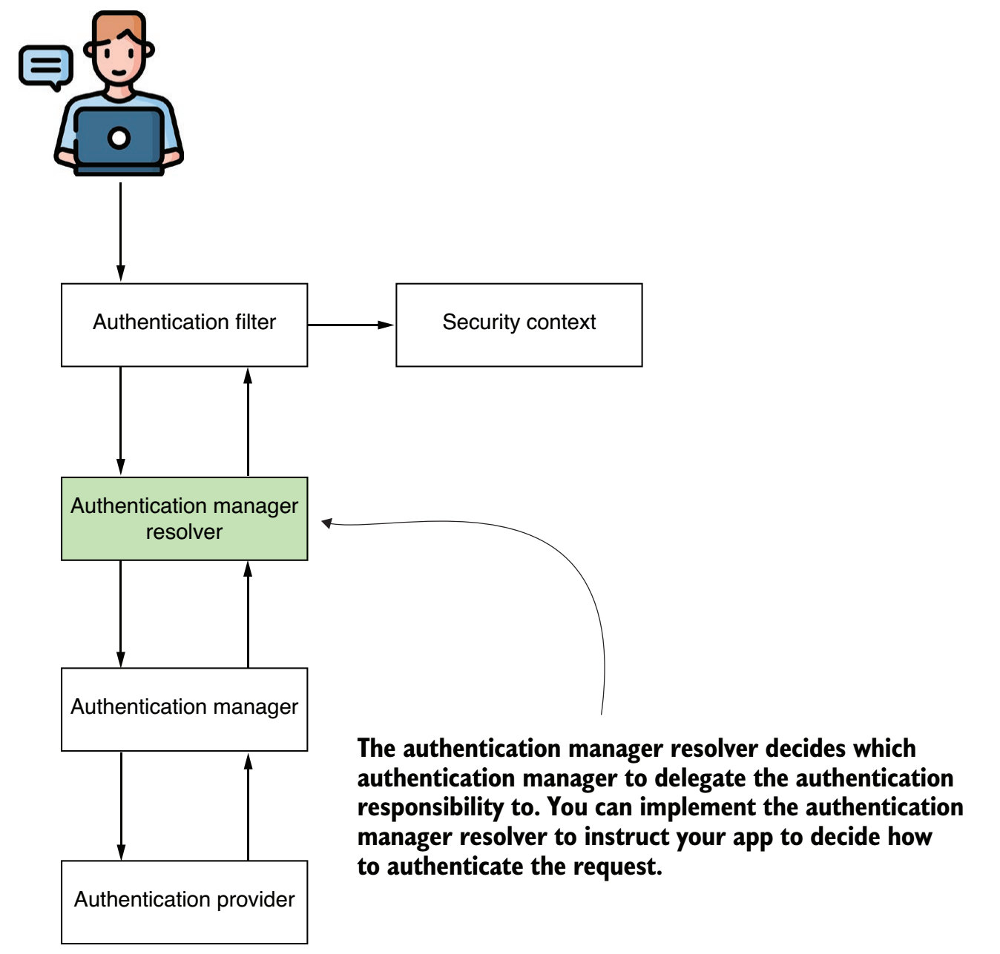

### Practice: Employing two distinct authorization servers

If you want your app to use multiple authorization servers all using
JWTs, Spring Security even provides an out-of-the-box authentication
manager resolver imple-mentation. For such a case, you only need to plug
in the JwtIssuer-AuthenticationManagerResolver custom implementation
that Spring Security provides.

Let's consider the following scenario: you need your resource server to
work with both JWT and opaque tokens with two different authorization
servers. Say your resource server discriminates the requests based on
the value of a \"type\" parameter. If the \"type\" parameter's value is
\"jwt\", the resource server must authenticate the request with an
authorization server using JWT access tokens; otherwise, it uses an
authorization server with opaque access tokens.

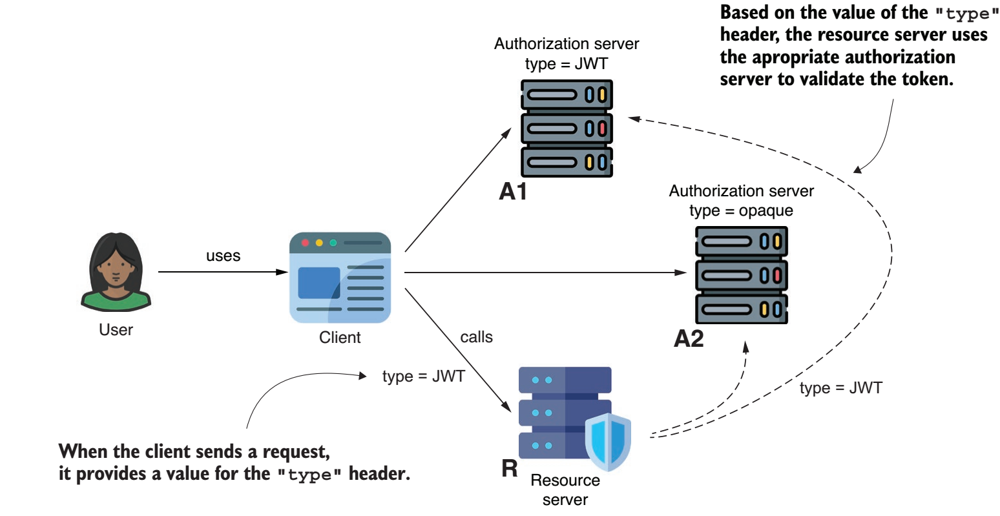

  -----------------------------------------------------------------------
  **\@Configuration**\
  **public** **class** **ProjectConfig** {\
  *// Omitted code*\
  **\@Bean**\
  **public** AuthenticationManagerResolver\<HttpServletRequest\>\
  **authenticationManagerResolver**(\
  JwtDecoder jwtDecoder,\
  OpaqueTokenIntrospector opaqueTokenIntrospector\
  ) {\
  \
  AuthenticationManager jwtAuth = **new** ProviderManager(\
  **new** JwtAuthenticationProvider(jwtDecoder)\
  );\
  AuthenticationManager opaqueAuth = **new** ProviderManager(\
  **new** OpaqueTokenAuthenticationProvider(opaqueTokenIntrospector)\
  );\
  **return** (request) -\> {\
  **if** (\"jwt\".equals(request.getHeader(\"type\"))) {\
  **return** jwtAuth;\
  } **else** {\
  **return** opaqueAuth;\
  }\
  };\
  }\
  **\@Bean**\
  **public** JwtDecoder **jwtDecoder**() {\
  **return** NimbusJwtDecoder\
  .withJwkSetUri(\"http://localhost:7070/oauth2/jwks\")\
  .build();\
  }\
  **\@Bean**\
  **public** OpaqueTokenIntrospector **opaqueTokenIntrospector**() {\
  **return** **new** SpringOpaqueTokenIntrospector(\
  \"http://localhost:6060/oauth2/introspect\",\
  \"client\", \"secret\");\
  }\
  }
  -----------------------------------------------------------------------

  -----------------------------------------------------------------------

  -----------------------------------------------------------------------
  **\@Configuration**\
  **public** **class** **ProjectConfig** {\
  **\@Bean**\
  **public** SecurityFilterChain **securityFilterChain**(HttpSecurity
  http)\
  **throws** Exception {\
  \
  http.oauth2ResourceServer(\
  j -\> j.authenticationManagerResolver(\
  authenticationManagerResolver(\
  jwtDecoder(),\
  opaqueTokenIntrospector()\
  ))\
  );\
  http.authorizeHttpRequests(\
  c -\> c.anyRequest().authenticated()\
  );\
  **return** http.build();\
  }\
  *// Omitted code*\
  }
  -----------------------------------------------------------------------

  -----------------------------------------------------------------------

##  

# Spring Security Reactive 

an **AuthenticationWebFilter** intercepts the HTTP request. This filter
delegates the authentication responsibility to an authentication
manager. The authentication manager implements the
**ReactiveAuthenticationManager** contract. Unlike non-reactive apps, we
don't have authentication providers. The
**ReactiveAuthenticationManager** directly implements the authentication
logic.

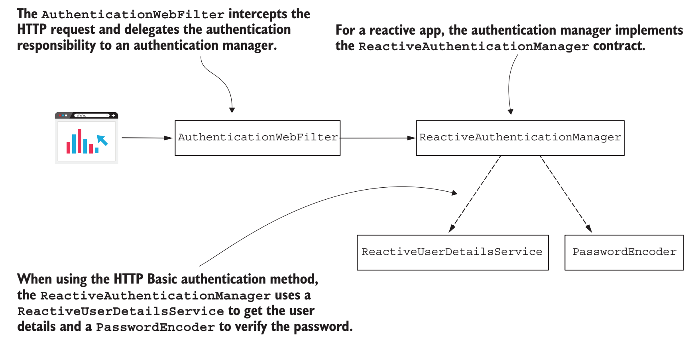{width="7.267716535433071in"
height="3.611111111111111in"}

Spring Security offers us a different implementation of the context
holder for reactive apps,

**ReactiveSecurityContextHolder**. We use this to work with the
SecurityContext in a reactive app

Once the **ReactiveAuthenticationManager** successfully authenticates
the request, it returns the Authentication object to the filter. The
filter stores the **Authentication** instance in the
**SecurityContext**.

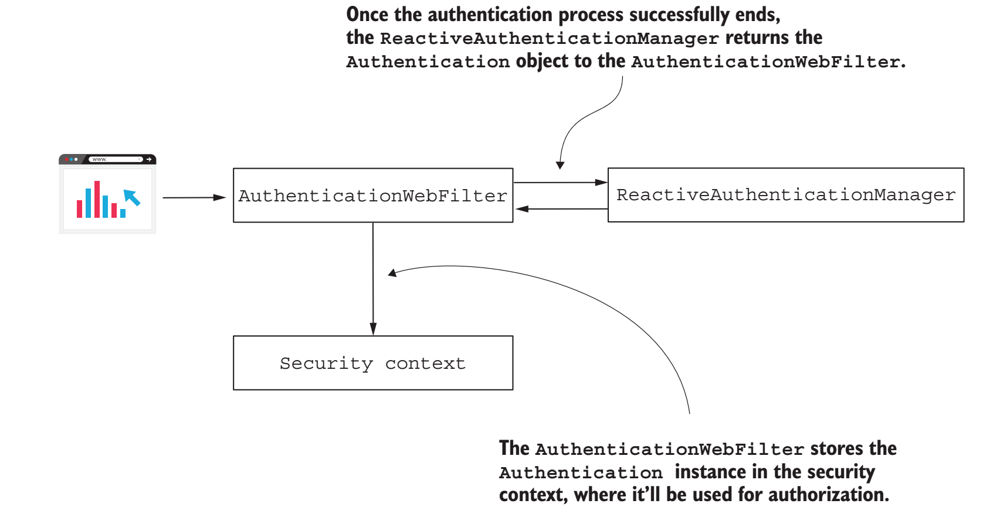{width="7.267716535433071in"
height="3.736111111111111in"}

## AuthorizationWebFilter

After the authentication process successfully ends, another filter,
named **AuthorizationWebFilter**, intercepts the request. This filter
delegates the authorization responsibility to a
**ReactiveAuthorizationManager**

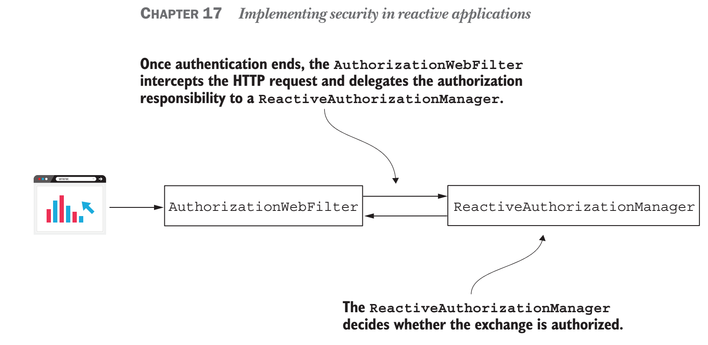