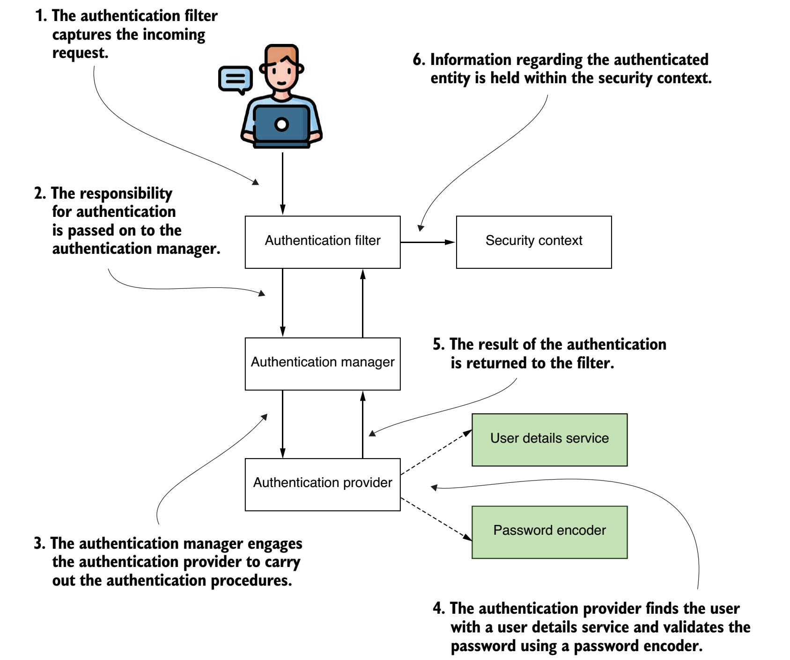

# Spring Security
## Authentication flow in Spring Security
The AuthenticationFilter captures the incoming request and passes the task of authentication to the AuthenticationManager. The AuthenticationManager, in turn, utilizes an authentication provider to carry out the authentication 
process. For verifying the username and password, the AuthenticationProvider relies on a UserDetailsService and a PasswordEncoder.

## Examples
* [Baeldung Spring Security OAuth Authorization Server](https://github.com/spring-kb/baeldung-spring-security-oauth-auth-server)