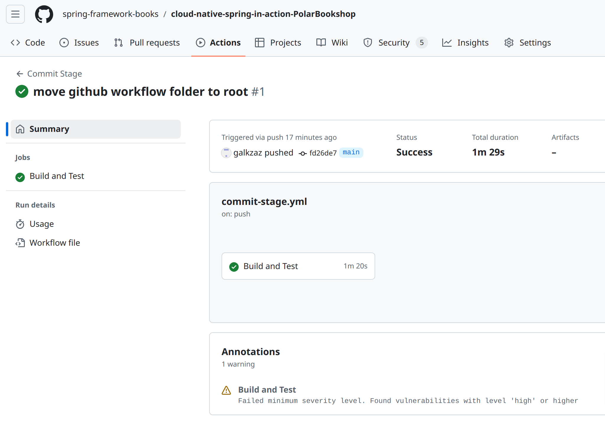

# GitHub Actions
GitHub Actions is a platform built into GitHub that lets you automate software workflows directly from your code repositories. 

A workflow is an automated process. Each workflow
listens to specific events that trigger its execution.

 Workflows should be defined in a .github/workflows folder in a GitHub repository
root, and they should be described following the YAML format provided by GitHub
Actions. 

Each workflow is organized into jobs that run in parallel. Each job is executed on a
runner instance, which is a server provided by GitHub. You can choose between
Ubuntu, Windows, and macOS. 

Each job is composed of steps, which are executed sequentially. A step could be either
a shell command or an action. Actions are custom applications used to perform com-
plex tasks in a more structured and reproducible way. For example, you could have
actions for packaging an application into an executable, running tests, creating a container image, or pushing an image to a container registry. The GitHub organiza-
tion provides a basic set of actions, but there’s also a marketplace with many more
actions developed by the community.

## Create Workflows 
Workflows should be defined in a .github/workflows folder in a GitHub repository
root, and they should be described following the YAML format provided by GitHub Actions. 

create a commit-stage.yml
file under a new .github/workflows folder. This workflow will be triggered whenever
new code is pushed to the repository.
```yml
name: Commit Stage
on:
  push:

jobs:
  build:
    name: Build and Test
    runs-on: ubuntu-22.04
    permissions:
      contents: read
      security-events: write
    steps:
      # Checks out the currentGit repository
      - name: Checkout source code
        uses: actions/checkout@v4
        # Installs and configures a Java runtime
      - name: Set up JDK
        uses: actions/setup-java@v4
        # Defines which version, distribution, and cache type to use
        with:
          distribution: temurin
          java-version: 17
          cache: maven
      - name: Build, unit tests and integration tests
        # Ensures the Gradle wrapper is executable, solving Windows incompatibilities
        # Runs the Maven build task, which incompatibilities compiles the codebase and runs unit and integration tests
        run: |
          chmod +x mvnw
          ./mvnw install
      - name: Code vulnerability scanning
        uses: anchore/scan-action@v3
        # Assigns an identifier to the current step so that it can be referenced from subsequent steps
        id: scan
        with:
          # The path to the checked-out repository
          path: "${{ github.workspace }}"
          # Whether to fail the build in the event of security vulnerabilities
          fail-build: false
          #The minimum security category to be considered as an error (low, medium, high, critical)
          severity-cutoff: high
      - name: Upload vulnerability report
        # Uploads the security vulnerability report to itHub (SARIF format)
        uses: github/codeql-action/upload-sarif@v3
        # Uploads the report even if the previous step fails
        if: success() || failure()
        with:
          # Fetches the report from the output of the previous step
          sarif_file: ${{ steps.scan.outputs.sarif }}
      # - name: Setup tools
      #   uses: alexellis/setup-arkade@v3
      # - name: Install tools
      #   uses: alexellis/arkade-get@master
      #   with:
      #     kustomize: latest
      #     kubeconform: latest
      # - name: Validate Kubernetes manifests
      #   run: |
      #     kustomize build k8s | kubeconform --strict -

```
After completing the declaration of the initial commit stage for the deployment pipe-
line, commit your changes and push them to the remote GitHub repository. The
newly created workflow will be immediately triggered. You can see the execution
results on your GitHub repository page on the Actions tab. 

By keeping the result of
the commit stage green, you can be quite sure that you haven’t broken anything or
introduced new regressions (assuming that you have proper tests in place).

After scanning the Java project for vulnerabilities, we also included a step to fetch
the security report generated by grype and upload it to GitHub, independently of
whether the build succeeds or not. If any security vulnerability is found, you can see
the results in the Security tab of your GitHub repository page 