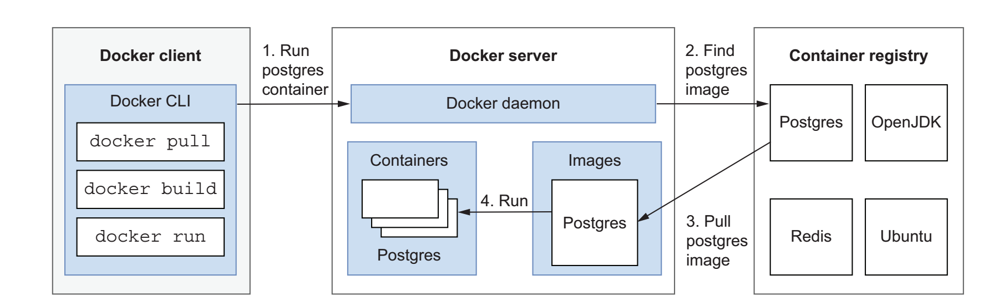

# Docker
**Docker** is an open source platform that “provides the ability to package and run an
application in a loosely isolated environment called a container”

The **Docker server** contains the Docker daemon, a background process responsible for creating and managing Docker
objects like images, containers, volumes, and networks. The machine where the
Docker server runs is called the Docker host. Each machine where you want to run con-
tainers should be a Docker host, so it should have a Docker daemon running. The
portability of containers is made possible by the daemon process itself.

The **Docker daemon** exposes an API you can use to send instructions, such as to
run a container or create a volume. The Docker client talks to the daemon through that
API. The client is command-line based and can be used to interact with the Docker
daemon either through scripting (for example, Docker Compose) or through the
Docker CLI directly.

Next figure shows how the Docker client, Docker server,and container registry interact.

A **container image** (or, simply, an image) is a lightweight executable package that
includes everything needed to run the application inside. The Docker image format is
the most used one for creating container images, and it has been standardized by the
OCI project (in the OCI Image Specification). OCI images can be created from
scratch by defining instructions in a Dockerfile, a text-based file containing all the
steps to generate the image. 

A **container** is a runnable instance of a container image. You can manage the con-
tainer life cycle from the Docker CLI or Docker Compose: you can start, stop, update,
and delete containers. Containers are defined by the image on which they are based
and the configuration provided at startup time (for example, environment variables
used to customize the container). By default, containers are isolated from each other
and the host machine, but you can make them expose services to the outside world
through specific ports with a process called port forwarding or port mapping. Containers
can have any name. If you don’t specify one, the Docker server will assign a random
one, like bazinga_schrodinger. 